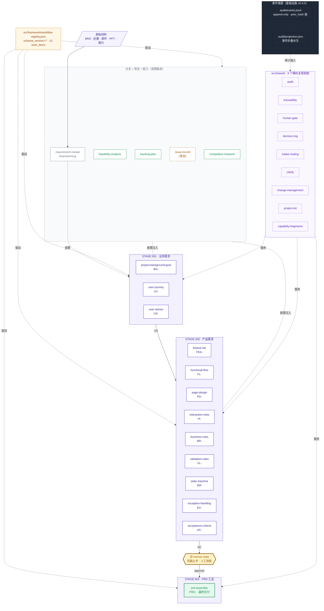
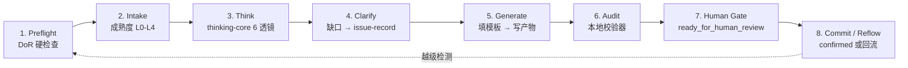
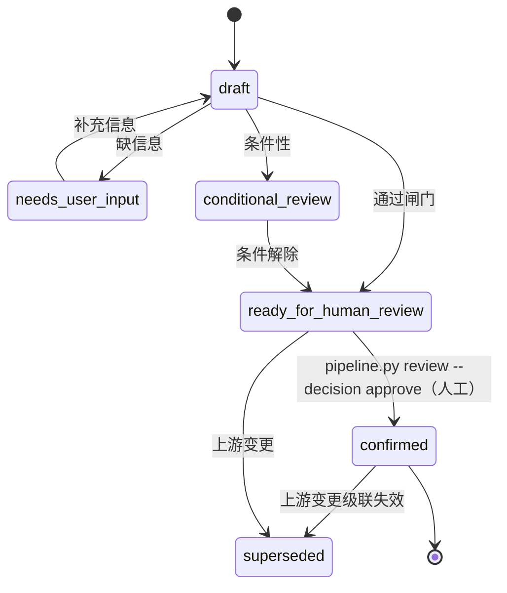

# PM Scaffold · 产品 AI 脚手架

> **PRD-only 产品经理 AI 工作流**：把原始需求（BRD、会议纪要、邮件、PPT、图片）逐步转化为一份**经真实人工确认、可沟通、可实现、可核验的中文 `prd.md`**。
>
> 13 个独立 work_item · 不可绕过的人工闸门 · 全程可追溯 · Loop 工程化

[](LICENSE)
[](https://github.com/konwait12/pm-scaffold)
[](run_tests_mac.sh)

---

## 目录

1. [TL;DR · 30 秒看懂](#tldr--30-秒看懂)
2. [驾驶舱 · 必看](#驾驶舱--必看)
3. [快速开始 · 5 分钟跑通](#快速开始--5-分钟跑通)
4. [架构全景](#架构全景)
5. [13 个 work_item](#13-个-work_item)
6. [产物体系](#产物体系)
7. [命令全集](#命令全集)
8. [脚本与基础设施](#脚本与基础设施)
9. [开发与测试](#开发与测试)
10. [配置与定制](#配置与定制)
11. [8 条硬宪法](#8-条硬宪法)
12. [故障排除](#故障排除)
13. [附录](#附录)

---

## TL;DR · 30 秒看懂

**这个项目解决**：AI 写需求最大的风险不是写得慢，而是「**推断冒充事实、没有人明确拍板、改了上游下游不知道**」。

**三条硬哲学**：

1. **业务真相由人类拥有**：AI 只起草，不替人决策。`confirmed` 永远只能由真实评审人批准。
2. **证据与不确定性必须可见**：每条声明标 `FACT / DECISION / ASSUMPTION / AI_INFERENCE / UNKNOWN / CONFLICT`，AI 推断永远冒充不了事实。
3. **AI 不得伪造人工确认**：机器闸门只能产出 `ready_for_human_review`，从不写 `confirmed`。

**5 分钟能做什么**：从空目录跑到一份经人工确认的中文 prd.md。

---

## 驾驶舱 · 必看

这是硬核项目、没有外部生态——**所有入门材料都在这一个文件里**：

```bash
open src/toolkit/visualization/scaffold-flow.html
```

打开后：

- 左侧点「**📖 新手教程 · 从这里开始**」——10 章协作手册，从零到第一份 prd.md 的完整剧本。
- 左侧导航是项目全景：主流程图（每条线有条件标注）、13 个 work_item 说明书、产物说明书、脚本说明书、命令全集、文件架构。

> **看完驾驶舱 = 了解项目 80%**。本 README 是文字索引；驾驶舱是交互式百科。

---

## 快速开始 · 5 分钟跑通

### 前置依赖

| 工具 | 版本 | 说明 |
|---|---|---|
| Python | 3.10+ | 仅用标准库；3.14 已测 |
| Bash 或 PowerShell | 任意 | 提供 `run_tests_mac.sh` / `run_tests_win.ps1` |
| Git | 任意 | 拉取仓库、回溯 PRD 历史 |
| 一个 AI Agent | Claude Code / Codex / Cursor 等 | 按 [`AGENTS.md`](AGENTS.md) 启动 |

### 第 1 步 · 克隆 + 看驾驶舱（1 分钟）

```bash
git clone https://github.com/konwait12/pm-scaffold.git
cd pm-scaffold
open src/toolkit/visualization/scaffold-flow.html   # macOS
# Windows: start src\toolkit\visualization\scaffold-flow.html
```

### 第 2 步 · 创建第一个需求（30 秒）

```bash
python3 src/scripts/pipeline.py init REQ-001-my-feature
```

输出示例：

```text
Created requirements/REQ-001-my-feature
  Next: put source materials in requirements/REQ-001-my-feature/00-input/, then run
        python3 src/scripts/pipeline.py requirements/REQ-001-my-feature status
```

### 第 3 步 · 放原始材料（1 分钟）

把 BRD、会议纪要、邮件、PPT、图片放入：

```text
requirements/REQ-001-my-feature/
├── README.md
├── 00-input/                              ← 原始材料放这里
│   ├── source-register.md                 # 材料登记
│   ├── authorized-reviewers.json          # 评审人名单（必须）
│   ├── BRD-2026-08-v1.md
│   └── ...
├── 001-business-requirements/             # 由 work_item 逐步生成
├── 002-product-requirements/              # 由 work_item 逐步生成
├── 003-prd-output/                        # 由 prd-assembly 汇总
└── 99-review/                             # 评审记录 + issue-record
```

`authorized-reviewers.json` 最小示例：

```json
{
  "reviewers": [
    {
      "id": "USR-001",
      "name": "张三",
      "roles": ["business_owner", "product_owner"]
    },
    {
      "id": "USR-002",
      "name": "李四",
      "roles": ["product_owner"]
    }
  ]
}
```

### 第 4 步 · 查状态（10 秒）

```bash
python3 src/scripts/pipeline.py requirements/REQ-001-my-feature status
```

```json
{
  "active_work_item": "project-background-goal",
  "next_work_item": "project-background-goal",
  "work_items": {
    "project-background-goal": "not_created",
    "user-journey": "not_created",
    ...
    "prd-assembly": "not_created"
  },
  "branch_skill_signals": ["requirement-restate"]
}
```

### 第 5 步 · 入口判定（10 秒）

```bash
python3 src/scripts/pipeline.py requirements/REQ-001-my-feature entry
```

返回 L0–L4 成熟度判定 + 分支 skill 建议（如 L0 建议先 `requirement-restate` 需求重举）。

### 第 6 步 · AI 按 SKILL.md 起草

让你的 AI Agent 按 [`AGENTS.md`](AGENTS.md)（项目唯一入口）启动，逐个走完 13 个 work_item 的 8 步循环。

每个 work_item 完成后，让 AI 执行：

```bash
python3 src/scripts/pipeline.py requirements/REQ-001-my-feature gate \
  --work-item project-background-goal
```

机器闸门会跑校验器 + 一致性检查。**通过则产物状态变 `ready_for_human_review`**（AI 不能写 `confirmed`）。

### 第 7 步 · 真实人工确认

```bash
python3 src/scripts/pipeline.py requirements/REQ-001-my-feature review \
  --work-item project-background-goal --decision approve \
  --reviewer "张三" --reviewer-id "USR-001" --reviewer-role "business_owner"
```

校验：

- `--reviewer-id` 在 `00-input/authorized-reviewers.json` 中存在 ✓
- `--reviewer-role` 在该 reviewer 的 roles 列表中 ✓
- 产物通过闸门 ✓

→ 写 `confirmed` + SHA-256 绑定 + 事件溯源记录。

### 第 8 步 · 全部 12 上游 confirmed → prd-assembly 自动可启动

```bash
python3 src/scripts/pipeline.py requirements/REQ-001-my-feature gate \
  --work-item prd-assembly
python3 src/scripts/pipeline.py requirements/REQ-001-my-feature review \
  --work-item prd-assembly --decision approve \
  --reviewer "李四" --reviewer-id "USR-002" --reviewer-role "product_owner"
```

→ `003-prd-output/prd.md` 经真实人工确认完成。

---

## 架构全景

### 三阶段 + 13 个 work_item（注册表驱动）



**图例**：

| 颜色/形状 | 含义 |
|---|---|
| 紫色实线框 | 13 主干 work_item |
| 🟡 黄色厚边框（菱形） | Human Gate（机器止步·人工拍板） |
| 🟢 绿色实线框 | prd-assembly 最终交付 |
| 🟢 绿色细线框 | 3 个分支 skill（按需触发） |
| 🟠 虚线框 | issue-record（常驻贯穿全流程） |
| 灰色细线框 | 2 个能力 skill（requirement-restate / brainstorming） |
| 浅紫框 | 9 个共享机制（横向服务） |
| 深色填充框 | 事件溯源基础设施 |
| 虚线箭头 | 触发 / 服务 / 驱动（非主链路强依赖） |

### 8 步执行循环（每个 work_item 必走）



### 产物状态机



> **关键不变量**：`confirmed` 状态只能由 `pipeline.py review --decision approve` 写入；AI Agent **永远不能**直接编辑 frontmatter 把状态改为 `confirmed`。

### 六态知识标注（每条声明必标）

| 标签 | 语义 | 典型场景 |
|---|---|---|
| `FACT` | 有源可查的客观事实 | 用户原话、邮件原文、API 文档 |
| `DECISION` | 已达成的人为决策 | 采纳/拒绝某方案的会议结论 |
| `ASSUMPTION` | 为推进而做的假设 | 目标用户规模、性能基线 |
| `AI_INFERENCE` | AI 推断（非事实） | 从已确认信息演绎的二级结论 |
| `UNKNOWN` | 不知道，需要澄清 | 缺少业务规则、字段定义 |
| `CONFLICT` | 来源说法矛盾 | 不同 stakeholder 同一问题不同答案 |

---

## 13 个 work_item

v0.5.0 把 v0.4.x 的「5 主 + 9 子」复合结构拆解为 **13 个独立 work_item**，各产一份独立 .md 文件。

### 13 主干（顺序执行）

| # | work_item | 产物 | 前缀 | 前置 |
|---|---|---|---|---|
| 1 | `project-background-goal` | `background-goal.md` | `BG-` | — |
| 2 | `user-journey` | `user-journey.md` | `UJ-` | BG |
| 3 | `user-stories` | `user-stories.md` | `US-` | UJ |
| 4 | `feature-list` | `feature-list.md` | `FEA-` | US |
| 5 | `functional-flow` | `functional-flow.md` | `FL-` | FEA |
| 6 | `page-design` | `page-design.md` | `PD-` | FL |
| 7 | `interaction-rules` | `interaction-rules.md` | `IX-` | PD |
| 8 | `business-rules` | `business-rules.md` | `BR-` | FL |
| 9 | `validation-rules` | `validation-rules.md` | `VL-` | BR |
| 10 | `state-machine` | `state-machine.md` | `SM-` | BR |
| 11 | `exception-handling` | `exception-handling.md` | `EX-` | SM |
| 12 | `acceptance-criteria` | `acceptance-criteria.md` | `AC-` | EX, IX |
| 13 | `prd-assembly` | `prd.md` | `PRD-` | 全部 12 上游 |

### 3 分支 + 1 常驻 + 2 能力

| 类型 | skill | 触发 |
|---|---|---|
| 分支 | `competitive-research` | 方案方向不清 / 多方案对比 |
| 分支 | `feasibility-analysis` | 技术可行性不确定 |
| 分支 | `tracking-plan` | 功能需要埋点 |
| 常驻 | `issue-record` | 任何 UNKNOWN/CONFLICT 触发（贯穿全流程） |
| 能力 | `requirement-restate` | L0（无材料）或内容六信号命中 |
| 能力 | `brainstorming` | L0 发散收敛 |

---

## 产物体系

13 个产物 + 1 个最终 PRD，每个都有：

- **独立模板**（`src/templates/stage-{1,2,3}-*/...md`）
- **独立校验器**（`scripts/validate_artifact.py`，使用 `validation_errors.make_issue` 输出统一错误格式）
- **8 步循环 + 7 类引用**

产物 frontmatter 示例（`prd.md`）：

```yaml
---
artifact_id: "PRD-001-my-feature-v1"
version: "v1.0"
status: "confirmed"          # 只能由 pipeline.py review --decision approve 写
owner: "产品经理姓名"
business_fact_owner: "业务方代表"
goal_decision_owner: "业务方负责人"
reviewer: "评审人"
created_at: "2026-08-17"
updated_at: "2026-08-17"
confirmed_at: "2026-08-17"
upstream_artifact_ids: ["BG-001", "UJ-001", "US-001", "FEA-001", "FL-001", "PD-001", "IX-001", "BR-001", "VL-001", "SM-001", "EX-001", "AC-001"]
---
```

**追溯链**：`BG → UJ → US → ST → FEA → FL → PD → IX → BR → VL → SM → EX → AC → PRD`

---

## 命令全集

唯一入口：`python3 src/scripts/pipeline.py`

| 子命令 | 用途 | 示例 |
|---|---|---|
| `init` | 创建新需求骨架 | `init REQ-NNN-topic` |
| `status` | 查激活项 / 下一步 / 越级 | `requirements/REQ-001 status` |
| `entry` | 入口判定（L0-L4 + 分支建议） | `requirements/REQ-001 entry` |
| `gate` | 跑机器闸门（不改状态） | `gate --work-item project-background-goal` |
| `review` | 人工确认（写 confirmed） | `review --work-item X --decision approve --reviewer "姓名" --reviewer-id "USR-XXX" --reviewer-role "business_owner"` |
| `reflow` | 变更回流 / 级联失效 | `reflow --work-item X --apply` |
| `audit backfill` | 历史需求反推事件 | `audit backfill` |

完整示例：

```bash
# 1. 初始化
python3 src/scripts/pipeline.py init REQ-005-wecom-integration

# 2. 放材料到 requirements/REQ-005-wecom-integration/00-input/

# 3. 查状态
python3 src/scripts/pipeline.py requirements/REQ-005-wecom-integration status

# 4. 入口判定
python3 src/scripts/pipeline.py requirements/REQ-005-wecom-integration entry

# 5. 跑机器闸门（每个 work_item 完成后）
python3 src/scripts/pipeline.py requirements/REQ-005-wecom-integration gate \
  --work-item project-background-goal

# 6. 人工确认（仅评审人可执行；带真实姓名 + reviewer-id）
python3 src/scripts/pipeline.py requirements/REQ-005-wecom-integration review \
  --work-item project-background-goal --decision approve \
  --reviewer "王经理" --reviewer-id "USR-001" \
  --reviewer-role "business_owner"

# 7. 变更回流（上游 confirmed 改了 → 下游失效）
python3 src/scripts/pipeline.py requirements/REQ-005-wecom-integration reflow \
  --work-item project-background-goal --apply

# 8. 全量自检
bash run_tests_mac.sh
python3 src/scripts/consistency_check.py
```

---

## 脚本与基础设施

`src/scripts/` 下 18 个注册表驱动脚本。**所有路径从 `workflow-registry.json` 读取，禁止硬编码**（宪法第 7 条）。

| 类别 | 脚本 | 职责 |
|---|---|---|
| 生命周期 | `pipeline.py` | 需求全生命周期（init/status/gate/review/reflow） |
| 生命周期 | `orchestrator.py` | work_item 越级检测 + 范围冻结 |
| 注册表 | `registry_contract_check.py` | schema 校验 + 模板↔校验器字段闭环（首项 fail-loud） |
| 一致性 | `consistency_check.py` | 跨文档一致性（路径、skill 契约、E1/E3） |
| 一致性 | `desensitize_check.py` | fixture 真实姓名脱敏自动化 |
| 审计 | `audit_log.py` | 事件溯源（prev_hash 链 + event_sha256 自指纹） |
| 审计 | `projection_cache.py` | 从事件日志折叠派生 projection.json |
| 校验 | `dor_check.py` | Definition of Ready 硬检查 |
| 校验 | `branch_validator.py` | 分支支持 skill 触发判定 |
| 校验 | `traceability_check.py` | RTM 链路 G→UJ→US→…→AC→PRD 完整性 |
| 校验 | `validation_errors.py` | 统一错误格式（`make_issue` 8+ 字段） |
| 注册表 | `workflow_registry.py` | 注册表读取 + work_item 排序 |
| 注册表 | `migrate_layout_v2.py` | 复合→独立 skill 的目录迁移 |
| 工具 | `hash_anchor.py` | 产物 SHA-256 绑定评审记录 |
| 工具 | `property_check.py` | 逻辑完整性检查 |
| 工具 | `snapshot_cases.py` | 需求案例快照 |
| 工具 | `prd_publish.py` | prd 发布（待 v0.5.x 启用） |
| 工具 | `feishu_fetch.py` | 飞书材料拉取（可选） |

---

## 开发与测试

### 测试基线

```bash
# 全部 78 项（72 PASS / 6 v0.5.1 follow-up）
bash run_tests_mac.sh                # macOS / Linux
powershell run_tests_win.ps1         # Windows
```

测试分 4 阶段：

1. **registry contract**：`src/scripts/registry_contract_check.py`（首项 fail-loud）
2. **consistency**：`src/scripts/consistency_check.py`
3. **desensitize**：`src/scripts/desensitize_check.py`
4. **fixture + 单元 + 集成**：每个 work_item 的 fixture + `test/scripts/test_*.py`

### 添加新 work_item（v0.5.x 扩展指南）

1. 在 `src/framework/workflow-registry.json` 加 work_item 条目（含 id / order / stage / skill_path / artifact_dir / artifact_file / artifact_prefix / predecessors）
2. 创建 `src/stages/<stage>/skills/<skill>/{SKILL.md, agents/openai.yaml, scripts/validate_artifact.py, references/}`
3. 在 `src/templates/stage-{1,2,3}-*/` 加对应模板
4. 在 `src/templates/resolver.py` 的 `TEMPLATE_MAP` 加映射
5. 创建 `test/skills/<skill>/fixtures/` 至少 1 个正例 + 1 个 violation fixture
6. 跑 `bash run_tests_mac.sh` 确认全部通过

### 贡献流程

```bash
# 1. Fork + clone
git clone https://github.com/<you>/pm-scaffold.git

# 2. 创建分支
git checkout -b feat/your-skill-name

# 3. 改动后跑测试 + 提交
bash run_tests_mac.sh
git add -A
git commit -m "feat(<scope>): <description>"

# 4. Push + 提 PR
git push origin feat/your-skill-name
gh pr create --base main
```

**PR 要求**：通过 `registry_contract_check + consistency_check + run_tests_mac.sh` + 至少 1 个 reviewer 批准。

---

## 配置与定制

### 注册表（唯一真相源）

`src/framework/workflow-registry.json`：

```json
{
  "schema_version": 7,
  "stages": [...],
  "work_items": [
    {
      "id": "project-background-goal",
      "name": "项目背景与目标",
      "order": 1,
      "stage": "001-business-requirements",
      "skill_path": "src/stages/001-business-requirements/skills/project-background-goal",
      "artifact_dir": "001-business-requirements/01-background-goal",
      "artifact_file": "background-goal.md",
      "artifact_prefix": "BG-",
      "required_outputs": ["project-background-goals"],
      "predecessors": [],
      "reviewer_roles": ["business_owner", "product_owner"],
      "human_gate": true
    }
  ],
  "artifact_types": [...],
  "support_capabilities": [...]
}
```

### 评审人登记

`requirements/REQ-NNN-topic/00-input/authorized-reviewers.json`：

```json
{
  "reviewers": [
    {"id": "USR-001", "name": "张三", "roles": ["business_owner", "product_owner"]},
    {"id": "USR-002", "name": "李四", "roles": ["product_owner"]}
  ]
}
```

> 本地校验不替代未来的飞书/SSO 身份认证。

### 模板定制

修改 `src/templates/stage-{1,2,3}-*/<skill>.md` 后，**同步修改** `src/templates/resolver.py` 的 `TEMPLATE_MAP`，否则 `pipeline.py` 找不到模板。

---

## 8 条硬宪法

每条都有自动化检查或人工闸门强制。来源：`src/framework/constitution.md`。

| § | 条款 | 强制机制 |
|---|---|---|
| 1 | `confirmed` 永远不能由 AI 设置 | `pipeline.py review --decision approve`（带真实人名 + 授权清单匹配） |
| 2 | 上游未 confirmed，下游不启动 | `orchestrator` 检测越级并阻止 |
| 3 | PRD assembly 只聚合、不发明 | 发现缺口路由回最早的 Work Item 重来 |
| 4 | 知识状态必须标注 | FACT/DECISION/ASSUMPTION/AI_INFERENCE/UNKNOWN/CONFLICT 六态 |
| 5 | 产物单点存放 | 一个 artifact 一个位置；版本演进用 v0.* 快照 |
| 6 | 变更已确认内容使下游失效 | `reflow --apply` 级联失效下游 confirmed |
| 7 | 注册表是唯一真相源 | 禁止硬编码路径/阶段名/Skill 名；所有脚本读 `workflow-registry.json` |
| 8 | 事件日志不可篡改 + 校验器统一错误格式 | `.audit/events.jsonl` append-only + `validation_errors.make_issue` 输出 |

---

## 故障排除

### `ValueError: Unsupported workflow registry schema`

`workflow-registry.json` 的 `schema_version` 比脚本支持的高。检查：

```bash
python3 -c "import json; print(json.load(open('src/framework/workflow-registry.json'))['schema_version'])"
grep -n "schema_version" src/scripts/workflow_registry.py
```

`workflow_registry.py` 白名单需要包含此版本。

### `confirmed status is not allowed for this work_item output`

AI 试图把 frontmatter 的 `status` 设为 `confirmed`。**这是 v0.4.0 第 1 条宪法违反**——必须改为 `draft` / `ready_for_human_review`，由 `pipeline.py review --decision approve` 写 confirmed。

### `Missing required frontmatter / status field`

每个产物文件必须有 YAML frontmatter 含 `artifact_id` / `version` / `status` / `owner` / `business_fact_owner` / `goal_decision_owner` / `reviewer` / `created_at` / `updated_at` / `confirmed_at` 字段。详见 `src/templates/_frontmatter-schema.md`。

### `consistency_check: 1 warning (consistency.e1.regex_missing)`

`prd-assembly/scripts/validate_artifact.py` 中 `UPSTREAM_ID_PATTERN` 必须匹配 `(BG|UJ|US|FEA|FL|PD|IX|BR|VL|STATE|EX|AC|PRD)-\d+(?:-\d+)?`。

### `registry contract: FAIL`

注册表 schema 违反。先看 `python3 src/scripts/registry_contract_check.py` 输出，按提示修复字段缺失 / 类型错误 / 引用不存在的 ID。

### `pipeline.py gate` 报 `Unknown work_item`

`work_item` 不在 `workflow-registry.json` 的 `work_items` 中。检查拼写或加新条目。

---

## 附录

### 相关链接

- **驾驶舱**：[`src/toolkit/visualization/scaffold-flow.html`](src/toolkit/visualization/scaffold-flow.html)
- **AI Agent 入口**：[`AGENTS.md`](AGENTS.md)
- **宪法**：[`src/framework/constitution.md`](src/framework/constitution.md)
- **注册表**：[`src/framework/workflow-registry.json`](src/framework/workflow-registry.json)
- **思考核心**：[`src/framework/thinking-core.md`](src/framework/thinking-core.md)
- **契约**：[`src/framework/contracts.md`](src/framework/contracts.md)
- **变更日志**：[`CHANGELOG.md`](CHANGELOG.md)
- **贡献指南**：[`CONTRIBUTING.md`](CONTRIBUTING.md)
- **GitHub 仓库**：https://github.com/konwait12/pm-scaffold

### 项目结构

```text
src/
├── framework/                       # 规范 + 注册表 + 思考核心 + 契约
│   ├── workflow-registry.json       # 唯一真相源（schema_version=7, 13 work_items）
│   ├── constitution.md               # 8 条硬宪法
│   ├── workflow.md                   # 8 步循环
│   ├── thinking-core.md              # 17 个思考透镜
│   └── contracts.md                  # Shared Records 契约
├── stages/                          # 3 阶段 × 13 work_item + 1 常驻 + 1 能力
│   ├── 001-business-requirements/skills/
│   │   ├── project-background-goal/
│   │   ├── user-journey/                    (v0.5.0 新拆)
│   │   ├── user-stories/                    (v0.5.0 新拆)
│   │   └── requirement-restate/             (能力)
│   ├── 002-product-requirements/skills/
│   │   ├── feature-list/                    (提升自 function-description)
│   │   ├── functional-flow/                 (提升)
│   │   ├── page-design/                     (提升自 product-ux)
│   │   ├── interaction-rules/               (提升)
│   │   ├── business-rules/                  (提升)
│   │   ├── validation-rules/                (提升)
│   │   ├── state-machine/                   (提升)
│   │   ├── exception-handling/              (提升)
│   │   ├── acceptance-criteria/             (提升)
│   │   └── tracking-plan/                   (分支)
│   └── 003-prd-output/skills/
│       └── prd-assembly/                    # 汇总 12 上游
├── shared/                          # 9 个横向复用机制
│   ├── audit/                       # 评审分类法
│   ├── traceability/                # 正反向追溯
│   ├── human-gate/                  # 评审机制 + SHA-256 绑定
│   ├── decision-log/                # DECISION 状态变更历史
│   ├── project-init/                # 需求骨架初始化
│   ├── intake-routing/              # 成熟度判定
│   ├── clarify/                     # 缺口澄清 + issue-record
│   ├── change-management/           # 变更级联失效
│   └── capability-fragments/        # 可复用功能片段
├── support-skills/                  # 分支产物 + 发散收敛能力
│   ├── competitive-research/
│   ├── feasibility-analysis/
│   └── brainstorming/                # 发散收敛能力（L0 候选 SCN-XXX）
├── scripts/                          # 18 个注册表驱动脚本
└── templates/                        # 14 个产物模板 + resolver

test/                                # 回归测试 + fixtures
requirements/                         # 运行时生成（gitignore）
```

### 测试通过率

| 阶段 | 测试数 | 状态 |
|---|---|---|
| registry contract | 1 | ✅ PASS |
| consistency | 1 | ✅ 0 errors 0 warnings |
| desensitize | 1 | ✅ PASS |
| work_item fixtures（002 阶段 9 个 + 其他 8 个 + negative 8 个） | 25 | ✅ PASS |
| branch-skill fixtures | 6 | ✅ PASS |
| branch-validator | 6 | ✅ PASS |
| 单元测试（`test/scripts/`） | 10 | ✅ PASS |
| user-journey/stories | 6 | ✅ PASS |
| 001 阶段 fixtures | 6 | ✅ PASS |
| REQ 状态/记录/追溯 | 22 | ✅ PASS |
| **总计** | **84** | **✅ 84 PASS / 0 FAIL** |

### 版本历史

- **v0.5.0**（2026-08-17）：13 个独立 work_item 拆解（composite → independent）；schema_version 6 → 7
- **v0.4.1**（2026-08-14）：19 个 SKILL.md 全中文化
- **v0.4.0**（2026-08-14）：Harness 借鉴（事件溯源 + 投影缓存 + 注册表契约 + 统一错误格式）
- **v0.3.0**（2026-08-13）：功能/UX 分离 + PRD 瘦身 + 驾驶舱

详见 [CHANGELOG.md](CHANGELOG.md)。

### 许可证

MIT — 见 [LICENSE](LICENSE)。