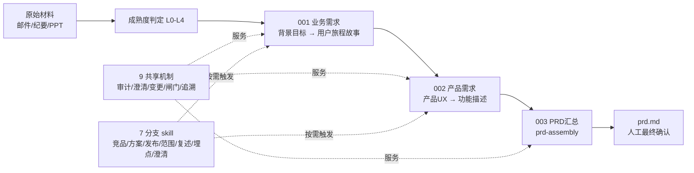

# PM Scaffold · 产品 AI 脚手架

> **PRD-only 产品经理 AI 工作流**：把原始需求材料（BRD、会议纪要、邮件、PPT）逐步转化为一份**经真实人工确认、可沟通、可实现、可核验的中文 `prd.md`**。

[](LICENSE)
[](https://github.com/konwait12/pm-scaffold)

---

## 它解决什么问题

AI 写需求最大的风险不是写得慢，而是：**推断冒充事实、没有人明确拍板、改了上游下游不知道**。本脚手架把「AI 写需求」变成「AI 起草 + 人拍板 + 全程可追溯」的受控流程：

- **六态知识标注**：每条声明必须标注 `FACT` / `DECISION` / `ASSUMPTION` / `AI_INFERENCE` / `UNKNOWN` / `CONFLICT`，AI 的推断永远冒充不了事实。
- **不可绕过的人工闸门**：`confirmed` 只能由真实评审人批准，产物 SHA-256 绑定评审记录；机器检查只能产出候选，永远不能产出确认。
- **双向可追溯**：目标 → 故事 → 功能 → 规则/验收，正反两个方向都能回溯；每条验收都链回它验证的业务目标。
- **变更闭环（Loop）**：上游变更自动级联失效下游并回流重跑，不让失效产物流入下游。
- **多源输入**：邮件、会议纪要、PPT、图片统一登记为 `SRC-*` 来源，逐条可溯源。
- **20 个同等丰富的 Skill**：5 主 + 8 子 + 7 分支，每个都有 10 节执行协议 + 7 类知识库 + 机器校验器。

---

## 快速开始

```bash
# 1. 初始化一个新需求骨架
python3 src/scripts/pipeline.py init REQ-001-my-feature

# 2. 把原始材料放进 requirements/REQ-001-my-feature/00-input/

# 3. 查看状态（当前激活项 / 下一步）
python3 src/scripts/pipeline.py requirements/REQ-001-my-feature status

# 4. AI 按 SKILL.md 起草 → 跑机器闸门
python3 src/scripts/pipeline.py requirements/REQ-001-my-feature gate --work-item project-background-goal

# 5. 真实人工确认（只有人能设 confirmed）
python3 src/scripts/pipeline.py requirements/REQ-001-my-feature review \
  --work-item project-background-goal --decision approve \
  --reviewer "评审人姓名" --reviewer-role "business_owner"
```

AI 执行体请读 [`AGENTS.md`](AGENTS.md)（唯一入口）。要求 Python 3.10+（核心脚本仅用标准库）。

---

## 工作流



每个 Work Item 走 8 步循环：`Preflight → Intake → Think → Clarify → Generate → Audit → Human Gate → Commit/Reflow`。机器闸门只能产出 `ready_for_human_review`，`confirmed` 只能由真实人工评审产生。

---

## Skill 全景（5 主 + 8 子 + 7 分支）

| 层 | Skill |
|---|---|
| 主（5） | `project-background-goal` · `user-journey-and-stories` · `product-ux` · `function-description` · `prd-assembly` |
| 子（8） | `ux-flow` · `page-design` · `interaction-rules` · `business-rules` · `validation-rules` · `state-machine` · `exception-handling` · `acceptance-criteria` |
| 分支（7） | `competitive-research` · `solution-assessment` · `prd-publish` · `project-scope` · `requirement-restate` · `tracking-plan` · `issue-record` |

每个 skill 拥有统一的完整结构：`SKILL.md`（10 节）+ `references/`（7 类）+ `agents/openai.yaml` + 手写语义 `validate_artifact.py` + 示例 + 回归测试。

---

## 目录

```text
src/framework/       宪法、契约、17 思考透镜、workflow-registry.json（唯一真相源）
src/stages/          3 阶段 × 5 主 skill + 8 子 skill
src/shared/          9 共享机制（审计/澄清/变更/闸门/追溯等）
src/support-skills/  7 分支/条件 skill
src/scripts/         pipeline / orchestrator / 校验器
src/templates/       22 个产物模板 + resolver
src/toolkit/         工具指南（Figma / Mermaid / lark-cli）
test/                回归测试（fixtures + 单元/集成）
```

权威来源：运行规则 [`src/framework/workflow.md`](src/framework/workflow.md)，阶段边界各 `src/stages/*/STAGE.md`，Skill 行为各 `SKILL.md`。

---

## 验证

```bash
bash run_tests.sh                              # 全量回归
python3 src/scripts/consistency_check.py       # 跨文档一致性
python3 src/scripts/pipeline.py <REQ-DIR> status  # 需求状态
```

## 许可

[MIT](LICENSE)
