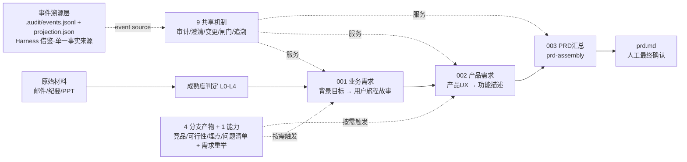

# PM Scaffold · 产品 AI 脚手架

> **PRD-only 产品经理 AI 工作流**：把原始需求材料（BRD、会议纪要、邮件、PPT、图片）逐步转化为一份**经真实人工确认、可沟通、可实现、可核验的中文 `prd.md`**。

[](LICENSE)
[](https://github.com/konwait12/pm-scaffold)
[](run_tests_mac.sh)

---

## 🌟 第一次来？先看驾驶舱

这是一个硬核项目、没有外部生态——**所有入门材料都在这一个文件里**：

```bash
open src/toolkit/visualization/scaffold-flow.html
```

打开后：左侧点「**📖 新手教程 · 从这里开始**」，10 章协作手册教你——用什么 Agent、怎么给 AI 下指令、从零到第一份 prd.md 的完整剧本。左侧导航是项目全景：流程图（每条线有条件标注）、19 个 Skill 说明书、产物说明书、19 个脚本说明书、命令全集、文件架构。**看完这个驾驶舱，你就了解这个项目的一切。**

---

## 它解决什么问题

AI 写需求最大的风险不是写得慢，而是：**推断冒充事实、没有人明确拍板、改了上游下游不知道**。本脚手架把「AI 写需求」变成「AI 起草 + 人拍板 + 全程可追溯」的受控流程：

- **六态知识标注**：每条声明必须标注 `FACT`（事实）/ `DECISION`（人类拍板）/ `ASSUMPTION`（假设，≤30% 硬顶）/ `AI_INFERENCE`（AI 推断）/ `UNKNOWN`（未知）/ `CONFLICT`（冲突）——AI 的推断永远冒充不了事实。
- **不可绕过的人工闸门**：`confirmed` 只能由真实评审人批准（真实人名 + 授权清单匹配 + 角色匹配），产物 SHA-256 绑定评审记录；机器检查只能产出候选，永远不能产出确认。
- **双向可追溯**：目标 → 故事 → 功能 → 规则/验收，正反两个方向都能回溯；每条验收都链回它验证的业务目标。
- **变更闭环（Loop）**：上游变更自动级联失效下游并回流重跑（`reflow --apply`），不让失效产物流入下游。
- **B3 每阶段强制收口**：每个工作项送审前，问题清单必须存在且收口表含该工作项行（空阶段也是审计证据），每个「待确认」必须带问题引用。
- **入口探索阶段**：`entry` 按材料内容判定 L0-L4；L0（仅想法）先发散收敛（候选人工处置），多源/歧义先需求复述——不带着糊涂需求进主干。
- **19 个同等丰富的 Skill**：5 主 + 9 子 + 4 分支产物 + 1 能力，每个都有统一的执行协议 + 7 类知识库 + 机器校验器 + 回归测试。

## 快速开始

```bash
# 1. 初始化一个新需求骨架
python3 src/scripts/pipeline.py init REQ-NNN-my-feature

# 2. 把原始材料放进 requirements/REQ-NNN-my-feature/00-input/

# 3. 查看状态（当前激活项 / 下一步 / 信号层）
python3 src/scripts/pipeline.py requirements/REQ-NNN-my-feature status

# 4. 入口判定（L0-L4 成熟度 + 材料是否充足 + 分支建议）
python3 src/scripts/pipeline.py requirements/REQ-NNN-my-feature entry

# 5. AI 按 SKILL.md 起草 → 跑机器闸门
python3 src/scripts/pipeline.py requirements/REQ-NNN-my-feature gate --work-item project-background-goal

# 6. 真实人工确认（只有人能设 confirmed；--reviewer-id 需与 00-input/authorized-reviewers.json 一致）
python3 src/scripts/pipeline.py requirements/REQ-NNN-my-feature review \
  --work-item project-background-goal --decision approve \
  --reviewer "评审人姓名" --reviewer-id "飞书或组织稳定用户ID" \
  --reviewer-role "business_owner"
```

要求 Python 3.10+（核心脚本仅用标准库）。AI 执行体请读 [`AGENTS.md`](AGENTS.md)（唯一入口）。

## 工作流



每个工作项走 8 步循环：`Preflight → Intake → Think → Clarify → Generate → Audit → Human Gate → Commit/Reflow`。机器闸门只能产出 `ready_for_human_review`，`confirmed` 只能由真实人工评审产生。产物状态机：`draft → needs_user_input / conditional_review / ready_for_human_review → confirmed`（`superseded` = 上游变更被级联失效）。

**贯穿全程的三类循环**（旧版「一闸门两分支」的机器化）：

| 循环 | 含义 | 机器落点 |
|---|---|---|
| 主循环 | AI 起草 → 自审 → 人工确认（唯一验收闸门） | 8 步循环 + gate + review |
| B1 纠错 | 驳回 → 修改 → 再送审 | review --decision changes→draft；连续 3 轮 changes → 熔断信号 |
| B2/B3 补全 | 不知道 → 问（重举 + 问题清单） | 入口复述 + issue-record 每阶段强制收口（dor_check 硬门禁）+ 7/14 天老化信号 |

## Skill 全景（19 个 · 数据源 workflow-registry.json）

| 层 | Skill |
|---|---|
| 主（5 · 主干必做） | `project-background-goal`（项目背景与目标）· `user-journey-and-stories`（用户旅程与故事）· `product-ux`（产品 UX）· `function-description`（功能描述）· `prd-assembly`（PRD 汇总，只聚合不发明） |
| 子（9 · 挂父产物章节） | `page-design`（页面设计）· `interaction-rules`（交互规则）· `feature-list`（功能清单）· `functional-flow`（功能流程）· `business-rules`（业务规则）· `validation-rules`（校验规则）· `state-machine`（状态机）· `exception-handling`（异常处理）· `acceptance-criteria`（验收标准） |
| 分支产物（4 · 触发才跑） | `competitive-research`（竞品调研）· `feasibility-analysis`（可行性分析）· `tracking-plan`（埋点计划）· `issue-record`（问题清单·B3 收口） |
| 能力（1 · 过程记录不进 PRD） | `requirement-restate`（需求重举：复述 + 发散收敛双模式） |

每个 skill 拥有统一的完整结构：`SKILL.md`（统一执行协议）+ `references/`（7 类知识库）+ `agents/openai.yaml`（Agent 路由元数据）+ `validate_artifact.py`（机器校验器）+ 示例 + 回归测试（含 violation 负例反向断言）。

## 命令速查

| 命令 | 作用 | 谁能改状态 |
|---|---|---|
| `python3 src/scripts/registry_contract_check.py` | registry 自检（schema + 模板↔校验器闭环 E3_drift），作为 `run_tests_mac.sh` 第一项 fail-loud | 只读 |
| `pipeline.py init REQ-NNN-topic` | 建需求骨架 | 机器（仅骨架） |
| `pipeline.py <req> status` | 状态 + next + 越级检测 + 信号层 | 只读 |
| `pipeline.py <req> entry` | L0-L4 内容判定 + entry_blocked + 分支信号 | 只读 |
| `pipeline.py <req> gate --work-item X` | 机器闸门（DoR/DoD/六态/自审/B3 收口/追溯） | 只读 |
| `pipeline.py <req> review --decision approve/changes` | 人工评审 | **人工（唯一写 confirmed 的路径）** |
| `pipeline.py <req> reflow [--apply]` | 变更回流（dry-run → --apply 级联失效） | 机器（--apply 才写） |

## 目录

```text
src/framework/       宪法、契约、17 思考透镜、workflow-registry.json（唯一真相源）
src/stages/          3 阶段 × 5 主 skill + 9 子 skill + requirement-restate（能力）+ tracking-plan（分支）
src/support-skills/  2 支持 skill（competitive-research / feasibility-analysis）
src/shared/          9 共享机制（审计/澄清/变更/闸门/追溯等）+ issue-record（B3 收口）
src/scripts/         pipeline / orchestrator / dor_check 等 18 个脚本（含 audit_log / projection_cache / registry_contract_check / validation_errors 四项 Harness 借鉴基础设施）
src/templates/       18 个产物模板 + resolver（优先级栈）
src/toolkit/         工具指南 + visualization/（驾驶舱 HTML）
test/                回归测试（fixtures 正反例 + 单元/集成）
requirements/        你的需求实例（运行时生成，gitignore——每个用户的需求是自己的）
```

权威来源：运行规则 [`src/framework/workflow.md`](src/framework/workflow.md)，阶段边界各 `src/stages/*/STAGE.md`，Skill 行为各 `SKILL.md`，注册表 `src/framework/workflow-registry.json`。冲突时以注册表为准。

## 新手 FAQ

- **gate 被拦了？** 三种原因按序排查：① `entry_material`——00-input 还没有 SRC-*.md 材料；② 六态不全覆盖或 ASSUMPTION >30%；③ `stage_closeup`——issue-record 不存在或收口表缺当前工作项（空阶段也要落行）。
- **review 报错？** `--reviewer`（真实人名）/`--reviewer-id`/`--reviewer-role` 缺一不可，且必须与 00-input/authorized-reviewers.json 逐项匹配。
- **requirements/ 哪去了？** 被 gitignore——每个用户的需求是自己的，用 `init` 随时生成。
- **L0 只有一句想法？** 先需求重举（发散模式）发散候选（人工四值处置），include 的候选就是背景目标的输入。

## 验证

```bash
bash run_tests_mac.sh                          # 全量回归（84 项，含负例反向断言；首项 registry_contract_check）
python3 src/scripts/consistency_check.py       # 跨文档一致性
python3 src/scripts/pipeline.py <REQ-DIR> status  # 需求状态
```

## 贡献

见 [CONTRIBUTING.md](CONTRIBUTING.md)。核心纪律：注册表是唯一真相源；fixtures 一律用占位符；AI 不得产生 confirmed。

## 许可

[MIT](LICENSE)
