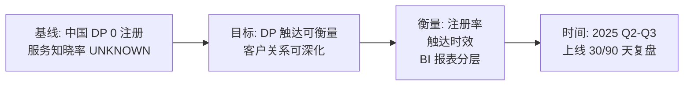
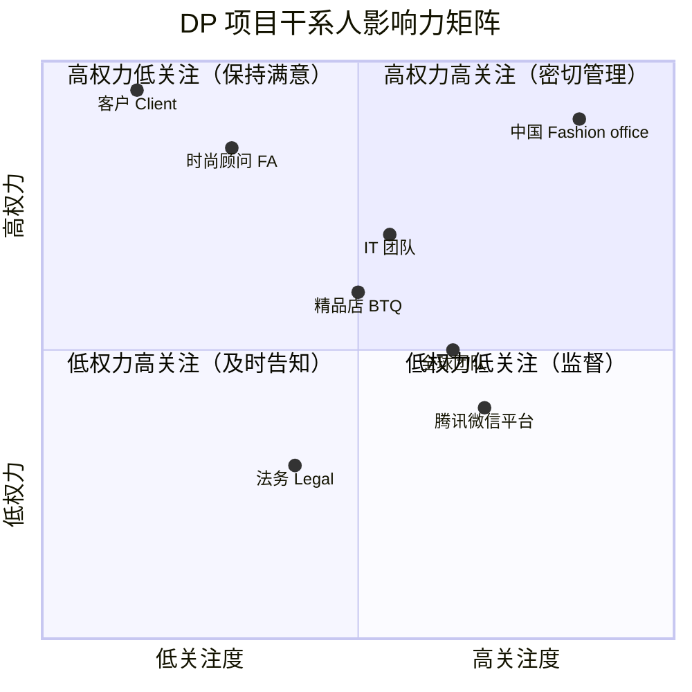
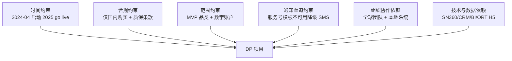

# 项目背景与目标

> 项目类型：从 0 到 1（PM 已于 2026-09-02 三选一确认，与 AI 初判一致；判断证据与可能误判点见治理伴随文件）
> 一句话摘要：香奈儿时尚中国要在微信生态首次建立 Digital Passport 数字产品护照能力，让客户购买后实时获得产品与保修信息、护理指南和售后入口，以深化客户关系并量化采用进展。
> 治理伴随文件：BG-CHANEL-001.governance.md
> 知识状态标注说明：本文对关键主张行内标注六态知识状态——FACT（材料明确陈述）、DECISION（业务方已做的决定，含 PM 已确认项）、ASSUMPTION（待验证假设）、AI_INFERENCE（AI 依据材料的推断）、UNKNOWN（材料未给出）、CONFLICT（材料间冲突）。完整主张-来源-状态矩阵、澄清记录与审计结论见治理伴随文件，不在本文展开。

## 一句话摘要

香奈儿时尚中国（FASHION MAINLAND CHINA）要在微信生态内首次建立 Digital Passport（数字产品护照，下称 DP）服务能力：客户在国内购买手袋或成衣后，由时尚顾问（FA）在销售流程中创建 DP，DP 实时送达客户的小程序账户，客户可在其中查阅产品与保修信息、获得护理指南、直达预约与维修追踪等售后服务；项目以此随时间深化客户关系、让 CHANEL & moi 售后关怀服务在中国更可见可感，并以 DP 注册率等指标量化采用与进展（FACT：以上为两份材料对项目范围与动机的明确陈述；"首次建立"的判断依据见治理文件，属 AI_INFERENCE，项目类型「从 0 到 1」已经 PM 确认）。

## 术语与缩略词

| 术语 / 缩略词 | 说明 | 来源 |
|---|---|---|
| DP | Digital Passport 数字产品护照——承载产品、购买与保修信息的数字化凭证，随客户购买生成 | 材料定义 |
| CHANEL & moi | 香奈儿面向客户的"作品持久关怀"主张，DP 是其在微信生态的数字化触点 | 材料定义 |
| FSN MP / FSN SA | FSN 小程序 / FSN 服务号（材料未给出 FSN 全称，沿用材料称谓）——客户持有与查看 DP 的两个入口 | 沿用材料称谓（全称需澄清） |
| FA | Fashion Advisor 时尚顾问——销售仪式中介绍主张、检查客户数字账户、创建 DP 的执行角色 | 材料定义 |
| HBG | Handbags 手袋——MVP 品类之一，含 Warranty 字段与 ORT 入口 | 材料定义 |
| RTW | Ready-to-Wear 成衣——MVP 品类之一，含 Size 字段，无 Warranty 与 ORT | 材料定义 |
| WOC / SLG | Wallet On Chain（手袋细类）/ Small Leather Goods 小型皮具——SLG 按全球计划 2025 Q2 跟进 | 材料定义 |
| OAB | Online Appointment Booking 在线预约——DP 详情直达的 e-service | 材料定义 |
| ORT | Online Repair Tracking 在线维修追踪——DP 详情直达，现仅见于手袋详情 | 材料定义 |
| ICON / CORE | FA 工具——ICON 为仪式中创建 DP，CORE 为仪式后从购买历史补建 | 材料定义 |
| POS | Point of Sale 收银系统——DP 创建状态需在 POS/ICON/CORE 间实时同步 | 材料定义 |
| SN | Serial Number 产品序列号——DP 核心字段之一，分享时去除 | 材料定义 |
| BTQ | Boutique 精品店——处理退换货与再销售，可查看本店 DP 指标 | 材料定义 |
| InCHANEL | 香奈儿客户身份体系与同名小程序——DP 计划 2025 年随其上线 | 材料定义 |
| EDM / SMS | 邮件通知 / 短信通知——DP 通知的两个外部渠道 | 材料定义 |
| PCN / Gifting | 海外购买方案 / 送礼场景——均列在本次不覆盖范围（等待全球专属方案） | 材料定义 |

## 项目背景

CHANEL & moi 是香奈儿面向客户售后关怀的业务伞：每件香奈儿作品封存客户与品牌的独特关系，CHANEL & moi 为每件作品提供持久关注；目前它通过覆盖全产品线的护理与维修服务体现（FACT，IT intake"Why"与"How embodied today"部分）。业务方为该项目确立了两大目标：随时间深化客户关系；通过护理与维修服务承诺品质（DECISION）。

Digital Passport 是一个面向所有产品线的数字产品信息查询工具，并可作为直达服务的入口：客户可以用它查询产品与保修关键信息、依据护理指南保持作品品质、更快获得售后响应（FACT）。全球 DP 服务自 2021 年 4 月启动：手袋与链条包（Handbag & Wallet On chain）自 2021 年 4 月 1 日起可创建 DP，成衣（RTW）计划 2024 年 11 月底加入，小皮具（SLG）计划 2025 年加入（FACT；启动日期在材料中另有一处 2021 年 4 月 8 日的表述，见"待确认与风险"第 7 条 CONFLICT）。

业务方认为，把 DP 带入微信生态，能在 CHANEL & moi 伞下为客户端连接创造一个"全新时刻"：让客户对作品的渴望与拥有转化为可感知的数字化体验，把 CHANEL & moi 打造成数字化的信息中心与更专属、个性化的服务门户，强化 CHANEL & moi 在中国的落地，并以 DP 注册率等方式量化采用与进展（DECISION，IT intake 业务价值页）。

为什么是现在（AI_INFERENCE，依据材料时间线索归纳）：材料高层时间线显示本项目 2024 年 4 月起启动，2024 年 9 月已进入方案设计、开发与测试阶段，UAT 后计划 2025 年随 InCHANEL 小程序一起上线；同时 RTW 品类全球即将于 2024 年 11 月底加入 DP，为品类扩展窗口；IT 材料还列出了 9 月 11 日跨职能研究输入、9 月 18 日工作量估算、9 月 30 日 MVP 范围优先级排序等近期节点（FACT）。

## 当前现状与已有做法

按「从 0 到 1」类型还原现状（项目类型已由 PM 于 2026-09-02 三选一确认）：中国市场尚无微信生态内的 DP 能力，但全球服务、既有渠道与人工做法均已存在。

已有业务与做法：

- 全球 DP 服务已运行（FACT）：2021 年 4 月启动，覆盖手袋与 WOC；RTW 计划 2024 年 11 月底、SLG 计划 2025 年（TBC）。

- 全球数据追踪基础已有（FACT）：全球 SN 仪表板提供市场/区域级 DP 注册率；EU 仪表板提供按精品店、按 FA 的 DP 注册，是中国本地数据设计的主要参考。

- 中国微信渠道已存在（FACT）：FSN 小程序（页面名称"香奈儿尊享时尚精品"）与 FSN 服务号已运行，具备数字账户注册能力；但 DP 能力尚未进入微信生态（AI_INFERENCE：材料以"全新时刻""强化在中国落地"等表述支持此判断，未直接陈述"中国当前无 DP"；该判断与 PM 确认的「从 0 到 1」类型一致）。

- FA 销售与售后做法已存在（FACT）：销售在精品店销售仪式中完成，也含远程销售；FA 使用 ICON 与 CORE 两个工具——ICON 覆盖约 95% 的销售，CORE 覆盖 100% 的交易（含换货、员工购买等边缘情况）；CHANEL & moi 护理与维修服务已面向全产品线存在。

- 中国客户当前获取保修信息与售后的做法（UNKNOWN）：材料未描述无 DP 时客户如何获取产品/保修信息、护理指南或联系售后，及其耗时与频率，待 PM 补充。

要建立的完整业务流程（材料定义的 MVP 业务流程概览，FACT）：

1. 销售仪式中，FA 向客户介绍 CHANEL & moi 与 DP，检查客户是否已有数字账户，没有则邀请注册 FSN 小程序，随后协助结账（含远程销售场景）。
2. FA 在 ICON（仪式中或仪式后）或 CORE（仪式后）按场景创建 DP：为整单创建全部合格 DP、仅为选定产品创建、或不创建。
3. DP 创建与支付完成后，客户通过服务号消息、EDM、SMS 或小程序内提醒即时获知，DP 实时进入客户的 FSN 小程序账户。
4. 客户登录小程序后浏览、搜索、筛选、分享、删除 DP，并经 DP 直达 e-services（预约服务 OAB、在线维修追踪 ORT）。
5. 退换货时，DP 与客户直接解除关联，精品店可立即重新销售该商品；换货时若产品符合条件，FA 需重新激活 DP。

## 核心问题与证据

问题一：CHANEL & moi 的护理与维修服务在中国客户触点中不够"可见、可感"。

- 影响：客户关系难以随时间深化，售后关怀的品牌价值传递受限。

- 证据：IT 材料以设问"如何加速让 CHANEL & moi 更可见、更可感"呈现业务动机，并以业务价值页陈述微信 DP 的意义（定性，FACT）。当前服务知晓率、使用率等量化数据材料未给出（UNKNOWN，取数路径见"待确认与风险"第 2 条）。

问题二：中国客户在微信生态内没有所购产品的数字护照触点。

- 影响：客户无法即时查阅产品与保修信息、无法获得护理指南、进入售后服务的路径更长（AI_INFERENCE：由材料"DP 允许客户做的三件事"反推该缺口，材料未直接描述现状痛点）。

- 证据：材料将微信生态 DP 定位为"全新时刻"，且中国本地方案需新建本地 DP 服务与后端（FACT，方案概览部分）；中国客户当前 DP 注册率等基线数据缺失（UNKNOWN）。

问题三：DP 的采用与业务进展在中国本地无法量化。

- 影响：无法按精品店和 FA 跟进 DP 注册、无法基于客户行为（如功能点击、浏览时长）优化客户旅程。

- 证据：材料明确将"量化采用与进展，如 DP 注册率"列为业务价值，并提出 BI 报表需求；全球仪表板已有，而中国本地 BI 需求待建（FACT）。

问题四（风险前置）：通知触达依赖腾讯消息模板政策。

- 影响：若服务号新消息模板不可用，DP 通知需降级为 SMS、EDM 与小程序提醒组合。

- 证据：材料明确标注"腾讯严格管控微信服务号新消息模板"为风险，并已给出模板不可用时的通知降级规则（FACT；降级规则属 DECISION）。

**问题链路图**——把三个核心问题与影响、证据串成链路，PM 一眼看清立项逻辑：

```mermaid
flowchart LR
  P1[CHANEL & moi 服务<br/>在中国不够可见可感] --> I1[客户关系难深化<br/>品牌价值传递受限]
  I1 --> E1[IT 材料设问 + 业务价值页 FACT]
  P2[中国客户在微信生态<br/>没有 DP 数字触点] --> I2[无法即时查产品保修<br/>进售后路径长]
  I2 --> E2[材料定位"全新时刻"<br/>中国需新建本地 DP FACT]
  P3[DP 采用与业务进展<br/>在中国无法量化] --> I3[注册率等基线缺失<br/>无法衡量进展]
  I3 --> E3[材料未给量化数据 UNKNOWN]
```

## 目标与成功判断

业务目标（材料陈述，DECISION）：

1. 随时间深化客户关系，通过护理与维修服务承诺品质。
2. 在微信生态内、CHANEL & moi 伞下创造客户端连接的全新时刻，强化 CHANEL & moi 在中国的落地。
3. 量化采用与进展，例如 DP 注册率。

交付结果（MVP 要建立的业务结果，概述自材料，FACT）：

1. FA 能在销售流程中为国内购买的手袋/WOC 与 RTW 产品创建 DP（含代客创建与三种场景化创建）。
2. 国内客户在 FSN 小程序内实时获得 DP，可查阅、维护、分享 DP 并直达售后服务（OAB/ORT）。
3. 退换货闭环：DP 解除关联、精品店可立即转售。
4. 中国本地数据能力：客户行为（按产品/DP 视图的功能点击、浏览时长；按交易视图的创建概览）与按精品店、FA 的 DP 注册状态可追踪，以 BI 报表呈现，支持时间、客户分层（Fashion 10 段）、区域、精品店、交易类型、产品线等维度分析。

成功判断——现状锚定与候选指标：

现状基线（材料未给中国本地量化数据，UNKNOWN）：中国 DP 注册率、通知到达时延、DP 访问转化等均无基线值。按基线数据引导，建议取数路径：全球 SN 仪表板（查中国市场/区域级现有 DP 注册率）、EU 仪表板（按精品店/FA 口径参考）、We-analyze 与 CRM 现有埋点和报表（小程序现有行为基线）、售后人工记录/工单（当前售后请求量与耗时）、抽样统计与业务负责人估算（以上均不可得时的最低置信路径，估算须记录估算人）。

候选成功指标（均 ASSUMPTION：口径与目标值未经 PM 确认，确认口径后才可升级为 DECISION）：

| 候选指标    | 统计口径                                    | 数据来源             | 状态         |
| ------- | --------------------------------------- | ---------------- | ---------- |
| DP 注册率  | 创建 DP 的合格产品/交易/客户占比（分母口径待确认）            | CN DP 服务 + BI 报表 | ASSUMPTION |
| 通知到达时延  | DP 创建且支付完成 → 客户收到首条通知；均值与 P90（材料要求"即时"） | 通知中心日志           | ASSUMPTION |
| 跨系统同步时延 | POS/ICON/CORE 间 DP 创建状态同步；P90（材料要求"实时"） | 系统日志             | ASSUMPTION |
| DP 访问转化 | 收到通知后 30 天内访问 DP 列表的客户占比（观测窗口待确认）       | We-analyze 埋点    | ASSUMPTION |
| 售后入口使用  | 经 DP 进入 OAB 预约/ORT 追踪的使用量与占比            | e-services 系统    | ASSUMPTION |

承诺与观测的区分：材料要求 DP 创建与支付后通知"即时"、POS/ICON/CORE"实时"同步，属于对客户的体验承诺，需在落地时明确例外情形（如服务号模板不可用降级 SMS、系统故障豁免口径）；其余为内部观测指标，需明确统计窗口（建议上线后 30/90 天，ASSUMPTION）。未选定保留：以上候选供 PM 选择，未采纳项及原因记录于治理文件备查。

时间窗口：材料高层时间线显示 2024 年 9 月处于方案设计、开发与测试阶段，UAT 完成后 go live，计划 2025 年随 InCHANEL 小程序上线（FACT；具体月份由材料时间轴图读取，约 2025 年 4–6 月区间，AI_INFERENCE，待确认）。

**目标链路图**——把基线→目标→衡量指标→时间窗口串成链路：



## 角色与干系人

- 客户（Client）：直接受益方——获得产品与保修信息、护理指南、更快的售后响应；需注册数字账户并登录 FSN 小程序才能持有和查看 DP（FACT）。

- 时尚顾问（FA）：流程关键执行者——销售仪式中介绍 CHANEL & moi 与 DP、检查客户数字账户、创建 DP；新增操作步骤，同时获得深化客户关系的抓手（FACT）。

- 精品店（BTQ）与精品店管理团队：处理退换货与再销售；可查看本店相关 DP 指标（FACT）。

- 中国 Fashion office（Digital Service Innovation & Client Experience 团队）：项目发起方；区域级概览与精品店间比较数据仅对其开放（FACT）。

- IT 团队与跨职能团队：方案设计、开发、测试、BI 建设；按材料后续节点推进跨职能研究与工作量估算（FACT）。

- 全球团队：提供全球 DP 服务、护理内容、信息字段缺失场景的 figma 原型、Gifting 与 PCN 方案；全球验证周期影响本地排期（FACT）。

- 法务（Legal）：确认 CHANEL 质保条款（FACT）。

- 腾讯/微信平台：外部约束方——服务号消息模板管控政策影响通知方案（FACT）。

**干系人影响力矩阵**——权力 × 关注度四象限，谁拍板谁执行一眼看清：



## 约束与依赖

- 合规约束：仅国内购买可加入 DP（法律与 PCN 方案限制）；CHANEL 质保条款需与法务确认（FACT）。

- 范围约束（DECISION）：只有注册数字账户（FSN 小程序或服务号）的客户可持有 DP；MVP 品类为手袋/WOC 与 RTW，SLG 按全球计划目标 2025 年 Q2。

- 通知渠道约束（DECISION）：服务号消息模板可用时用服务号消息 + EDM + 小程序提醒，未关注服务号的客户收 SMS；模板不可用时降级为 SMS + EDM + 小程序提醒。

- 组织协作依赖：依赖全球团队（内容、原型、Gifting/PCN 方案、验证周期）与本地系统节奏（InCHANEL 小程序时间线、FA 工具与 SMART 依赖）（FACT）。

- 技术与数据依赖（ASSUMPTION，材料标注为方案假设）：依赖 SN360、Service Catalog、YEXT、CRM LION/PIONEER 等使能系统；BI 数据来自 We-analyze、CN DP 服务、CRM 三个来源；ORT H5 方案与性能待定；DP 列表的搜索与筛选待技术方案。

- 时间约束：高层时间线为 2024 年 4 月启动、2025 年 go live；系列上新日期待定，精品店日历（上新、活动）影响培训与试点安排（FACT/部分待确认）。

**约束/依赖关系图**——把六类约束按依赖关系画出，避免散落在列表里：



## 边界与非目标

- 本次不覆盖（FACT，材料 MVP 指南与范围图）：Gifting 送礼场景（等待全球专属方案）；海外购买（等待 PCN 方案）；召回 DP、传递 DP、客户沟通与个性化内容（未来阶段）；SLG 品类（全球计划 2025 年 Q2 后跟进）；FA 侧详细旅程（材料注明另行分享）。

- 远程销售：FA 销售仪式环节明确包含远程销售场景（DECISION），但对应的客户旅程待定义（UNKNOWN，材料后续步骤中明确列为待办）。

- 数据权限边界：精品店级指标对精品店管理团队开放、店内可按角色授权；区域概览与精品店比较仅 Fashion office 可见（DECISION）。

- 本文不写功能清单、页面字段、接口与技术实现，相关内容留给下游工作（按本 skill 输出契约）。

## 待确认与风险

1. ~~项目类型待 PM 三选一确认~~已闭环（2026-09-02）：PM 拍板「从 0 到 1」，与 AI 初判一致，已回写 frontmatter 与类型写法。备查：若以全球 DP 服务为既有系统、视中国上线为其本地化扩展，存在被判为迭代/扩展的视角，记录于治理文件。
2. 量化基线缺失（UNKNOWN）：中国 DP 注册率现状、无 DP 时客户获取售后服务的耗时与方式、通知触达现状均无数据。建议取数路径：全球 SN 仪表板与 EU 仪表板（现有 BI）、We-analyze/CRM 埋点、售后人工记录、一周抽样统计、业务负责人估算（估算须记录估算人并按假设登记）。不确认的后果：目标无法验证，"缩短/提升"类表述无从落地。
3. 成功指标口径与目标值（见候选指标表）均为候选（ASSUMPTION）：需 PM 选定指标、确认口径与目标值，未选定项保留备查。
4. 腾讯服务号消息模板可用性（FACT 风险）：影响通知方案与体验承诺的例外口径；材料已给降级规则，但模板获批时间未知。
5. 内容与法务依赖：HBG 差异化护理内容待与全球确认（TBC）、质保条款待法务确认、信息字段缺失/错误场景的原型待全球提供（FACT）。
6. 关键日期待确认：go live 具体日期及与 InCHANEL 小程序上线的联动；RTW 全球 2024 年 11 月底上线与中国本地节奏的衔接；试点（Pilot，材料标注目标 2025 年）范围与精品店选择。
7. 材料内部不一致（CONFLICT，保留不擅自取舍）：全球 DP 启动日期一处为"手袋与 WOC 自 2021 年 4 月 1 日起"、另一处为"2021 年 4 月 8 日启动"；Gifting 场景在 9 月版材料 MVP 范围图中出现于 MVP 框内，但两版材料的 MVP 指南均注明"等待全球专属方案"。
8. 中国客户当前（无 DP 时）保修信息获取与售后做法材料未描述（UNKNOWN）：影响"现状与问题"的证据强度，建议 PM 补充原始材料或说明。

## 参考资料

- [《Chanel & moi Digital Passport — Client Journey》（SRC-001）](https://ccegroup.feishu.cn/file/EVgUbpbpQon6maxfigKc8NCVnGb)——FASHION MAINLAND CHINA，Digital Service Innovation & Client Experience，2024 年 6 月，内部材料。本地副本 `raw/client-journey.txt`（主张引用按此文件行号定位）。涵盖 DP 宏观旅程（FA 与客户）、FSN 小程序主旅程（通知、入口、浏览与编辑、e-services）、退换货场景与后续步骤。

- [《Chanel & moi Digital Passport — IT Intake》（SRC-002）](https://ccegroup.feishu.cn/file/SmWfbwJfioNdfxx45fKc6WHHnqd)——FASHION MAINLAND CHINA，同上团队，2024 年 9 月，内部材料。本地副本 `raw/it-intake.txt`。涵盖背景与业务价值、FA 与客户旅程业务需求、数据追踪需求与维度、高层项目时间线、方案与架构假设、后续步骤（9/11、9/18、9/30 节点）。


（以上均为本次任务的唯一事实输入；主张的行号定位对应本地副本，飞书链接为便于团队查阅的原文入口。）
