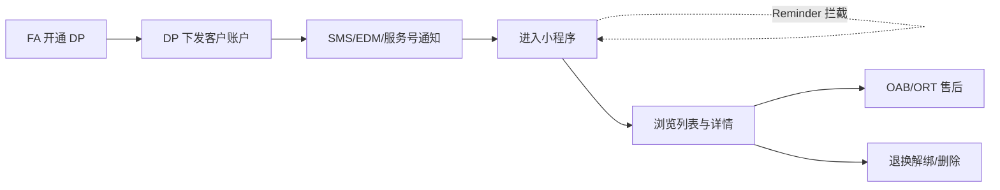
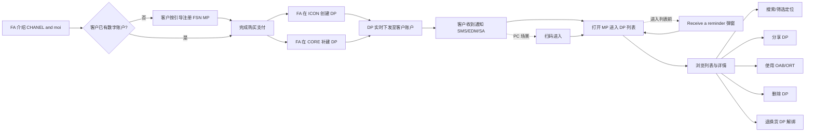
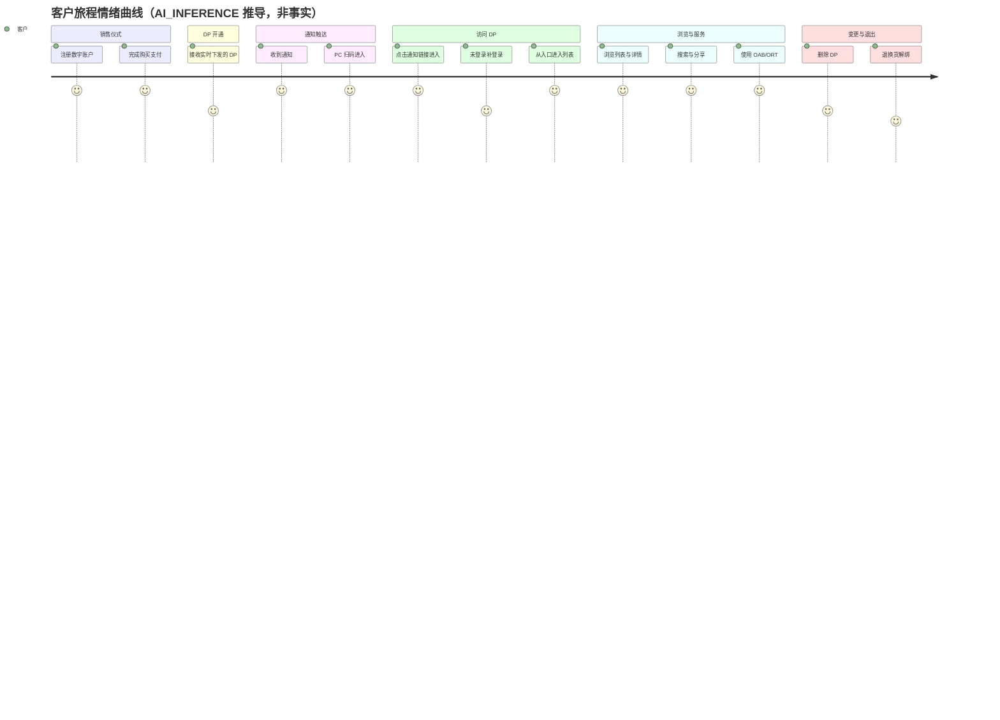
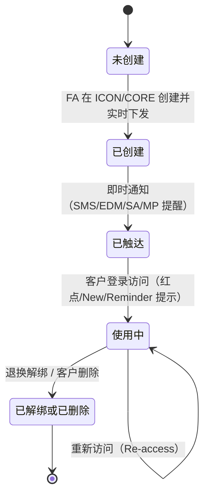

# 用户旅程 · Chanel & moi Digital Passport（FSN 小程序客户旅程 · 候选基线）

## 预检与摘要

- **上游状态**：上游 `project-background-goal` 产物 BG-CHANEL-001 存在但为**候选基线**（v0.2，status=needs_user_input，项目类型已由 PM 确认为从 0 到 1）。按 skill 输入边界，本旅程仍为基于原始材料的**候选基线**，全部内容须待授权人类确认后方可作为下游输入，任何内容不写成已确认事实。
- **事实输入（材料隔离测试模式）**：仅使用 PM 本轮指定的两份原始材料——SRC-001（client-journey.txt，2024-06，客户旅程 PDF 文本）与 SRC-002（it-intake.txt，2024-09，IT Intake 会议材料）。未使用联网搜索、行业常识、其他项目文件、reference 示例、上游 BG 产物或模型记忆补充旅程事实；reference 仅作方法背景。
- **材料成熟度**：L3（角色、阶段、触点和部分分支清楚；情绪证据缺失）。角色：客户（Client）、时尚顾问（FA）。生命周期：6 个业务阶段（销售仪式 → DP 开通 → 通知触达 → 访问 DP → 浏览与服务 → 变更与退出）。
- **材料解读三分法**：
  - 材料明确说了什么：宏观旅程（销售仪式中/后）、MVP 范围与排除项（Gifting、海外购买）、通知渠道与降级规则、MP 内三种提醒形态（红点/New 标签/Reminder 弹窗）、访问入口与身份标注（All user / Authorised InCHANEL Client）、浏览/搜索/分享/删除行为、HBG 与 RTW 详情字段与入口差异、退换解绑规则、FA 工具（ICON/CORE）创建与状态实时同步、数据追踪目的与维度。
  - AI 的理解（AI_INFERENCE）：旅程起点=销售仪式开始，终点=客户长期重新访问 DP 或 DP 解绑/删除；宏观旅程中 "Today's focus" 标注在文本版式上无法精确定位，推断指向仪式后创建与客户侧查看环节；"Follow SA and register the FSN MP" 中的 SA 更可能指 FSN 服务号；身份×登录×资产状态三维分支将作用于每个通知/访问入口（影响面见「旅程覆盖与边界」分支骨架）。
  - 材料无法证明：任何客户情绪/满意度；Reminder 弹窗的触发频率与文案；EDM 模板的选择规则；搜索/筛选/显示视图/分享的技术可行性；ORT H5 体验；FA 重新激活 DP 的确切条件；无 DP（删光/解绑后）的入口与空态页去向。
- **粒度判断**（Q-GR-001 已由 PM 答复）：材料同时包含业务层宏观旅程（SRC-001·L120-151；SRC-002·L186-215）与 FSN 小程序内产品层流程（SRC-001·L219-1014），PM 于 2026-09-02 确认按「业务层为主 + 产品层展开（子表分开）」产出（选项 C），frontmatter `granularity = business+product`。
- **v0.2 变更摘要（2026-09-02，深版）**：吸收盲测对比报告 P0/P1 改进，全部仅以两份原始材料可证内容为限，未引入 BRD/外部事实——① HBG/RTW 品类强制分列（详情字段、功能/信息入口、ORT 适用范围，对应 A-1/A-2/A-5）；② Reminder 弹窗识别为 MP 内第三提醒形态并追问规则（A-3）；③ EDM 三模板枚举（A-4）；④ 通知/提醒形态枚举清单（A-3 修复）；⑤ 身份×登录×资产状态分支骨架与资产空态矩阵（A-6、P1）；⑥ SMS/EDM 动态占位符登记（A-7，轻度）。粒度与范围沿用 v0.1 口径（Q-GR-001 已闭环）。
- **状态**：`needs_user_input`——情绪证据缺失、CONFLICT-001 未裁决、范围/部分分支与规则待确认（见「待确认与风险」与治理伴随文件澄清记录）。

## 一句话旅程叙事

客户在精品店（或远程）购买可开通 Digital Passport 的产品后，由 FA 在销售仪式中（ICON）或仪式后（CORE 购买历史）开通 DP，DP 实时下发至客户 FSN 小程序账户并经短信/邮件/服务号消息即时触达，客户进入小程序时还可能收到红点（我的作品入口）、New 标签（图片左上）或 Reminder 弹窗（进入列表前）等提醒；客户登录后经由通知链接或「我的作品 / CHANEL & moi」入口访问自己的 DP，长期查阅产品、购买与保修信息（手袋与成衣的信息字段与入口按品类分列）并直达护理与售后服务（OAB 两者皆有、ORT 现仅见于手袋详情），直至退换货解绑或主动删除（完成标志：客户可随时重新访问 DP，或 DP 与客户解绑/移除）。

**旅程概览图**——叙事后立即配图，避免读者读到 §3 才看到图：

## 业务生命周期分解

| # | 业务阶段 | 触发 | 主要角色行为 | 触点 | 业务结果 | 主路径类型 |
|---|---|---|---|---|---|---|
| S1 | 销售仪式·账户与购买 | 客户到店/远程发起购买 | FA 介绍 CHANEL & moi（与 DP）、检查数字账户；无账户客户按引导注册；完成支付 | 精品店销售仪式 · FA 工具 · FSN MP | 客户具备数字账户且交易成立（DP 前提齐备） | normal |
| S2 | DP 开通 | 支付完成/交易成立 | FA 在 ICON（仪式中）或 CORE（仪式后）按场景创建 DP；客户被动接收 | ICON · CORE · FSN MP 账户 | DP 实时下发至客户 FSN MP 账户 | normal（备选：仪式后 CORE 补建） |
| S3 | 通知触达 | DP 创建且支付完成后（要求即时） | 客户经 SMS/EDM/服务号消息获知 DP 已开启；未关注服务号者收 SMS，模板不可用时整体降级 | 短信 · 邮件 · FSN SA | 客户知悉并可前往查看 DP | normal（备选：模板不可用 SMS 兜底、PC 扫码） |
| S4 | 访问 DP | 客户点击通知或主动进入入口 | 经通知链接/MyAccount/SA 菜单进入；未登录先完成登录；进入列表前可能收到 Reminder 弹窗，入口有红点/New 提示 | 通知链接 · MyAccount 入口 · CHANEL & moi 菜单 · 登录 · MP 内提醒 | 客户可达 DP 列表（仅登录可见） | normal（异常：未登录） |
| S5 | 浏览与服务 | 客户进入 DP 列表/详情 | 浏览列表与详情（HBG/RTW 字段与入口分列）、搜索筛选、分享、进入 OAB/ORT | DP 列表/详情 · 微信分享 · OAB/ORT | 客户可查阅产品/购买/保修信息并使用售后服务 | normal（备选：搜索/分享/删除） |
| S6 | 变更与退出 | 退换货发生或客户主动删除 | DP 与客户直接解绑；客户删除 DP（材料假设删除的是最后一件） | 精品店退换流程 · 删除入口 | DP 移除（退货商品精品店可立即转售） | exception（退换）/ alternative（删除） |

各阶段触发、行为、触点、结果、路径类型的逐节点证据见「角色旅程矩阵」。

## 角色旅程矩阵

先建空网格后填充：2 角色 × 6 阶段 = 12 格，无缺格；FA 在 S3/S4 未参与，如实留空并注明原因，不虚构行为填充。

### 网格总览（节点 ID 分布）

| 角色 \ 阶段 | S1 销售仪式 | S2 DP 开通 | S3 通知触达 | S4 访问 DP | S5 浏览与服务 | S6 变更与退出 |
|---|---|---|---|---|---|---|
| 客户（Client） | C-1、C-2 | C-3 | C-4、C-5 | C-6～C-9 | C-10～C-14 | C-15、C-16 |
| 时尚顾问（FA） | FA-1～FA-4 | FA-5～FA-9 | —（未参与：通知由客户侧渠道触达，FA 无节点） | —（未参与：访问为客户侧动作，FA 无节点） | FA-10、FA-11 | FA-12 |

### 客户（Client）独立叙事

客户在销售仪式中经 FA 介绍了解 CHANEL & moi；若无数字账户则按引导注册 FSN MP（数字账户是持有 DP 的硬前提）并完成支付（含远程销售场景）。DP 由系统实时下发至其 FSN MP 账户，客户通过短信/邮件/服务号消息获知 DP 已开启；进入小程序后还依赖三类 MP 内提醒——我的作品入口红点、图片 New 标签、进入列表前的 Reminder 弹窗。客户点击通知链接（或从「我的作品」入口、FSN SA「CHANEL & moi」菜单进入；未登录先完成登录）到达 DP 列表，浏览全部 DP 的产品、购买与保修信息——其中手袋与成衣详情的字段和功能/信息入口不同（详见产品层展开品类对照表），查阅护理说明，按需搜索筛选、切换显示视图、分享给微信好友（敏感信息自动去除）、直达 OAB 预约与 ORT 在线维修追踪（ORT 现仅见于手袋详情）；直至退换货时 DP 与自己直接解绑，或主动删除某件 DP。

（矩阵每格情绪：材料未提供任何可观察情绪证据，全部标 UNKNOWN；画板中顺畅度曲线为按路径类型推导的 AI_INFERENCE，推导规则见「路径与情绪」。）

### 客户节点明细

| 节点 | 阶段 | 行为（业务层） | 触点 | 路径类型 | 情绪/可观察信号 | 证据（知识状态·来源） |
|---|---|---|---|---|---|---|
| C-1 | S1 | 在 FA 介绍 CHANEL & moi 后按引导完成 FSN MP 数字账户注册（无账户分支；原文 "Follow SA and register the FSN MP"，SA 指代待确认——AI_INFERENCE：更可能为 FSN 服务号） | FA · FSN MP | alternative | UNKNOWN | FACT（SRC-001·L120-151；SRC-002·L278-281） |
| C-2 | S1 | 完成购买支付 | FA 协助结账（含远程销售） | normal | UNKNOWN | FACT（SRC-001·L142-144；SRC-002·L195-197） |
| C-3 | S2 | 无需主动操作，接收实时下发至 FSN MP 账户的 DP | FSN MP 账户 | handoff | UNKNOWN | FACT（SRC-002·L401-402） |
| C-4 | S3 | 通过 SMS/EDM/服务号消息收到 DP 通知（要求 DP 创建与支付完成后即时送达）；材料通知规则页把「MP 内提醒」计入触达组合，未关注服务号的客户收 SMS，模板不可用时整体降级为 SMS+EDM+MP 提醒 | 短信 · 邮件 · FSN SA | normal | UNKNOWN | FACT（SRC-001·L219-303、L347-365） |
| C-5 | S3 | 在 PC 等非手机设备打开 EDM 时按提示扫码进入 FSN MP | EDM · 二维码 | alternative | UNKNOWN | FACT（SRC-001·L259-263） |
| C-6 | S4 | 点击通知链接打开 FSN MP 进入 DP 列表（列表展示全部 DP，非仅本次交易）；打开 MP 后、进入列表前，短信/服务号/未登录各路径流程均含独立的「Receive a reminder」节点（第三提醒形态，规则待确认见 Q-UJ-005） | 短信/EDM/SA 消息链接 → FSN MP | normal | UNKNOWN | FACT（SRC-001·L243-248、L272-277、L300-303、L333-338） |
| C-7 | S4 | 未登录时按提醒完成注册/登录后查看 DP（业务规则：仅登录客户可见 DP） | FSN MP 登录 | exception | UNKNOWN | FACT（SRC-001·L313-346、L461、L494-527） |
| C-8 | S4 | 从「我的作品」（MyAccount）入口进入 DP 列表（仅已创建 DP 的客户显示该入口；有未读提醒时入口带红点） | MyAccount 入口 · 红点 | normal | UNKNOWN | FACT（SRC-001·L371-401、L432-457） |
| C-9 | S4 | 从 FSN SA「CHANEL & moi」菜单进入 DP 列表或介绍页（身份与资产状态分支去向部分标注 TBC，见「旅程覆盖与边界」分支骨架） | FSN SA 菜单 | alternative | UNKNOWN | FACT（SRC-001·L459-527、L1114-1149） |
| C-10 | S5 | 浏览 DP 列表（HBG/RTW 双子类；子类、系列、颜色、序列号、购买日期等字段；仅有某类新 DP 时默认该类，图片 New 标签） | DP 列表页 | normal | UNKNOWN | FACT（SRC-001·L557-580） |
| C-11 | S5 | 查看单件 DP 详情——HBG 与 RTW 的信息字段、功能/信息入口**按品类分列**（HBG 含 Warranty 字段与 ORT 入口，RTW 无 Warranty、有 Size、入口命名不同，详见产品层展开品类对照表） | DP 详情页（HBG/RTW） | normal | UNKNOWN | FACT（SRC-001·L587-600、L655-671） |
| C-12 | S5 | 通过搜索/筛选与切换显示视图快速定位指定产品（均待技术方案） | 列表搜索/筛选 · 显示视图 | alternative | UNKNOWN | FACT（SRC-001·L715-924） |
| C-13 | S5 | 将 DP 分享给微信好友（SN、购买与保修信息在分享页去除；可二次分享；仅详情页可分享） | 微信分享 | alternative | UNKNOWN | FACT（SRC-001·L925-958） |
| C-14 | S5 | 从 DP 详情直达 e-services：OAB 预约在手袋与成衣详情均可进入；ORT 在线维修追踪入口现仅在手袋详情出现（ORT H5 方案与性能 TBC） | OAB · ORT | normal | UNKNOWN | FACT（SRC-001·L593-595、L663-664、L959-974） |
| C-15 | S6 | 删除 DP（经确认后移除；材料假设删除的是最后一件 DP，删除后回到列表见 DP 已移除） | 删除入口 | alternative | UNKNOWN | FACT/ASSUMPTION·材料自标（SRC-001·L694-713） |
| C-16 | S6 | 退换货后 DP 与自己直接解绑（退货商品精品店可立即转售） | 精品店退换流程 | exception | UNKNOWN | FACT（SRC-001·L983-1014；SRC-002·L389-402） |

### 时尚顾问（FA）独立叙事

FA 在销售仪式中向客户介绍 CHANEL & moi（9 月材料表述为 CHANEL & moi 与 DP），并在 FA 工具内检查客户数字账户状态；客户无账户时邀请其注册，随后协助结账（含远程销售场景）。支付后 FA 可在仪式中于 ICON 按场景创建 DP（全部/部分/不创建），或在仪式后于 CORE 购买历史中补建，并通过工具通知获知创建成功、POS 交易项变更或创建失败（失败时重新创建）；DP 创建状态需在 POS、ICON、CORE 间实时同步。客户使用 DP 期间，FA 接受客户基于分享 DP 的售后咨询，并按精品店/FA 维度跟踪 DP 注册率（BI 报表，权限分层）。退换场景中 FA 是否需要重新激活 DP 存在冲突表述，待 FA journey session 裁决。

### FA 节点明细

| 节点 | 阶段 | 行为（业务层） | 触点 | 路径类型 | 情绪/可观察信号 | 证据（知识状态·来源） |
|---|---|---|---|---|---|---|
| FA-1 | S1 | 向客户介绍 CHANEL & moi（6 月材料）/ CHANEL & moi 与 DP（9 月材料） | 精品店销售仪式 | normal | UNKNOWN | FACT（SRC-001·L120-128；SRC-002·L186-194） |
| FA-2 | S1 | 在 FA 工具内检查客户是否拥有数字账户（FSN MP & FSN SA）★MOT-1 决策翻转 | FA 工具（ICON/CORE） | normal | UNKNOWN | FACT（SRC-001·L120-134；SRC-002·L278-281） |
| FA-3 | S1 | 客户无数字账户时邀请客户注册 FSN MP | 客户 · FSN MP | alternative | UNKNOWN | FACT（SRC-001·L130-134） |
| FA-4 | S1 | 协助客户结账（含远程销售场景） | POS/收银 | normal | UNKNOWN | FACT（SRC-002·L195-197、L338） |
| FA-5 | S2 | 仪式中在 ICON 创建 DP（推送收银后，按场景创建全部/部分/不创建） | ICON | normal | UNKNOWN | FACT（SRC-002·L285-294、L323-332） |
| FA-6 | S2 | 仪式后在 CORE 购买历史中创建/补建 DP（按品类或时段） | CORE | alternative | UNKNOWN | FACT（SRC-002·L287-288、L339） |
| FA-7 | S2 | 查看交易状态与 DP 创建状态，发现问题时重新创建 DP | ICON/CORE（状态实时同步） | recovery | UNKNOWN | FACT（SRC-002·L323-341） |
| FA-8 | S2 | 收到 DP 创建成功通知与 POS 交易项变更通知 | FA 工具通知 | normal | UNKNOWN | FACT（SRC-002·L306-310） |
| FA-9 | S2 | 收到 DP 创建错误通知并处理创建失败 | FA 工具通知 | failure | UNKNOWN | FACT（SRC-002·L306-310） |
| FA-10 | S5 | 就售后问题接受客户咨询（客户分享 DP 的场景之一） | 客户 · 微信分享页 | handoff | UNKNOWN | FACT（SRC-001·L929-941） |
| FA-11 | S5 | 跟踪 DP 注册率（按精品店与 FA；参考 EU dashboard；权限分层：精品店指标归精品店管理团队，区域对比仅 Fashion office） | BI 报表/dashboard | handoff | UNKNOWN | FACT（SRC-002·L408-459、L657-663） |
| FA-12 | S6 | 退换场景处理：材料同时出现「FA 无需任何操作」与「产品符合条件时 FA 需重新激活 DP（待 FA journey session）」两种表述 ★MOT-2 干系人分叉 | FA 工具 | exception | UNKNOWN | CONFLICT（SRC-001·L999-1010，详见 CONFLICT-001） |

### 产品层展开（granularity = business+product · 仅列材料明确给出的交互流程，作为 S3-S6 的下钻；页面/步骤级描述不构成业务层事实）

**① 通知/提醒形态枚举清单**（v0.2 修复 A-3：凡材料出现 notification / reminder / alert 类词汇均逐一枚举，不与已知形态合并）

| 形态 | 渠道类别 | 材料定位与主要规则 | 旅程落点 | 证据 |
|---|---|---|---|---|
| 短信 SMS | 外部渠道 | 文案含动态占位符（XX 称谓、女士/先生、链接；取值口径待确认 R7）与退订指令「回复 R 退订」；流程：点链接 → 浏览器 → 确认 → FSN MP 打开（启动屏遵循 Fashion MP 规则）→ Receive a reminder → 进 DP PLP；模板可用时，未关注 FSN SA 的客户收 SMS（L354） | S3 C-4 → S4 C-6/C-7 | FACT（SRC-001·L221-248、L347-365） |
| EDM 邮件 | 外部渠道 | 模板按品类分三种图示：**EDM of Leather goods / EDM of RTW / EDM of RTW & Leather goods**（选择规则待技术方案 R8）；流程：点邮件链接 → 确认 → FSN MP 打开 → Receive a reminder → 进 DP PLP；PC/其他设备显示二维码提示扫码（pending solution） | S3 C-4/C-5 → S4 C-6 | FACT（SRC-001·L250-278） |
| 服务号消息 | 外部渠道（模板受腾讯管控） | 模板可用时为主渠道之一（与 EDM、MP 提醒组合）；不可用时整体降级 SMS+EDM+MP 提醒；流程：点服务号通知 → FSN MP 打开 → Receive a reminder → 进 DP PLP | S3 C-4 → S4 C-6 | FACT（SRC-001·L279-303、L347-365） |
| 红点 | MP 内提醒 | 出现于「我的作品」入口；持续至客户进入 DP 列表页 | S4 C-8 | FACT（SRC-001·L371-375、L398） |
| New 标签 | MP 内提醒 | 出现于图片左上；持续至打开该 DP 的详情页；未打开则持续至新一批合格产品 DP 生成；无新 DP 则最长 3 个月 | S4/S5 C-10/C-11 | FACT（SRC-001·L380-392） |
| Reminder 弹窗 | MP 内提醒 | 短信/服务号/未登录三条路径流程图均在「FSN MP 打开」后、进 DP PLP 前设独立节点「Receive a reminder」——与红点/New 并列的第三形态；触发频率与文案材料未定义（Q-UJ-005） | S4 进入列表前（C-6 路径） | FACT（SRC-001·L243-245、L300-302、L333-338） |

**② 触达 → 访问路径流程**（与上图/①清单对读；每条均为材料明确给到节点级的流程）

- 短信路径：点击短信内 MP 链接 → 浏览器跳转 → 点击「确认」→ FSN MP 打开 → Receive a reminder → 进入 DP 列表（展示全部 DP）（FACT，SRC-001·L229-248）。
- EDM 路径：收到 EDM（三种模板之一）→ 点击邮件内链接 → 点击「确认」→ FSN MP 打开 → Receive a reminder → 进入 DP 列表；PC/其他设备场景展示二维码提示手机扫码进入（FACT，SRC-001·L250-278；详细流程 pending solution）。
- 服务号消息路径：点击 FSN 服务号通知 → FSN MP 打开 → Receive a reminder → 进入 DP 列表（FACT，SRC-001·L279-303）。
- 未登录/未注册路径：FSN MP 打开 → 点击「注册并登录」→ 登录成功页 → Receive a reminder → 进入 DP 列表（FACT，SRC-001·L313-346；详细流程 follows InCHANEL FSN MP solution）。

**③ HBG vs RTW 品类对照表**（v0.2 修复 A-1/A-2/A-5：禁止跨品类合并表述；差异显式继承到下游）

| 维度 | HANDBAGS（手袋 PDP） | READY-TO-WEAR（成衣 PDP） | 证据 |
|---|---|---|---|
| 信息字段 | Sub-category / Collection / Color and hardware description / Serial number / Purchase date / Boutique of purchase / **Warranty** | Sub-category / Collection / Color and Material description / Serial number / **Size** / Purchase date / Boutique of purchase（**无 Warranty**） | FACT（SRC-001·L587-591 / L655-660） |
| 功能入口 | **OAB**；**ORT***（TBC：ORT H5 solution and the experience performance） | **OAB**（仅此一项，无 ORT） | FACT（SRC-001·L593-595 / L663-664） |
| 信息入口 | CARE instructions；CHANEL warranty；CHANEL restoring care | CARE tips；The art of alteration；The CHANEL commitment | FACT（SRC-001·L597-600 / L667-671） |
| 删除入口 | Delete DP | Delete DP | FACT（SRC-001·L603 / L674） |
| 内容/法务待办 | 手袋差异化护理说明 TBC with Global（L614-616）；Warranty Terms & Conditions 待 Legal（L634-635） | 相关信息详情为通用弹层页（L689）；护理内容未列差异化待办 | FACT（SRC-001·L611-689） |
| 信息缺失/错误 | 两品类共用注：信息字段缺失或错误场景，由 global 提供 figma 原型作参考（处理规则未定义，见 E4） | 同左 | FACT（SRC-001·L607、L680） |

**④ 其余产品层交互**（搜索/视图/分享/删除/列表默认/e-services/InCHANEL，作为 S5-S6 下钻）

| 所属业务阶段 | 角色 | 产品层流程（材料原文转述） | 证据 |
|---|---|---|---|
| S5 | 客户 | 列表/详情默认与显示：仅当客户同时拥有两类 DP 时列表出现 HANDBAGS / READY-TO-WEAR 两个可选子区；仅有 RTW 新 DP 时默认 READY-TO-WEAR；图片 New 标签提示 | FACT（SRC-001·L557-580） |
| S5 | 客户 | 搜索（保留最近 3 条历史）与筛选条件、显示视图 1:1/2:2 切换、本地需求四大场景（查看已购产品/购买日期/护理说明或指引/了解 CHANEL 保修）——均 pending technical solution | FACT（SRC-001·L715-924） |
| S5 | 客户 | 分享：仅详情页可分享（列表页不可）；分享页去除 SN、购买与保修信息；支持二次分享 | FACT（SRC-001·L925-958） |
| S5 | 客户 | 删除流程：点击 Delete DP → 确认弹窗 → 删除成功页 → 返回列表见 DP 已移除；材料假设删除的是最后一件 DP | FACT/ASSUMPTION（SRC-001·L694-713） |
| S5 | 客户 | e-services：OAB（Book an appointment）与 ORT（Online repair tracking）均从 DP 详情直达对应主页；ORT 入口仅在手袋详情出现（见品类对照表） | FACT（SRC-001·L593-595、L663-664、L959-974） |
| S3-S4 | 客户 | InCHANEL onboarding 相关通知与「CHANEL & moi」菜单访问流程（All User/InCHANEL 身份、注册/登录、是否已建 DP 三分支）——材料标注 TBC，骨架见「旅程覆盖与边界」 | FACT/TBC（SRC-001·L1068-1149） |

## 路径与情绪

### 路径类型覆盖（六态）

| 路径类型 | 实例（节点） | 缺口 |
|---|---|---|
| normal（正常） | C-2、C-4、C-6、C-8、C-10、C-11、C-14；FA-1、FA-2、FA-4、FA-5、FA-8 | 无 |
| alternative（备选） | C-1、C-5、C-9、C-12、C-13、C-15；FA-3、FA-6 | 无 |
| exception（异常） | C-7（未登录）、C-16（退换解绑）、FA-12 | 无 |
| failure（失败） | FA-9（DP 创建失败错误通知） | 客户侧「彻底失败且不可恢复」场景材料未描述（如重新创建仍失败时客户体验）——显式缺口 |
| handoff（交接） | C-3（DP 下发）、FA-10（售后咨询）、FA-11（数据追踪） | 无 |
| recovery（恢复） | FA-7（重新创建） | 客户侧异常（未登录）的恢复仅到「登录后进入列表」；错误后的上下文保留未描述——显式缺口 |

### 异常与恢复路径（E 表）

| 字段 | E1 通知渠道降级 | E2 未登录访问受阻 | E3 DP 创建失败 | E4 信息字段缺失/错误 | E5 跨设备打开 EDM | E6 删除最后一件 DP |
|---|---|---|---|---|---|---|
| Trigger | 服务号消息模板不可用（腾讯严格管控新模板） | 客户未登录/未注册访问 DP | ICON/CORE 创建过程出错 | DP 信息字段缺失或不正确 | 客户在 PC 或其他设备打开 EDM | 客户删除账户内最后一件 DP |
| User Sees | 未关注 FSN SA 的客户收到 SMS；其余收到 EDM+MP 内提醒 | 被提醒完成注册与登录流程 | FA 工具收到错误通知 | 列表/详情信息不全或错误 | 展示二维码并提示手机扫码进入 FSN MP | 确认弹窗 → 删除成功页 → 返回列表见 DP 已移除 |
| Recovery Path | SMS 替代服务号消息（材料明确兜底） | 完成「注册并登录」→ 登录成功 → 进入 DP 列表 | FA 重新创建 DP（re-create） | 处理方式待 global 提供 figma 原型参考 | 手机扫码 → FSN MP 打开 → 进入 DP 列表 | 入口显示与列表空态去向材料以假设/TBC 标注（见「资产空态矩阵」与 Q/R5） |
| Test | 模板不可用场景下客户仍能收到通知（时效阈值待确认） | 登录成功后 DP 列表可见 | DP 创建状态在 POS/ICON/CORE 实时核对 | 待确认 | 扫码后进入列表（流程 pending solution） | 待确认（验证材料假设） |

E 表均为四段式（Trigger / User Sees / Recovery Path / Test）；E4/E6 的 Test 待确认并已登记负责人（见「待确认与风险」）。

### 情绪与关键时刻（MOT）

- 材料未提供任何可观察情绪证据（无客服记录、无流失/停用数据、无满意度陈述）→ 全部节点情绪 = UNKNOWN，不编造「满意/焦虑」类形容词。
- MOT（按三判据标注，均为结构性判据而非情绪判据）：MOT-1 FA 检查数字账户（决策翻转：注册 → 开通的分叉，SRC-001·L120-134）；MOT-2 退换解绑（干系人分叉：客户失去 DP、精品店可立即转售、FA 或需重新激活，SRC-001·L983-1014）；MOT-3 通知触达（行为方向转折：客户从线下购买转入线上持有，材料要求即时，SRC-001·L146、SRC-002·L401）。
- 画板顺畅度推导规则（AI_INFERENCE，仅用于可视化，不构成事实）：normal/alternative = 3；handoff/exception/recovery = 2；failure = 1。

**情绪曲线（journey，AI_INFERENCE 推导）**——按阶段 × 角色评分（1-10），映射自顺畅度推导规则（normal/alternative≈7、handoff/exception/recovery≈5、failure≈3）；曲线用于一眼定位体验低谷，不构成事实：

### 旅程指标（衔接材料 data tracking 要求）

| 指标 | 口径 | 目标值 | 埋点时机 | 状态 |
|---|---|---|---|---|
| 通知即时性（完成时长类） | DP 创建+支付完成 → 客户收到通知的时长 | 即时（材料要求 immediate；量化阈值待确认） | 通知发送事件 vs DP 创建事件 | FACT（要求）/ UNKNOWN（阈值） |
| DP 注册率 | 已创建 DP ÷ 可开通购买（按精品店/FA 维度） | 待确认 | DP 创建事件 + 交易数据 | FACT（口径见 SRC-002·L408-459） |
| 各步流失 | 通知触达 → 访问 → 查看各级转化 | UNKNOWN | feature clicks、browse duration（材料明确） | UNKNOWN（目标） |
| 错误率/恢复率（成对） | DP 创建错误通知率；FA 重新创建成功率 | UNKNOWN | FA 工具错误通知与重创建事件 | UNKNOWN（目标） |

## 触点、痛点与机会

### 触点矩阵

| 阶段 | 触点（MOT 打★） | 渠道/媒介 | 角色情绪 | 判据来源 | 机会 |
|---|---|---|---|---|---|
| S1 | 精品店销售仪式（FA 介绍+账户检查★） | 线下 · FA 工具 | UNKNOWN | SRC-001·L120-151 | 数字账户注册引导前置，使 DP 可开通 |
| S2 | FA 工具 ICON/CORE | 内部工具 | UNKNOWN | SRC-002·L265-343 | DP 创建状态产品级+交易级双工具实时同步 |
| S3 | 通知（短信/EDM/服务号消息★） | WeChat 生态 · SMS · EDM | UNKNOWN | SRC-001·L219-303 | 模板不可用时 SMS 兜底；多渠道组合触达 |
| S4 | DP 入口（通知链接/MyAccount/SA 菜单）+ MP 内提醒（红点/New/Reminder★） | FSN MP · FSN SA | UNKNOWN | SRC-001·L432-527、L243-245 | 多入口+提醒+登录引导保障可达 |
| S5 | DP 列表/详情 · 微信分享 · OAB/ORT | FSN MP · 微信 | UNKNOWN | SRC-001·L557-974 | 品类分列信息 + 快速定位/脱敏分享/售后直达 |
| S6 | 退换与删除★ | 精品店退换流程 · 删除入口 | UNKNOWN | SRC-001·L983-1014 | 退货商品精品店立即转售 |

### 痛点登记（真痛点四判定）

本旅程为设计阶段（TO-BE）材料，无现网行为证据，「行为证据」列多数不满足，故按**设计风险**登记而非已验证痛点，不静默丢弃也不拔高：

| ID | 痛点/风险 | 行为证据 | 停用/放弃威胁 | 量化代价 | 跨来源/非个人偏好 | 判定 |
|---|---|---|---|---|---|---|
| P1 | 腾讯严格管控服务号新消息模板（材料标注 Risk） | 无（预防性风险） | 通知触达降级（有 SMS 兜底） | UNKNOWN | 单一来源 | 设计风险 |
| P2 | 搜索/筛选/显示视图/分享均待技术方案 | 无 | 无法快速定位产品 | UNKNOWN | 多项并列出现 | 设计风险 |
| P3 | 仅登录客户可见 DP，未登录需先完成登录 | 无 | 访问受阻（有恢复路径 E2） | UNKNOWN | 多处出现 | 设计风险（有恢复路径） |
| P4 | ORT H5 方案与体验性能 TBC，且入口仅见于手袋详情 | 无 | 成衣售后追踪体验不确定 | UNKNOWN | 单一来源 | 设计风险 |
| P5 | 保修条款待法务确认、护理说明待全球确认 | 无 | 详情页信息完整性风险 | UNKNOWN | 多处 TBC | 设计风险 |
| P6 | Reminder 弹窗为独立第三提醒形态，但触发频率/文案规则材料未定义 | 无 | 提醒体验不可控、无法验收 | UNKNOWN | 流程图多处出现 | 设计风险（待澄清 Q-UJ-005） |
| P7 | HBG/RTW 字段与入口存在结构性差异（Warranty/Size、ORT 适用范围、信息入口命名），易被合并表述丢失 | 无（提取层风险） | 下游字段与入口设计返工 | UNKNOWN | 品类分页并列出现 | 设计风险（v0.2 已分列） |

### 机会清单（可观察改进结果）

| ID | 机会（可观察改进结果） | 追溯 | 量化判据 |
|---|---|---|---|
| O1 | 客户可在 DP 列表快速定位指定产品（查看已购产品/购买日期/护理说明/保修了解四场景） | SRC-001·L715-742 | 待确认（技术方案 pending） |
| O2 | 客户可向好友分享 DP 且敏感信息（SN/购买/保修）自动去除，支持二次分享 | SRC-001·L925-958 | 待确认 |
| O3 | 客户可从 DP 详情直达 OAB 预约与 ORT 在线维修追踪，更快响应售后（ORT 适用范围按品类分列） | SRC-001·L593-595、L663-664、L959-974；SRC-002·L135-138 | 待确认 |
| O4 | 通知模板不可用时客户仍能经 SMS 获知 DP 开通 | SRC-001·L347-365 | 待确认 |
| O5 | 退货商品解绑后精品店可立即转售 | SRC-001·L994；SRC-002·L402 | 待确认 |

机会评分所需重要性/满意度数据材料未提供，全部标待确认，不编造基线（AP3）。

## 旅程覆盖与边界

### 覆盖

- 角色：客户（16 节点）、时尚顾问 FA（12 节点），共 28 节点 × 6 阶段全覆盖；FA 在 S3/S4 未参与，如实留空。
- 路径：normal/alternative/exception/failure/handoff/recovery 六类均有实例；两类缺口已在「路径与情绪」显式列出。
- 形态与品类（v0.2）：通知/提醒六形态（SMS/EDM/服务号消息/红点/New/Reminder 弹窗）逐一枚举；HBG/RTW 字段与入口强制分列；两份材料的主要旅程陈述均已落位或标注排除原因（来源登记见治理伴随文件）。
- 可视化一致性：UJ-CHANEL-001.board.html 与本矩阵 2 角色 × 28 节点一一对应，一个不缺；泳道图覆盖全部角色泳道。

### 分支骨架：身份 × 登录 × 资产状态（影响面清单，v0.2 修复 A-6/P1）

材料对每个入口并非只给一条路径，而是按「身份（All User / Authorised InCHANEL Client）× 登录注册态 × 是否已创建 DP」展开；即使材料标注 TBC，也先画骨架并登记影响面，供下游逐分支收敛：

| 分支维度 | 取值 | 影响的旅程节点 | 材料给出的去向 | 状态/证据 |
|---|---|---|---|---|
| 身份（账户类型） | All User vs Authorised InCHANEL Client | S3 通知（C-4）、S4 全部入口（C-6～C-9） | MyAccount 入口图标注两身份（L453）；InCHANEL onboarding 通知流程含「All User or InCHANEL?」分支：All User→登录成功页；InCHANEL→CHANEL to InCHANEL screen / 登录成功页(InCHANEL) | 部分明确，onboarding 流程整体 TBC（L1068-1112） |
| 登录/注册态 | 已登录 vs 未登录/未注册 | C-7（E2）、C-8/C-9（未登录先注册登录） | 未登录被提醒完成注册/登录后进入 DP 列表；详细流程 follows InCHANEL FSN MP solution | 明确（流向登录方案 TBC，L313-346、L494-527） |
| 资产状态 | 是否已创建 DP | C-8（入口显示）、C-9（菜单去向）、S6 空态（C-15/E6） | 已创建→DP 列表/入口显示；未创建→CHANEL & moi introduction page（L1116、L1136）；曾创建但当前无 DP（已删/解绑）→去向标注 TBC（L1126） | 部分明确、部分 TBC |
| 影响面结论 | —（AI_INFERENCE） | 上述三维度将对每个「通知/入口路径」形成组合分支 | 材料仅覆盖部分组合（如短信/服务号流程以登录态分叉、菜单以注册×登录×资产分叉） | 本清单为下游 user-stories/交互规则的待澄清首要集合；组合去向在旅程确认后逐分支收敛，不先行补全 |

### 资产空态矩阵（列表与入口去向，v0.2 P1 必检）

| 资产状态 | DP 列表 | 「我的作品」入口 | SA「CHANEL & moi」菜单 | 状态/证据 |
|---|---|---|---|---|
| 从未创建 DP | 不适用（无 DP 可看） | 不显示（Only when the client has created DP, the entry point will be displayed） | 进入 CHANEL & moi introduction page | FACT（L371-375、L437-439、L1116、L1136） |
| 曾创建、已删除/解绑至零 | 删除最后一件 DP 的场景材料以假设标注（L706 页面 33 图示删除流程）；删除后空态页文案/CTA 材料未给出 | 入口在删除/解绑后的持久性未定义（created 时态歧义） | 「已创建过但当前无 DP」分支去向标注 TBC（L1126） | ASSUMPTION/TBC（L706、L371-375、L1126；见 R5/Q-UJ-005 同源澄清） |
| 有 DP（正常态） | 展示全部 DP | 显示并可进入（可带红点） | 进入 DP 列表 | FACT（L248/277/303、L455、L1125-1144） |

> 本矩阵为骨架级产物：材料标 TBC/假设的格子如实标注，不在旅程层替上游裁决；裁决后按「假设被推翻时的下游影响清单」更新（对应盲测 B-12/E-9 教训，产物不采信未证实假设）。

### 边界（范围内/范围外）

- 范围内：客户与 FA 在 DP 业务事件生命周期中的行为、触点、交接、异常与业务结果；产品层展开仅下钻到材料明确给出的交互流程（含通知/提醒六形态、HBG/RTW 品类对照）。
- 范围外（材料明确排除或标注待定，未写成「不存在」）：
  - Gifting 场景：等待全球专属方案（SRC-001·L58-60）；
  - 海外购买开通 DP：等待 PCN 方案（SRC-001·L65-67）；
  - DP 转赠/召回（transmission/pass on/recall）：未来阶段（SRC-001·L74-119）；
  - 远程销售的 FA 侧客户旅程：材料 next step 待定义（SRC-001·L1061）；
  - InCHANEL onboarding 相关流程：材料标注 TBC（SRC-001·L1068-1149）；
  - SLG 品类：目标 2025 Q2（SRC-002·L272-273）。
- 本产物不写：用户故事卡、范围基线、功能清单、页面字段、接口、业务规则、状态机、验收标准、通知文案/模板与弹窗的具体设计；材料中的页面/字段级细节仅保留在产品层展开表（形态清单、品类对照、占位符登记），并路由到下游 user-stories / feature-list / page-design / 交互规则，不在此裁决。

## 待确认与风险

（每项含负责人与处理方式；负责人在 PM 指认前统一记为「业务/产品负责人（待指认）」。Q-GR-001 已由 PM 于 2026-09-02 闭环。）

| ID | 事项 | 类型 | 影响 | 负责人 | 处理方式 |
|---|---|---|---|---|---|
| Q-GR-001 | 粒度裁决：A 只业务层 / B 只产品层 / C 业务层为主+产品层展开 | DECISION 已确认 | 主文档结构（已按 C 产出） | PM | 2026-09-02 答复 C（business+product），已回写 frontmatter；基线确认仍待上游 BG 整体确认 |
| Q-UJ-001 | 退换场景 FA 行动归属（CONFLICT-001：「无需操作」 vs 「符合条件需重新激活」） | CONFLICT | 影响 FA-12 节点与 S6 路径 | 业务负责人 | 待 FA journey session 裁决 |
| Q-UJ-002 | 情绪证据补充（现全为 UNKNOWN） | UNKNOWN | 影响痛点优先级与机会评分 | PM/业务负责人 | 提供客服/流失/调研数据，或接受推导标注 |
| Q-UJ-003 | "Follow SA" 中 SA 指代（服务号 vs 销售助理） | UNKNOWN | 影响 C-1 行为表述准确性 | 业务负责人 | 澄清 |
| Q-UJ-004 | 旅程范围：客户为主 FA 为辅（当前），或仅客户侧，或完整 FA 旅程另做 | DECISION 待确认 | 改变矩阵行列 | PM | 澄清 |
| Q-UJ-005 | Reminder 弹窗（第三提醒形态）的触发频率、出现条件与文案规则——材料仅给节点未给规则 | UNKNOWN | 提醒体验不可控、无法验收（E 表无对应恢复项） | 产品负责人 | 澄清（与红点/New 的关系、新 DP 后是否仅首次进入出现） |
| R1 | 通知即时性量化阈值缺失 | UNKNOWN | 指标不可验收 | 业务负责人 | 确认基线+目标+时间窗口 |
| R2 | 搜索/筛选/显示视图/分享待技术方案 | 设计风险 | O1/O2 落地不确定 | 技术/产品负责人 | 可行性研究（材料 next step 已列） |
| R3 | ORT H5 方案与性能 TBC，且入口仅见手袋详情 | 设计风险 | O3 落地不确定（成衣侧无 ORT） | 技术负责人 | 待确认 |
| R4 | 保修条款待法务确认、护理说明待全球确认 | 设计风险 | 详情页信息完整性 | 法务/全球对接人 | 待确认 |
| R5 | 删除最后一件 DP 后的入口/列表空态去向为材料假设与 TBC | ASSUMPTION | E6 恢复路径、空态矩阵 | 产品负责人 | 验证假设（被推翻时更新空态矩阵，不静默选边） |
| R6 | FA 收到错误通知后的客户侧影响未描述 | 覆盖缺口 | failure 路径闭环 | 产品负责人 | 补充材料或澄清 |
| R7 | SMS/EDM 文案动态占位符取值口径：XX（姓？）、女士/先生（性别称谓？）、链接 URL（示例 abc.ef/ghijklmn）、退订指令 R | UNKNOWN | 模板无法落库、下游 BRD 文案需返工 | 产品负责人 | 登记动态变量清单 + 口径待确认（供下游直接认领） |
| R8 | EDM 三模板（Leather goods / RTW / RTW & Leather goods）的选择规则（按本批 DP 类别组合？） | UNKNOWN | 通知文案与发送逻辑不确定 | 技术/产品负责人 | 澄清 + 技术方案 |

## 参考资料

### 来源材料（唯一事实输入）

- [SRC-001：Chanel & moi Digital Passport — Client journey](https://ccegroup.feishu.cn/file/EVgUbpbpQon6maxfigKc8NCVnGb)（Digital Service Innovation & Client Experience · FASHION MAINLAND CHINA · Internal use · 2024-06）。本地副本 `raw/client-journey.txt`（关键位置行号以此为准）。关键位置：L43-67（MVP 指引）、L120-151（宏观旅程）、L219-401（通知渠道规则、SMS/EDM/服务号/未登录路径、红点/New 规则）、L432-527（入口与身份标注）、L557-713（列表、HBG/RTW 详情、删除）、L715-974（搜索/筛选/视图/分享/e-services）、L983-1014（退换场景）、L1068-1149（InCHANEL onboarding 与菜单分叉，TBC）。
- [SRC-002：Chanel & moi Digital Passport — IT intake](https://ccegroup.feishu.cn/file/SmWfbwJfioNdfxx45fKc6WHHnqd)（同部门 · Internal use · 2024-09）。本地副本 `raw/it-intake.txt`。关键位置：L265-343（FA 旅程）、L344-407（客户旅程）、L408-459（数据追踪）、L550-645（方案概览与功能清单）。

### 方法参考（仅方法，不构成事实来源）

- 本产物按 user-journey SKILL.md v1.1+ 及其 references（output-contract / audit-checklist / anti-patterns / journey-matrix-and-mot / journey-error-recovery-and-metrics / journey-behavior-vs-feature-jtbd / html-journey-board / source-handling / thinking-framework）执行；加载清单与跳过理由见治理伴随文件 UJ-CHANEL-001.governance.md。
- v0.2 深版改进依据：盲测对比报告《对比报告-CHANEL.md》（A-1～A-7 归因与 P0/P1 改进清单），吸收点见「预检与摘要 · v0.2 变更摘要」。

（治理信息、来源登记、澄清与审计记录见同目录治理伴随文件；本主文档保持人读纯净，不含机器治理表。）
