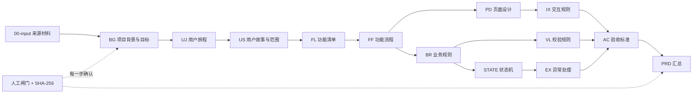

# PM Scaffold 架构

> 版本：v0.6.1 · 2026-08-19
> 本文以 `src/framework/workflow-registry.json`（schema v7）为唯一机器基线；历史拆分说明只在 `CHANGELOG.md` 保留。

## 1. 现行分层

项目由 3 个阶段、13 个独立 work item、6 个支持能力和 9 个共享机制组成。每个 work item 都有自己的 `SKILL.md`、参考文档、agent 配置和全文校验器；不存在需要先运行的复合父 Skill。



### 1.1 注册表中的 13 个主干

`project-background-goal → user-journey → user-stories → feature-list → functional-flow → page-design → interaction-rules → business-rules → validation-rules → state-machine → exception-handling → acceptance-criteria → prd-assembly`。

其中 `FUN-XXX` 仍表示功能流程内部节点，`ST-XXX` 表示用户故事行，`FEA-XXX` 表示功能条目；它们不与顶层产物前缀混用。

### 1.2 支持能力和共享机制

支持能力包括 `competitive-research`、`feasibility-analysis`、`requirement-restate`、`brainstorming`、`tracking-plan`、`issue-record`。它们按需接入，不改变主干依赖链。

共享机制包括审计、人工闸门、追溯、决策日志、项目初始化、入口路由、澄清、变更管理和能力片段库。共享机制不能绕过注册表或人工确认不变式。

## 2. 状态与事件不变式

- AI 只能生成 `draft`、`needs_user_input`、`conditional_review` 或 `ready_for_human_review`；`confirmed` 只能由授权人工执行 `pipeline.py review --decision approve` 写入。
- 每个需求的 `.audit/events.jsonl` 是 append-only 单一事实来源，事件通过 `prev_hash`、`event_sha256`、`payload_sha256` 形成可验证链。
- `.audit/projection.json` 是事件流的派生视图。投影构建失败或审计链失效会阻断当前分支；旧案例的 glob 回退只用于诊断，不会把失败变成通过。
- ReviewRecord 的产物哈希、人工身份和角色必须与当前产物内容一致。发生 reflow 时先形成变更计划并记录事件，再提交文件变更。

## 3. 模板、校验器与输出契约

`src/templates/stage-1-business/`、`stage-2-product/`、`stage-3-prd/` 是现行核心模板；`src/templates/resolver.py` 按项目覆盖、preset、extensions、core 的顺序解析。已删除的复合模板和各 Skill 下重复输出模板不再是可加载内容。

每个现行 work item 必须满足：

1. frontmatter 符合 `_frontmatter-schema.md`，知识状态仅使用六种标准标签。
2. 输出中的 ID、上游引用、人工确认状态与 registry 一致。
3. validator 使用 `validation_errors.make_issue` 返回统一错误对象，错误包含位置、字段、阻断级别、期望值和修复提示。
4. 正向 fixture 与真实失败模式的负向 fixture 均由注册表驱动执行。

## 4. 运行时入口

```text
pipeline.py init/status/entry/gate/review/reflow/audit backfill
orchestrator.py        前置依赖、越级阻断与状态投影
audit_log.py           追加、幂等、哈希链和篡改检测
projection_cache.py    重建、过期判断和事件重放
branch_validator.py    共享记录、投影完整性和人工确认绑定
traceability_check.py 正向/反向追溯
```

`pipeline.py init <name> --root <dir>` 支持在临时目录创建需求骨架；飞书检测只使用 PATH 或 `PM_SCAFFOLD_LARK_PLUGIN_ROOT`，不包含个人绝对路径。

## 5. 验证策略

macOS 与 Windows 入口执行同一组注册表、脱敏、一致性、fixture、单元、状态、记录和追溯检查。现有需求目录只作为证据之一；独立临时目录测试用于验证初始化隔离、失败注入、哈希篡改和投影重建。

测试数量以当前执行结果为准，不在架构文档中硬编码历史通过数。完整命令：

```bash
bash run_tests_mac.sh
python3 src/scripts/registry_contract_check.py
python3 src/scripts/consistency_check.py
```

## 6. 扩展边界

外部研究、原型、文档导出或协作平台能力只能作为支持能力或输入适配器接入；不得新增隐式阶段、绕过人工闸门、把外部技能名称当作事实，或改变 PRD 只能聚合已确认上游内容的边界。

模板库 `src/templates/library/` 当前是预留接口，实际模板仍以 registry 和 `src/templates/stage-*` 为准。任何新增模板必须同时补 resolver 映射、validator 契约、正负 fixture、文档和注册表检查。
