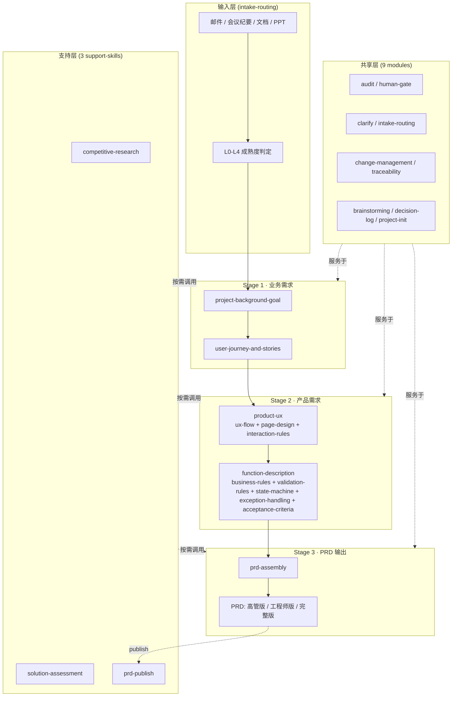

# Project_001 产品 AI 脚手架 · 架构文档

> **版本**：v0.1 · 2026-08-12
> **范围**：3 阶段 × 5 主 Skill × 8 子 Skill × 9 共享模块 × 7 分支 Skill 的整体架构说明
> **目的**：帮助新成员快速理解项目结构与数据流；为外部协作者提供架构门面

---

## 1. 整体架构



---

## 2. 关键设计决策

### 2.1 5 主 Skill 的层级关系

业务需求分析（`project-background-goal` + `user-journey-and-stories`）是上游；
产品需求分析（`product-ux` + `function-description`）是中游；
PRD 输出（`prd-assembly`）是下游。

**有意收敛**：不把"功能清单"或"UX 流程图"作为独立主干，它们是 UX 步骤的内部表达。

### 2.2 Constitution 治理层

每个主 Skill 产物末尾必须包含 `## Constitution Compliance` 章节，显式审计与项目宪法的对齐情况。Constitution 包含三类原则：核心、业务约束、技术约束、治理规则。

### 2.3 六态知识标注（FACT / DECISION / ASSUMPTION / AI_INFERENCE / UNKNOWN / CONFLICT）

每个产物正文必须**显式区分**这六类陈述，避免 AI 把推断当事实、忽略冲突、漏掉未知。

- v0.1.1 起：dor_check 在 `ready_for_human_review` 状态下**强制 6 态覆盖**且 ASSUMPTION ≤ 30%
- `confirmed` 状态下：仅做信息性记录（已升格是合理状态）

### 2.4 Human Gate 强约束

**没有任何产物可以绕过人工确认进入下游**。AI 只能产生 `ready_for_human_review`；`confirmed` 必须由人工 reviewer 设置。

### 2.5 共享机制复用

8 个 sub-skill 与 9 个 shared 模块是**横向复用**机制，不独立构成业务阶段。`business-rules` 等被 `function-description` 顺序调用，输出 §BR / §VL / §State / §Exception / §AC 五个章节。

---

## 3. 数据流

```
[输入材料] 
  → intake-routing 判定 L0-L4
  → project-background-goal (背景+目标)
  → user-journey-and-stories (旅程+故事)
  → product-ux (UX 流程+页面+交互)
  → function-description (BR/VL/State/Exception/AC 五章节)
  → prd-assembly (汇总 → prd.md)
  → prd-publish (正式发布)
```

每步产物都有：
- frontmatter 10 字段（见 `src/templates/_frontmatter-schema.md`）
- §Constitution Compliance 章节
- validator 脚本（保证结构合法）
- dor_check 检查清单

---

## 4. 关键文件位置

| 类型 | 位置 |
|---|---|
| 框架规则 | `src/framework/constitution.md` / `contracts.md` / `governance.md` / `thinking-core.md` |
| 工作流注册 | `src/framework/workflow-registry.json` |
| 5 主 Skill | `src/stages/{001,002,003}-*/skills/*/` |
| 8 子 Skill | `src/stages/002-product-requirements/skills/{function-description,product-ux}/skills/*/` |
| 3 支持 Skill | `src/support-skills/{competitive-research,solution-assessment,prd-publish}/` |
| 9 共享模块 | `src/shared/{audit,human-gate,clarify,...}/` |
| 11 产物模板 | `src/templates/stage-{1,2,3}-*/*.md` + `src/templates/support/*.md` |
| 8 核心脚本 | `src/scripts/{orchestrator,pipeline,workflow_registry,consistency_check,traceability_check,dor_check,property_check,branch_validator}.py` |
| 模板库接口 | `src/templates/library/{README.md,manifest.schema.json,classifier-interface.md}` |
| 测试 | `test/skills/*/`（9 套 fixture）+ `test/scripts/*.py`（集成测试） |

---

## 5. 验证与发布

### 5.1 测试

`run_tests.sh` 跑 9 类检查：
- 跨文档一致性（`consistency_check.py`）
- 9 个主 Skill 产物校验（`validate_artifact.py` × 9）
- 8 个子 Skill 产物校验
- 3 个支持 Skill 产物校验
- 6 个 unit 单元测试
- 需求目录状态 / 记录 / RTM 校验

**当前结果**：44/44 PASS（含 5 个跨 Skill 集成测试）

### 5.2 发布

`prd-publish` 是 PRD 流程的"封口"环节，要求：
- 关联 `authorized-reviewers.json` 人工授权
- 记录 `artifact_content_sha256`（下游 `branch_validator.py` 用其比对）
- AI 不得自动标记 published

---

## 6. 扩展性

### 6.1 模板库（v0.1 预留）

`src/templates/library/` 下已留出：
- `README.md` · 模板库规划
- `manifest.schema.json` · 模板包清单 schema
- `classifier-interface.md` · 自动分类器接口契约

未来模板库接入 `resolver.py` 第 3 层 extensions（**不修改**现有代码）。

### 6.2 外部 Agent 接入

每个 Skill 都有 `agents/openai.yaml` 元数据（5 主 + 8 子 + 7 分支 = 20 份），描述：
- `display_name` · `short_description`
- `default_prompt` · `trigger_examples` · `should_not_trigger_examples`

满足 OpenAI Agents SDK / Anthropic Skills 开放标准。

---

## 7. 进一步阅读

- 详细计划：`docs/00-plan/01-三阶段主流程与工作事项.md`
- 共享机制：`docs/00-plan/02-共享机制与产物契约.md`
- 迁移验证：`docs/00-plan/03-实施迁移与验证计划.md`
- 变更日志：`CHANGELOG.md`
