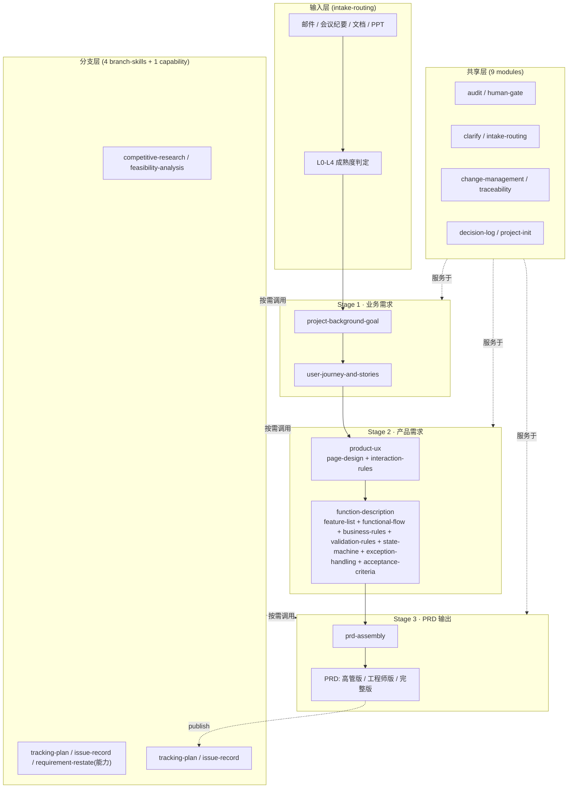

# PM Scaffold · 产品 AI 脚手架 · 架构文档

> **版本**：v0.4.0 · 2026-08-14
> **范围**：3 阶段 × 5 主 Skill × 9 子 Skill × 9 共享模块 × 4 分支 + 1 能力 的整体架构说明
> **目的**：帮助新成员快速理解项目结构与数据流；为外部协作者提供架构门面

---

## 1. 整体架构



---

## 2. 关键设计决策

### 2.1 5 主 Skill 的层级关系

业务需求分析（`project-background-goal` + `user-journey-and-stories`）是上游；
产品需求分析（`product-ux` + `function-description`）是中游；
PRD 输出（`prd-assembly`）是下游。

**有意收敛**：不把"功能清单"或"功能流程"作为独立主干；它们是 `function-description` 的子 skill 章节（feature-list / functional-flow），`product-ux` 只承载页面设计与交互规则。

### 2.2 Constitution 治理层

每个主 Skill 产物末尾必须包含 `## Constitution Compliance` 章节，显式审计与项目宪法的对齐情况。Constitution 包含三类原则：核心、业务约束、技术约束、治理规则。

### 2.3 六态知识标注（FACT / DECISION / ASSUMPTION / AI_INFERENCE / UNKNOWN / CONFLICT）

每个产物正文必须**显式区分**这六类陈述，避免 AI 把推断当事实、忽略冲突、漏掉未知。

- v0.1.1 起：dor_check 在 `ready_for_human_review` 状态下**强制 6 态覆盖**且 ASSUMPTION ≤ 30%
- `confirmed` 状态下：仅做信息性记录（已升格是合理状态）

### 2.4 Human Gate 强约束

**没有任何产物可以绕过人工确认进入下游**。AI 只能产生 `ready_for_human_review`；`confirmed` 必须由人工 reviewer 设置。

### 2.5 共享机制复用

9 个 sub-skill 与 9 个 shared 模块是**横向复用**机制，不独立构成业务阶段。`feature-list` 等被 `function-description` 顺序调用，输出 §功能清单 / §功能流程 / §BR / §VL / §State / §Exception / §AC 七个章节；`page-design` / `interaction-rules` 挂在 `product-ux`。

### 2.6 事件溯源 + 投影缓存（Harness 借鉴）

v0.4.0 起，脚手架引入 Harness 风格的事件溯源基础设施，作为 review/change 生命周期的单一事实来源：

| 模块 | 文件 | 角色 |
|---|---|---|
| 事件溯源 | `src/scripts/audit_log.py` | append-only `.audit/events.jsonl`；事件 token = `review/change/decision/confirm/reject/reflow/init`；每事件含 `prev_hash` 链 + `event_sha256` 自指纹 + `payload_sha256` 绑定记录体 + 单调 `recorded_at`；提供 `append_event` / `replay_events` / `verify_chain` / `reconstruct_causality` |
| 投影缓存 | `src/scripts/projection_cache.py` | 从事件日志折叠 `.audit/projection.json`（latest status / artifact hash / reviewer / review record）；提供 `build_projection` / `read_projection` / `is_stale` / `latest_review_for`；替代 branch_validator 旧 glob+sort；老案例带 warning fallback |
| 注册表契约硬化 | `src/scripts/registry_contract_check.py` | schema 校验 + 模板↔校验器字段闭环（E3_drift）；`run_tests_mac.sh` Phase 0 首项 fail-loud |
| 统一错误格式 | `src/scripts/validation_errors.py` | `make_issue` 输出 8+ 字段（severity / blocking / check_id / check_family / location / field_path / message / expectation / actual / repair_hint / source_ref）；`format_issue` / `aggregate_by_check_id` / `wrap_unexpected` |

**不变式**：**event ⟺ model-visible state**——没有事件先落到 `events.jsonl`，状态变更不算正式发生。validators 一律读 `projection.json` 派生视图，不直接 glob+sort markdown（老案例 fallback 带 warning）。

---

## 3. 数据流

```
[输入材料] 
  → intake-routing 判定 L0-L4
  → project-background-goal (背景+目标)
  → user-journey-and-stories (旅程+故事)
  → product-ux (页面设计+交互规则)
  → function-description (FEA/FLOW/BR/VL/State/Exception/AC 七章节)
  → prd-assembly (汇总 → prd.md)
  → 发布复核（SHA-256）
```

每步状态跃迁同步追加事件到 `requirements/REQ-NNN-*/.audit/events.jsonl`（append-only 事件）+ 由 `projection_cache` 折叠派生 `.audit/projection.json`（latest status / hash 派生视图）；事件先于状态变更，保证整条数据流可 replay。

每步产物都有：
- frontmatter 10 字段（见 `src/templates/_frontmatter-schema.md`）
- §Constitution Compliance 章节
- validator 脚本（保证结构合法）
- dor_check 检查清单

---

## 4. 关键文件位置

| 类型 | 位置 |
|---|---|
| 框架规则 | `src/framework/constitution.md` / `contracts.md` / `governance.md` / `thinking-core.md` |
| 工作流注册 | `src/framework/workflow-registry.json` |
| 5 主 Skill | `src/stages/{001,002,003}-*/skills/*/` |
| 9 子 Skill | `src/stages/002-product-requirements/skills/{function-description,product-ux}/skills/*/` |
| 4 分支产物 + 1 能力 | `src/support-skills/*/`（竞品/可行性）+ `src/stages/*/skills/{requirement-restate,tracking-plan}/` + `src/shared/clarify/skills/issue-record/` |
| 9 共享模块 | `src/shared/{audit,human-gate,clarify,...}/` |
| 26 产物模板 | `src/templates/stage-{1,2,3}-*/` + `src/templates/{support,others,records}/` |
| 12 核心脚本 | `src/scripts/{orchestrator,pipeline,workflow_registry,consistency_check,traceability_check,dor_check,property_check,branch_validator}.py` + `audit_log.py`（事件溯源 append-only 日志 + hash 链）+ `projection_cache.py`（投影缓存派生视图）+ `registry_contract_check.py`（注册表契约硬化 Phase 0 首项）+ `validation_errors.py`（统一错误格式 make_issue 8+ 字段） |
| 模板库接口 | `src/templates/library/{README.md,manifest.schema.json,classifier-interface.md}` |
| 测试 | `test/skills/*/`（20 套 fixture）+ `test/scripts/*.py`（集成测试） |

---

## 5. 验证与发布

### 5.1 测试

`run_tests_mac.sh` 跑 9 类检查（Phase 0：registry 契约自检 fail-loud 首项 → desensitize 脱敏自检 → consistency 一致性，随后进入原 8 类）：
- **Phase 0 注册表契约自检**（`registry_contract_check.py`，schema + 模板↔校验器闭环 E3_drift，失败即 abort 后续测试）
- **Phase 0b-1 脱敏自检**（`desensitize_check.py`，扫描 test/ fixtures，任一疑似未脱敏真实数据即 FAIL）
- 跨文档一致性（`consistency_check.py`）
- 5 个主 Skill 产物校验
- 9 个子 Skill 产物校验
- 5 个分支/能力 Skill 校验器（注册表驱动：4 产物 + 1 能力）
- 单元/集成测试（workflow_runtime / cross_skill_integration / 5 主 skill 校验器 + `test_audit_log.py` 10 个单元测试覆盖幂等/哈希链/自指纹/payload 绑定/单调时间戳）
- 需求目录状态 / 记录 / RTM 校验

**当前结果**：85/85 PASS（v0.4.0：新增 audit_log 10 个单元测试，property_check 全线迁移 `make_issue` 无回归）

### 5.2 发布

发布复核是 PRD 流程的"封口"动作（SHA-256 由 branch_validator 自动执行），要求：
- 关联 `authorized-reviewers.json` 人工授权
- 记录 `artifact_content_sha256`（下游 `branch_validator.py` 用其比对）
- AI 不得自动标记 published

---

## 6. 扩展性

### 6.1 模板库（v0.1 预留）

`src/templates/library/` 下已留出：
- `README.md` · 模板库规划
- `manifest.schema.json` · 模板包清单 schema
- `classifier-interface.md` · 自动分类器接口契约

未来模板库接入 `resolver.py` 第 3 层 extensions（**不修改**现有代码）。

### 6.2 外部 Agent 接入

每个 Skill 都有 `agents/openai.yaml` 元数据（5 主 + 9 子 + 4 分支 + 1 能力 = 19 份），描述：
- `display_name` · `short_description`
- `default_prompt` · `trigger_examples` · `should_not_trigger_examples`

满足 OpenAI Agents SDK / Anthropic Skills 开放标准。

---

## 7. 进一步阅读

- 运行规则：`src/framework/workflow.md`
- 阶段边界：各 `src/stages/*/STAGE.md`
- Skill 行为：各 `skills/*/SKILL.md`
- 产物模板可选章节：`docs/template-optional-sections.md`（术语表 / 涉及团队及职责总结，按需章节说明）
- 变更日志：`CHANGELOG.md`
