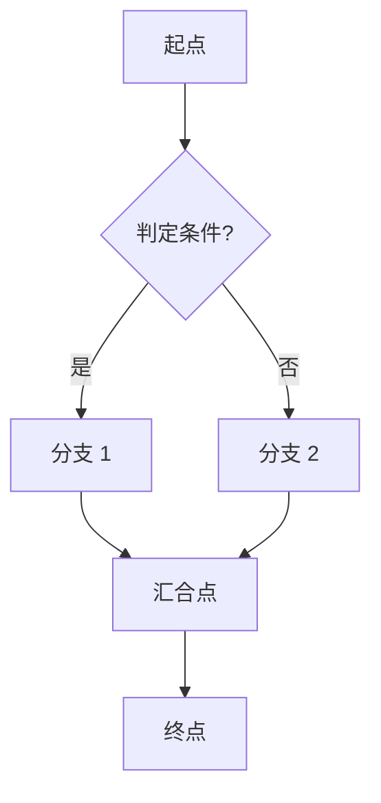
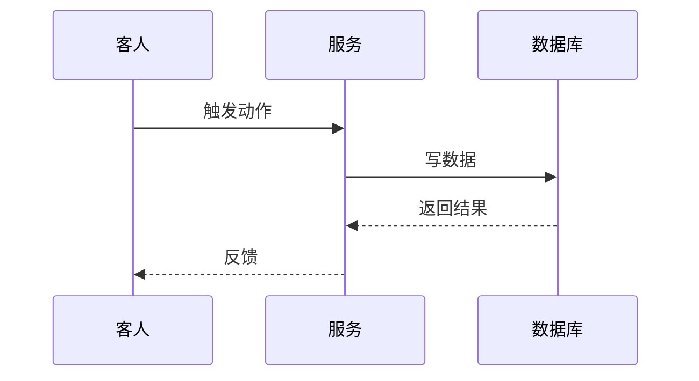
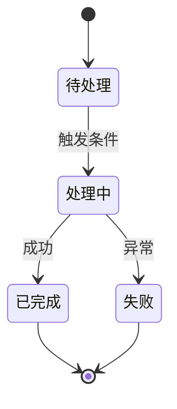
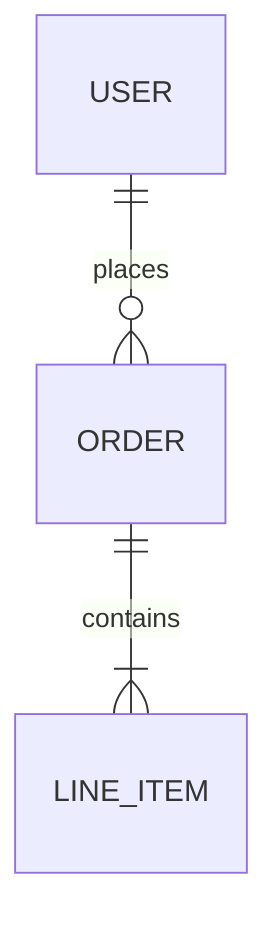
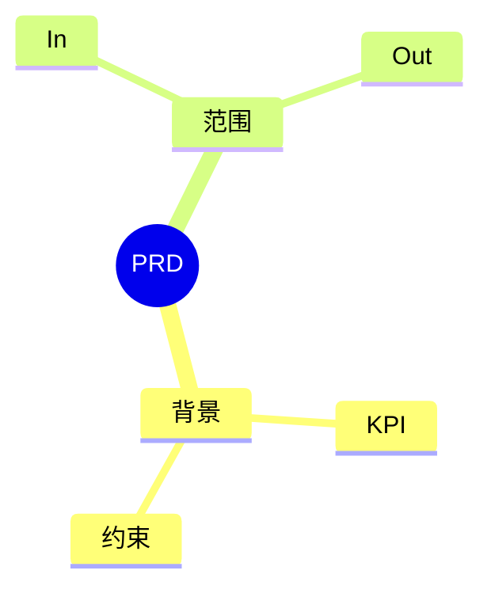
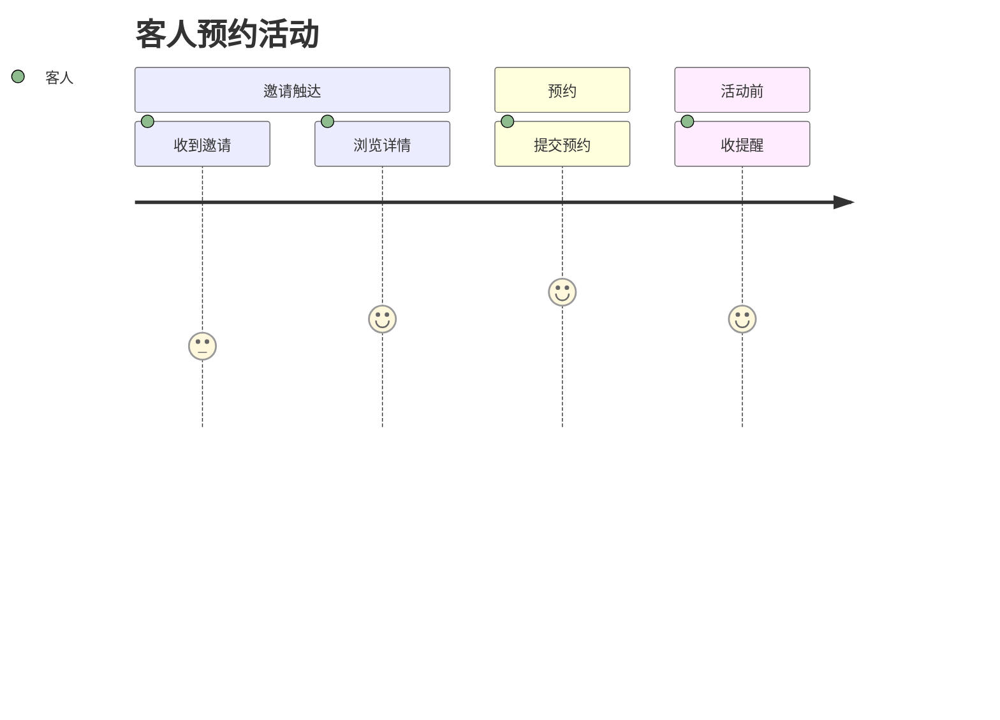

# Mermaid 图类型选择与语法指南

> 本指南提供独立、可验证的图表表达规则；不依赖任何本地索引或特定工具。
> 用途：项目内所有 mermaid 图的**统一规范**，避免各 skill 写出的图风格不一致。
> 适用范围：`bg/uj/ff/state-machine/exception-handling` 等所有 skill 的 Mermaid 图输出。

## 1. 图类型速选表

| 你想表达什么 | 选 mermaid 类型 | 关键字 |
|---|---|---|
| 主流程 / 分支 / 异常 / | 流程图（Flowchart） | `graph TD` / `graph LR` |
| 顺序交互（多角色/多系统）| 时序图（Sequence） | `sequenceDiagram` |
| 状态机 / 状态转移 / | 状态图（State） | `stateDiagram-v2` |
| 实体关系 / 数据模型 | ER 图（ER Diagram） | `erDiagram` |
| 时间线 / 里程碑 | 时间线（Gantt） | `gantt` |
| 思维导图 / 分类 | 脑图（Mindmap） | `mindmap` |
| 用户旅程阶段 + 情绪 | 用户旅程（Journey） | `journey` |

## 2. 各图类型模板

### 2.1 流程图（最常用）

约定：

- 主流程**自上而下**（`graph TD`），分支流程**自左而右**（`graph LR`）
- 判定用 `{}`；动作用 `[]`；数据库用 `[("圆柱形")]`；子图用 `subgraph ... end`
- 箭头文字用 `|文字|`：超过 4 个汉字用简写

### 2.2 时序图

约定：

- `participant 别名 as 显示名` 起别名，避免角色名占宽
- 实线用 `->>`，虚线用 `-->>`
- 步骤文字不超 30 字

### 2.3 状态图

约定：

- `[*]` 表示初始 / 终止
- 转移标签 `:` 后只写**事件 + 守卫**，不写过程
- 多守卫用 `;` 分隔

### 2.4 ER 图

约定：

- 关系符号：`||`=1, `o|`=0+, `}|`=1+, `}o`=0+
- 关系标签简短（动词）

### 2.5 脑图

### 2.6 旅程图

## 3. 常见语法错误（蒸馏自查）

| 错误 | 现象 | 修复 |
|---|---|---|
| 箭头方向反 | `A -- B` 不出箭头 | 改为 `A --> B` |
| 节点标签含括号未转义 | `A[文本(扩展)]` 报错 | 用引号 `A["文本(扩展)"]` |
| 中文标签报错 | 部分渲染器不识别中文 | 加引号 `A["中文"]` 或 `A[中文]` |
| 子图嵌套层级错 | `subgraph` 后未 `end` | 严格配对 |
| 时序图箭头语法错 | 用错 `->` 而非 `->>` | 时序图必须 `->>` 或 `-->>` |
| 状态图守卫分行错 | 同一转移跨行被认为被被另一次转移 | 同一转移用单行或多行 `:` 续接 |
| ER 关系符号错位 | `||--o{` 顺序错 | 严格 `左端 关系 右端 : 标签` |
| 节点 ID 含特殊字符 | 报错 | 仅用字母数字下划线，文字用引号 |

## 4. 本项目约定

1. **主流程图必须含「起点 + 主路径 + 至少 1 条分支 + 至少 1 条异常路径 + 终点」5 元素**
2. **状态图必须含「[*] 起点 + 至少 1 个终态 [*]」**
3. **时序图至少含 2 个 participant**
4. **图标题用 `%%` 注释说明**，不放标题节点
5. **跨页/跨文件图用 PNG 导出**（用 `render_diagrams.sh`）

## 5. 与既有契约的兼容性

- 不替代各 skill 已有的 Mermaid 代码：仅作风格参考
- 不新增校验：图渲染失败由 `render_diagrams.sh` 报告，不阻断交付
- 不动 registry：纯文档
