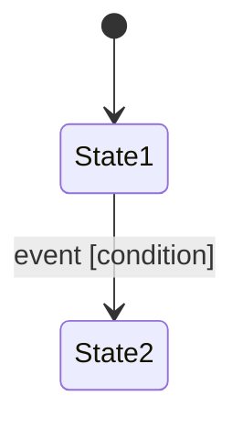

<!-- state-machine output · auto-generated from sub-skill -->
---
parent_artifact: FD-{REQ}
sub_skill: state-machine
version: v0.1
status: draft
upstream_artifact_id: FD-{REQ}
---

## 状态变化

> 本节由 `state-machine` 子 Skill 生成，属于 function-description §2 状态机层。
> 上游：product-ux (IX 流程) + business-rules (BR 触发条件)

### 状态定义

| 状态 ID | 状态名称 | 所属功能 (FUN) | 描述 | 进入条件 | 退出条件 |
|---|---|---|---|---|---|
| | | | | | |

### 状态转移表

| 当前状态 | 触发事件 | 目标状态 | 条件 | 副作用 | 来源 (BR/IX) |
|---|---|---|---|---|---|
| | | | | | |

### 状态机图 (Mermaid)

### 状态完备性检查

| 状态 | 已定义出边事件 | 已知缺失事件 | 状态 |
|---|---|---|---|
| | | | ✅ / ⚠️ |

### 事实与决定

| ID | 类型 | 内容 |
|---|---|---|

### 待确认问题

| ID | 问题 | 结论 |
|---|---|---|
