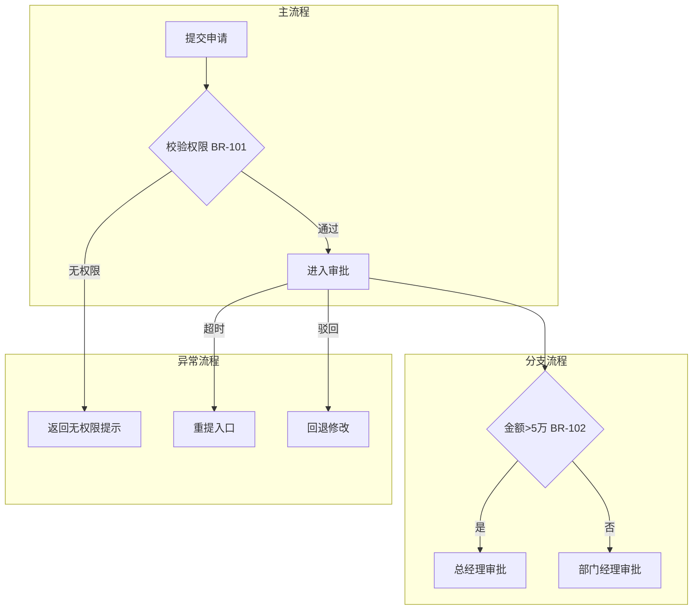
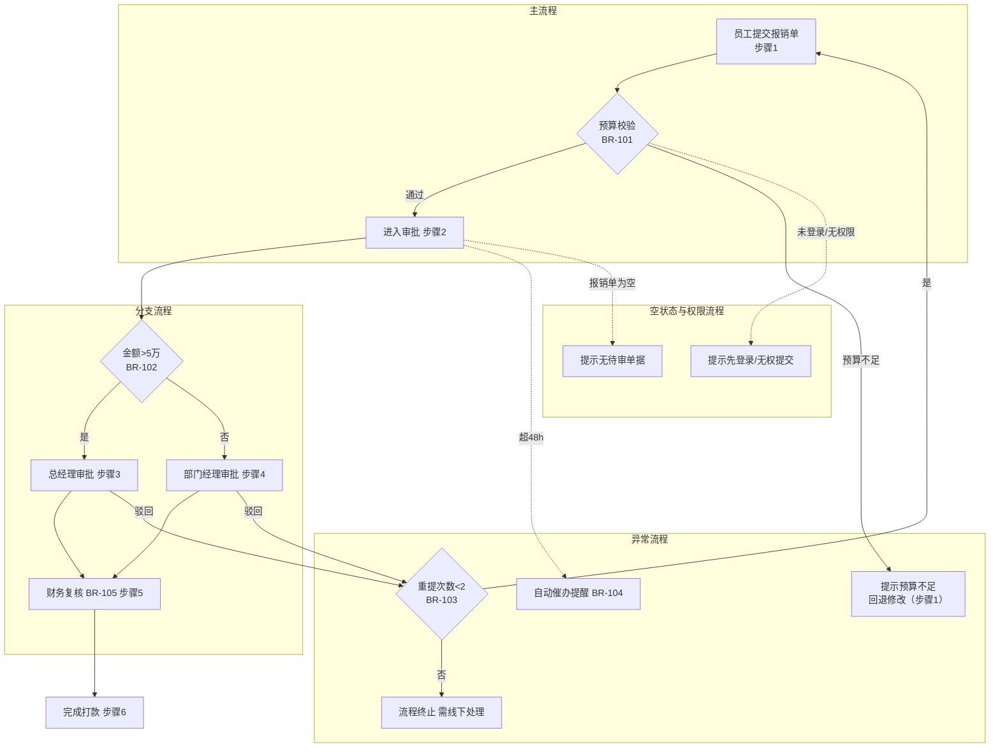

# 流程覆盖度检查技法（Flow Coverage Check）

> 来源吸收：`incremental-prd-collaboration` 的 references/ai-prd-review-rubric.md（deep_check 重点与严重问题判定）、references/prd-structure-checklist.md（功能流程章节职责）、references/prd-output-guardrails.md（高频遗漏检查）、`product-spec-generator` 的 references/prd-selfcheck-consistency.md（引用完整性 B 检查与 P0/P1/P2 严重级别），作为 functional-flow 的可选落地能力。
> 定位：给 functional-flow 的"每 FEA 一张 Mermaid 图"加一道覆盖度闸门——主/支/异常/空状态/权限五类路径齐全、决策节点回指 BR-XXX、每个步骤回指 FEA-XXX/ST-XXX、Mermaid 表达分区规范。
> 触发：Generate 画完流程后自查、Audit 前跑覆盖度检查、或发现流程图只有一条 happy path 时加载。**按需加载，不设全局闸门**。

## 1. 输入映射（pm-scaffold 语境）

| 外部 skill 输入 | pm-scaffold 对应产物 | 说明 |
|---|---|---|
| 评审要点"主流程、关键分支和异常流程是否闭环" | functional-flow 的 §主流程/§分支流程/§异常流程 | 流程完整性三件套 |
| 严重问题"核心流程缺失，导致主流程无法理解" | Audit 的 completeness 检查 | 缺失即 critical 的判据 |
| "从哪里触发/怎么进入/系统做什么/哪里分支/哪里中断/流向哪里" | 流程结构契约（start_condition/steps/branch_points/exception_paths/exit_states） | 每张图必须回答的 6 问 |
| 引用完整性（BR-xx 存在性、引用悬空=P0） | 决策节点 → business-rules 的 BR-XXX 挂钩 | 菱形节点不允许无规则裸奔 |
| 高频遗漏（成功/失败/异常状态、权限、空状态） | 分支/异常/权限/空状态流程 | 5 类流程覆盖的检查项来源 |

> **流程图是下游的挂接点**：business-rules / state-machine / exception-handling 都要在流程图步骤上挂规则。图里缺一条分支，下游就少一个挂接点——覆盖度检查本质是"下游可挂接性"检查。

## 2. 5 类流程覆盖（主路径/分支/异常/空状态/权限）

每个 P0 FEA 的主流程图必须显式覆盖 5 类路径，缺一类即 Audit 不通过：

| # | 流程类 | 检查问题 | 缺失后果（incremental 严重级别） |
|---|---|---|---|
| 1 | **主路径** | 起点→步骤序列→出口是否完整可走通 | 核心流程缺失 = critical，主流程无法理解 |
| 2 | **分支流程** | 每个决策点的分支是否标注、互斥、可穷举 | 分支条件模糊 → 下游规则无挂点 |
| 3 | **异常流程** | 失败/超时/取消/恢复是否画出并带回退目标 | 异常漏掉 → 开发"自己会处理"出事故 |
| 4 | **空状态流程** | 无数据/首次使用/清单为空时的路径 | 空态漏掉 → 首次体验断头 |
| 5 | **权限流程** | 无权限/角色受限/越权访问的路径 | 权限漏掉 → 越权事故 |

**路径清单自检**（每条 FEA 流程收口时跑一遍）：

- [ ] 主路径：能讲出"谁触发 → 系统做什么 → 结束去向"（prd-structure-checklist 功能流程 6 问）
- [ ] 分支路径：每个 `{判断}` 节点所有出口都有箭头与条件，无"else 迷路"
- [ ] 异常路径：error / 失败 / 超时 / 取消 / 恢复至少按本 FEA 的真实场景枚举
- [ ] 空状态路径：首次进入、无数据、空结果集的去向
- [ ] 权限路径：未登录 / 无权限 / 部分权限的角色路径

## 3. 决策节点→业务规则挂钩（prd-selfcheck-consistency 引用完整性 B）

流程图中的每个菱形决策节点（`{...}`）都必须回指一条业务规则 `BR-XXX`：

- 图内标注：菱形节点旁注明 `{判断} — BR-012`。
- 双向校验（引用完整性）：图里引用的 BR-XXX 必须在 business-rules 中真实存在；business-rules 定义的规则如果该出现在图里却没出现 → 同样算缺口。
- **引用悬空 = P0**：图引用不存在的 BR-XXX，或业务规则无处挂接，按 product-spec-generator 严重级别**必须修复后才能输出**。

决策节点自检表：

| 检查项 | 判据 |
|---|---|
| 每个 `{判断}` 有 BR-XXX 回指 | 无回指 = 决策裸奔 = P0 |
| BR-XXX 在 business-rules 真实存在 | 悬空引用 = P0 |
| 分支条件与 BR 规则口径一致 | 不一致 = P1（枚举取值不符/条件冲突） |
| 判断条件可测（有明确数值/状态/枚举） | 写"大概/差不多" = P1 |

## 4. 流程步骤→功能追溯（步骤追溯检查清单）

functional-flow 的流程结构契约要求每个步骤回指 `FEA-XXX` / `ST-XXX`；图内节点按流程内步骤序号（1..N）标注，不使用 `FL-XXX`（该前缀为历史遗留，当前产物未采用）。检查清单：

| # | 追溯检查 | 判据 | 违规 |
|---|---|---|---|
| 1 | 每张图标题含 FEA-XXX 与 ST-XXX | 图归属功能、回溯故事 | 孤儿图 = P0 |
| 2 | 每个业务步骤节点回指 FEA-XXX | 步骤来自已确认功能清单 | 孤儿步骤 = P0 |
| 3 | 为补全流程而加的步骤标 `AI_INFERENCE` | 分离"故事写了"与"我补的" | 静默补步骤 = P0 |
| 4 | 步骤命名与上游原文一致 | 不自造术语 | 术语漂移 = P2 |
| 5 | 排除的上游流程内容写了理由 | 重复/出范围/已被更新 | 静默丢弃 = P1 |

> 追溯三问（Audit 用）：这个步骤在功能清单里有吗？在故事里有依据吗？没有依据凭什么画进来？三问任一不过 → 要么补来源、要么标 `AI_INFERENCE` 交人工。

## 5. Mermaid 表达规范（主/分支/异常分区）

一张图内用分区（subgraph）表达不同路径类别，让主/支/异常一眼可分：

规范要点：

1. **分区即路径类别**：主流程 / 分支流程 / 异常流程 各一个 subgraph；分区内只放该类别节点。
2. **标注颜色或虚线区分异常**：异常分支统一用虚线或单独色调（团队约定一种即可），与主路径实线区分。
3. **菱形节点挂 BR**：每个 `{...}` 旁写 `BR-XXX`（见 §3）。
4. **条件必写**：每条分支箭头标注具体可测条件，禁止裸箭头。
5. **回退目标显式**：异常分支终点写清回退到哪个步骤（"回退到步骤 C"而非"返回"）。
6. **节点命名与上游一致**：缩写首次出现处解释。

## 6. 完整示例：to B 审批流（提交→分支审批→异常驳回→超时重提）

**场景**：报销审批（FEA-012，ST-015）。角色：员工、部门经理、总经理、财务。业务规则：BR-101（提交需在职且预算充足）、BR-102（金额>5 万需总经理审批）、BR-103（驳回后可修改重提，限 2 次）、BR-104（审批超 48h 自动提醒）、BR-105（财务复核人必须与提交人不同）。

**此图对应 5 类覆盖**：主路径=提交→审批→复核→打款；分支=金额>5 万两路；异常=预算不足/驳回重提限次/超时催办；空状态=无待审单据；权限=未登录/无权限。每个决策节点挂 BR-101~BR-105，步骤挂 步骤1~步骤6，图标题挂 FEA-012/ST-015。

## 7. 工作流程

1. **逐 FEA 拉取**：从 feature-list 取每个 P0 FEA，确认图标题挂 FEA-XXX / ST-XXX。
2. **画主路径**：起点→步骤序列→出口，过 prd-structure-checklist 6 问（谁触发/怎么进入/系统做什么/哪里分支/哪里中断/流向哪里）。
3. **铺分支**：对每个决策节点标注互斥、穷举的分支条件，回指 BR-XXX。
4. **补异常**：按本 FEA 真实场景枚举 error/失败/超时/取消/恢复，画回退目标。
5. **补空状态与权限**：无数据/首次使用路径 + 未登录/无权限路径。
6. **跑覆盖度检查**：§2 五类清单 + §4 追溯三问 + §3 引用完整性，全部通过再进 Audit。
7. **输出**：Mermaid 图按 §5 分区规范落位 functional-flow §功能流程；AI_INFERENCE 步骤显式列出。

## 8. 核心硬规则

1. **五类覆盖缺一不可**：主/支/异常/空状态/权限任一类缺失即 Audit 不通过；只画 happy path = 反模式。
2. **菱形节点必须挂 BR**：每个 `{判断}` 回指 BR-XXX，悬空引用 = P0 必改（product-spec-generator 严重级别）。
3. **步骤必须可追溯**：每步回指 FEA-XXX/ST-XXX；补全步骤标 `AI_INFERENCE`，静默补步骤 = P0。
4. **分支条件可测**：条件标注具体数值/状态/枚举，互斥且穷举；"大概/差不多"= P1。
5. **Mermaid 分区规范**：主/支/异常各一 subgraph，异常用虚线/独立色调，回退目标显式。
6. **图停结构层**：不画页面布局/IX/BR 明细/STATE 明细/EX 明细（→ 下游 work_item）。

## 9. 边界（Do Not）

- 不为"看起来完整"编造分支或异常场景——没有来源支撑的路径标 `AI_INFERENCE` 交人工。
- 不把上游未提的空白当"确认不存在"——标 `UNKNOWN` 交人工（source-handling 规则）。
- 不替下游画业务规则明细、状态机明细、异常处理明细表（→ business-rules/state-machine/exception-handling）。
- 不引入功能清单之外的孤儿功能——每个流程归属已登记 FEA。
- 不静默选择更方便的路径——上游范围与流程表达冲突时保留双方、标 `CONFLICT-XXX` 并停止。
- 不把"权限流程"简单画成"无权限→报错"一行——按角色差异拆行（如部门经理可审、总经理可终审）。

## 10. 质量自检清单

- [ ] 每个 P0 FEA 覆盖 5 类路径（主/支/异常/空状态/权限），无缺失
- [ ] 主路径能回答"谁触发/怎么进入/系统做什么/哪里分支/哪里中断/流向哪里"6 问
- [ ] 每个 `{判断}` 节点回指存在的 BR-XXX，无悬空引用（P0 已清零）
- [ ] 分支条件互斥、可穷举、可测，无"else 迷路"
- [ ] 每个步骤回指 FEA-XXX/ST-XXX，AI_INFERENCE 步骤已显式列出
- [ ] 排除的上游流程内容有理由记录
- [ ] Mermaid 图按 subgraph 分区（主/支/异常），异常路径可一眼区分
- [ ] 回退目标显式（写"回退到 步骤 N"而非"返回"）
- [ ] 无页面布局/IX/BR/STATE/EX 明细泄漏到流程图
