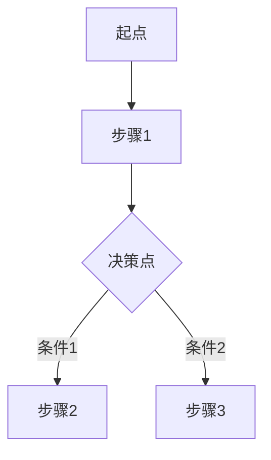

<!-- ⚠️ 已由 src/templates/stage-2-product/functional-flow.md 取代，本文件仅作历史参考 -->
<!-- functional-flow output · auto-generated from sub-skill -->
---
parent_artifact: FD-{REQ}
sub_skill: functional-flow
version: v0.1
status: draft
upstream_artifact_id: FD-{REQ}
---

## 功能流程

> 本节由 `functional-flow` 子 Skill 生成，属于 function-description §功能流程。
> 上游：function-description 功能清单 (FEA-XXX) + user-journey-and-stories (scope baseline)

### 主流程

### 分支流程

| 决策点 | 判定条件 | 去向 | 条件是否互斥/穷举 |
|---|---|---|---|
| | | | |

### 异常流程

| 异常场景 | 触发条件 | 流程走向 | 回退目标 |
|---|---|---|---|
| | | | |

### 分流程详述

#### 流程 1: {流程名称}
- 起点 / 触发条件：
- 主流程步骤：
  1.
  2.
- 决策点 / 分支条件：
- 异常路径 / 回退目标：
- 出口 / 终止状态：

### 跨系统交接点

| 交接点 | 触发 | 源系统 | 目标系统 | 传递数据 | 超时/失败处理 |
|---|---|---|---|---|---|
| | | | | | |

### 事实与决定

| ID | 类型 | 内容 |
|---|---|---|
| | | |

### 待确认问题

| ID | 问题 | 结论 |
|---|---|---|
| | | |

### 来源追溯

| 来源 | 关键内容 | 本文落位 |
|---|---|---|
| | | |
