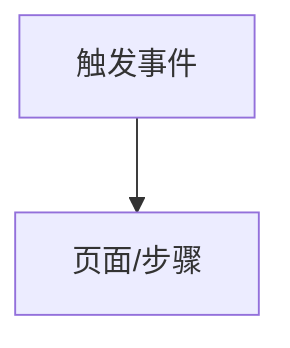

<!-- interaction-rules output · auto-generated from sub-skill -->
---
parent_artifact: UX-{REQ}
sub_skill: interaction-rules
version: v0.1
status: draft
upstream_artifact_id: UX-{REQ}
---

## 交互规则

> 本节由 `interaction-rules` 子 Skill 生成，属于 product-ux §3 交互规则。
> 上游：function-description §1 功能清单 (FEA-XXX) + product-ux §2 页面设计 + user-journey-and-stories (用户旅程)
> 边界：不定义 BR/VL/AC（属于 function-description）；不定义功能流程（→ functional-flow）

### 交互流程图 (Mermaid)

### 交互规则 IX-XXX

| 规则 ID | 触发 | 响应 | 异常/边界 | 来源 |
|---|---|---|---|---|
| IX-001 | | | | |

### 交互规则分组

#### 入口与身份层
| IX- | 说明 |
|---|---|

#### 核心操作层
| IX- | 说明 |
|---|---|

#### 反馈与异常层
| IX- | 说明 |
|---|---|

### 事实与决定

| ID | 类型 | 内容 |
|---|---|---|

### 待确认问题

| ID | 问题 | 结论 |
|---|---|---|

### 来源追溯

| 来源 | 关键内容 | 本文落位 |
|---|---|---|
