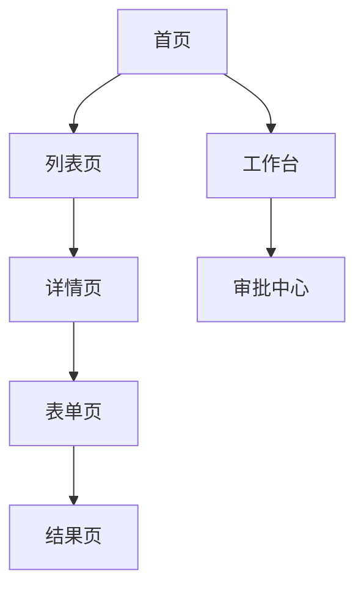

# 信息架构图技法参考（Information Architecture）

> 来源吸收：Trae `prd-fullstack` 与 `prd-to-design-doc` 两个 skill 的"信息架构图"方法论，经适配后作为 page-design 的可选落地能力。
> 定位：page-design 产出的 PD-XXX 页面骨架文本是权威；本文档提供"把页面层级与导航关系结构化为信息架构图"的技法，增强结构可见性。
> 触发：当页面数量多、层级深或需梳理导航关系时使用。**按需加载，不设全局闸门**。

## 1. 输入映射

| 外部 skill 输入 | pm-scaffold 对应产物 | 说明 |
|---|---|---|
| 页面清单 | page-design 的 PD-XXX | 架构节点 |
| 功能流程 | functional-flow 的 FEA-XXX | 导航边来源 |
| 角色 | user-journey 的角色 | 角色可见性分组 |
| 交互规则 | interaction-rules 的 IX-XXX | 导航跳转 |

## 2. 架构图结构

用 Mermaid 呈现页面层级与导航关系：

节点标注：所属 FEA-XXX、角色可见性（RBAC）、入口/出口。

## 3. 工作流程

1. **提页面**：从 page-design.md 页面与步骤描述 提取页面清单作节点。
2. **连导航**：按 IX-XXX 与 functional-flow 连边；标注跳转条件。
3. **分组**：按角色（RBAC）或模块分组可见性。
4. **输出图**：Mermaid 架构图 + 节点表（PD-XXX/FEA-XXX/角色）。

## 4. 核心硬规则

1. **节点不发明**：架构图节点必须来自 page-design.md 页面与步骤描述，不新增页面。
2. **导航边追溯 IX-XXX**：每条边追溯交互规则；无规则的跳转标 `待确认`。
3. **角色可见性显式**：to B 须按 RBAC 标注每个节点的角色可见性。
4. **图是辅助**：架构图不替代 page-design 文本表格。

## 5. 边界（Do Not）

- 不设计视觉布局/配色（属视觉层，超出 page-design 范畴）。
- 不替代 PD-XXX 文本——图是导航关系增强。
- 不替业务方决定角色可见性——以 RBAC 为准。

## 6. 质量自检清单

- [ ] 节点全部来自 page-design.md 页面与步骤描述，无发明页面
- [ ] 导航边追溯 IX-XXX
- [ ] 角色可见性按 RBAC 标注（to B）
- [ ] Mermaid 语法可渲染
- [ ] 图与 PD-XXX 文本表一致
