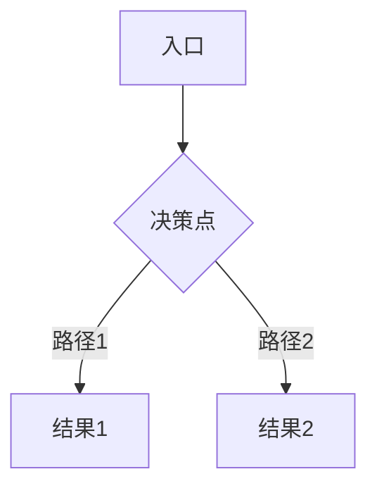

<!-- ux-flow output · auto-generated from sub-skill -->
---
parent_artifact: UX-{REQ}
sub_skill: ux-flow
version: v0.1
status: draft
upstream_artifact_id: UX-{REQ}
---

## UX 流程

> 本节由 `ux-flow` 子 Skill 生成，属于 product-ux §3 Structural 层。
> 上游：product-ux §2 (FEA list) + user-journey-and-stories (scope baseline)

### 功能流程总览

### 分流程详述

#### 流程 1: {流程名称}
- 入口：
- 步骤：
  1.
  2.
- 决策点：
- 主路径：
- 替代路径：
- 异常路径：
- 结果状态：

### 跨系统交接点

| 交接点 | 触发 | 源系统 | 目标系统 | 传递数据 | 超时/失败处理 |
|---|---|---|---|---|---|
| | | | | | |

### 事实与决定

| ID | 类型 | 内容 |
|---|---|---|

### 待确认问题

| ID | 问题 | 结论 |
|---|---|---|

### 来源追溯

| 来源 | 关键内容 | 本文落位 |
|---|---|---|
