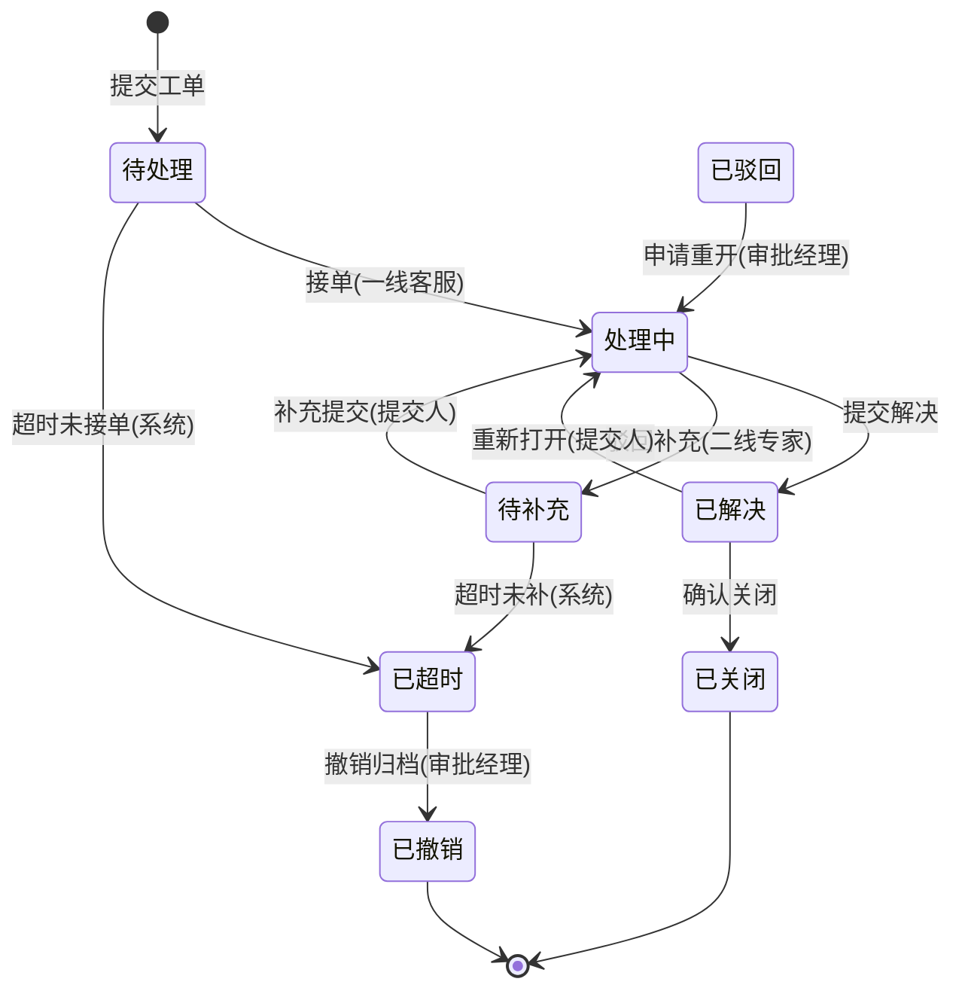

# 状态机完备性检查技法（State Machine Completeness Check）

> 来源吸收：`product-spec-generator` 的 `prd-selfcheck-consistency`（状态机三元一致性 D 检查、字段三元组 A 检查、引用完整性 B 检查、P0/P1/P2 严重级别与输出格式）+ `pm-master-prosl` 研发评审版 PRD 硬标准与测试场景模板（权限差异、空状态、边界值、操作逻辑死锁/回退），作为 state-machine 的可选完备性收口能力。
> 定位：在 STATE-XXX 转移表草稿完成后，用「完备性 6 检查 + 三元一致性 + 角色权限矩阵」三道闸做完备性收口，把漏转移 / 漏守卫 / 漏权限 / 枚举错位消灭在 Human Gate 之前。
> 触发：Generate 状态机草稿后、Audit 前；或 Audit 发现悬空转移、无权限信息、状态枚举与字段不一致时。**按需加载，不设全局闸门**。

## 1. 输入映射（pm-scaffold 语境）

| 外部 skill 输入 | pm-scaffold 对应产物 | 说明 |
|---|---|---|
| 状态机 ↔ 异常 ↔ 规则 三元（prd-selfcheck-consistency D） | STATE-XXX ↔ EX-XXX ↔ BR-XXX | 三方无冲突是 P0 级检查 |
| 权限差异 / 空状态 / 边界值（pm-master-prosl 测试场景必覆盖项） | state-machine 的边界状态 + BR-XXX 权限规则 | 未授权角色触发转移必须显式排除 |
| 字段三元组（prd-selfcheck-consistency A） | STATE-XXX 状态名 ↔ VL-XXX 状态字段枚举 | 状态机状态 = 字段枚举，取值完全一致 |
| 引用完整性（prd-selfcheck-consistency B） | STATE/BR/EX 交叉引用 | 每个引用编号必须真实存在 |
| 操作逻辑死锁 / 回退（pm-master-prosl 7 维度对抗） | state-machine 终态语义 | 终态回退必须显式标注「不允许」 |

> **上游未 confirmed，不启动完备性检查**：以已确认 STATE-XXX / BR-XXX / EX-XXX 为准；缺失标 `待确认`，不做假检查。

## 2. 状态机完备性 6 检查

对每个有状态实体的状态机逐项过闸。**任一项失败 → 该实体状态机不完备**，回到 Generate 补齐或标 `needs_user_input`。

| # | 检查项 | 检查内容 | 判定方法 | 失败示例 |
|---|---|---|---|---|
| 1 | 起止状态 | 每张状态机有且仅有唯一起始态（可无显式节点但语义明确），显式终态 ≥1（多个终态合法，如 已关闭/已撤销 并存） | 反推：从每个终态逆溯前置链是否可达；无终态直接不合格 | 状态机只有 待处理/处理中，无任何终态 |
| 2 | 异常恢复路径 | 每个「卡住 / 失败」状态都有 EX-XXX 兜底与恢复迁移，不是死路 | 对每个异常态找「回到主链」或「进入终态」的迁移，并追溯 EX-XXX | 「已驳回」无任何出边，工单永远卡死 |
| 3 | 守卫条件（guard） | 每条迁移守卫可判真伪，无「视情况」「适当时候」「根据业务」 | 守卫能翻译为 `IF <可测条件> THEN <目标态>`；不可判定即不合格 | 「金额异常时驳回」——异常阈值未定义 |
| 4 | 状态×角色权限 | 每条迁移标注可触发角色；未授权角色不能触发；被禁止转移显式排除 | 逐行核对：转移是否缺角色列；是否存在无角色能触发的悬空转移 | 「审批通过」无角色可触发；或普通用户可触发「驳回」 |
| 5 | 边界状态 | 超时 / 取消 / 拒绝 / 重试 / 并发等边界转移显式存在或显式声明不适用 | 对照生命周期枚举边界事件逐项打勾；缺失项标 `待确认` 或说明原因 | 有「支付超时自动取消」BR 但状态机无超时迁移 |
| 6 | 状态与字段枚举一致 | STATE-XXX 状态名集合与 VL-XXX 状态字段枚举取值完全一致（同名同拼写） | 两个集合逐项比对；任一状态名在枚举中缺失或多出即 `CONFLICT` | 状态机写「待接单」，字段枚举写「待受理」 |

## 3. 状态机三元一致性（STATE-XXX ↔ EX-XXX ↔ BR-XXX）

来源吸收：product-spec-generator `prd-selfcheck-consistency` D 检查——状态机状态全集 ↔ 模块八异常覆盖 ↔ 业务规则触发条件；**任一状态在异常层无对应兜底即冲突**。

### 3.1 三方核对表

| 状态 / 迁移 | 状态机（STATE-XXX） | 异常兜底（EX-XXX） | 规则触发（BR-XXX） | 结论 |
|---|---|---|---|---|
| 每个状态存在 | 状态机中有 | 该状态「卡住/失败」有异常方案 | 进入该状态有条件规则 | 三方缺一 → P0 |
| 每个迁移触发 | 转移表有事件 | 失败时有恢复异常 | 触发守卫有规则 | 迁移无规则支撑 → P1 |

### 3.2 冲突输出格式（P0 / P1 / P2）

```markdown
- [x] 状态机三元一致性通过（状态全集 ↔ 异常覆盖 ↔ 规则触发）
```

或：

```markdown
- [!][P0] 状态机缺口：状态「已取消」在 STATE-007 存在，但 EX 层未覆盖其卡住场景 → 补 EX-XXX
- [!][P0] 规则缺口：STATE-009「超时自动关闭」无 BR-XXX 支撑 → 补 BR 或降级标记
- [!][P1] 异常冗余：EX-012 描述的状态在状态机中不存在 → 修正 EX 或补状态
- [!][P2] 命名口径：状态机称「待受理」，异常层称「待接单」→ 统一
```

### 3.3 严重级别

| 级别 | 定义 | 处理 |
|---|---|---|
| P0 | 状态无异常兜底 / 迁移无规则支撑 / 引用悬空 | 必须修复后才能进入 Human Gate |
| P1 | 枚举取值不符 / 角色与权限错位 | 必须修复，可批注后交业务确认 |
| P2 | 命名口径差异 / 描述冗余 | 建议修复，不阻塞 |

## 4. 状态 × 角色权限矩阵

来源吸收：pm-master-prosl 研发评审版 PRD 硬标准（主路径、分支、异常、**空状态、权限流程**）与测试场景「权限差异」必覆盖项——状态流转必须能回答"谁可以触发、谁不可以"。

| 当前状态 | 触发事件 | 目标状态 | 可触发角色 | 拒绝角色（显式排除） | 依据 |
|---|---|---|---|---|---|
| STATE-001 | 接单 | STATE-002 | 一线客服 | 提交人 / 审批经理 | BR-XXX |
| STATE-002 | 转派 | STATE-002 | 一线客服 / 二线专家 | 提交人 | BR-XXX |
| STATE-003 | 驳回 | STATE-004 | 审批经理 | 一线客服 / 提交人 | BR-XXX |
| STATE-006 | 关闭 | STATE-007 | 提交人 / 一线客服 | 系统(自动) | BR-XXX |

规则：
- 每行「可触发角色」非空；存在无角色可触发的转移 → 悬空转移。
- 被禁止触发用「拒绝角色」显式列出，绝不静默省略。
- 特殊角色「系统(定时任务/外部集成/自动流转)」与人工角色分开列，作为泳道/权限判定的依据。

## 5. 迁移表模板与 to B 工单完整示例

### 5.1 迁移表模板（逐行定义 from/to/事件/守卫/副作用/权限角色）

| 当前状态 | 触发事件 | 目标状态 | 守卫条件（可判定） | 副作用（点名或「无」） | 权限角色 | 追溯 |
|---|---|---|---|---|---|---|
| {from} | {event} | {to} | IF {可测条件} | {通知/实体更新/埋点/审计} | {可触发角色} | STATE-XXX, BR-XXX |

> 模板吸收自脚手架 state-machine 转移表（当前状态/触发事件/目标状态/条件/副作用/来源）+ pm-master-prosl 权限差异要求，增加「权限角色」列。

### 5.2 完整示例：to B 工单状态机（含驳回 / 超时 / 撤销分支）

**角色**：提交人（客户侧）、一线客服、二线专家、审批经理、系统(自动流转)。

**状态全集**：待处理 → 处理中 → 待补充 → 已解决 → 已驳回 → 已超时 → 已撤销 → 已关闭（终态：已关闭、已撤销；已驳回可重开）。

| 当前状态 | 触发事件 | 目标状态 | 守卫条件 | 副作用 | 权限角色 | 追溯 |
|---|---|---|---|---|---|---|
| 待处理 | 接单 | 处理中 | 工单未超 8 小时未响应 | 通知提交人"已受理" | 一线客服 | STATE-001, BR-021 |
| 待处理 | 超时未接单 | 已超时 | 超过 8 小时无客服接单 | 升级通知审批经理；审计 | 系统(自动流转) | STATE-002, BR-022, EX-031 |
| 处理中 | 提交解决 | 已解决 | 解决描述 ≥10 字 | 通知提交人确认 | 一线客服 | STATE-003, BR-023 |
| 处理中 | 转派 | 处理中 | 目标角色 = 二线专家 | 通知被转派专家 | 一线客服 / 二线专家 | STATE-004, BR-024 |
| 处理中 | 驳回补充 | 待补充 | 材料缺失（附件数 = 0） | 通知提交人补材料 | 二线专家 | STATE-005, BR-025 |
| 待补充 | 补充提交 | 处理中 | 附件数 ≥ 1 | 通知原处理专家 | 提交人 | STATE-006, BR-026 |
| 待补充 | 超时未补 | 已超时 | 超过 72 小时未补材料 | 通知双方；审计 | 系统(自动流转) | STATE-007, BR-027, EX-032 |
| 已解决 | 确认关闭 | 已关闭 | 无 | 工单归档；满意度问卷触发 | 提交人 / 一线客服 | STATE-008, BR-028 |
| 已解决 | 重新打开 | 处理中 | 原问题复现（用户描述 ≠ 空） | 通知原处理专家 | 提交人 | STATE-009, BR-029 |
| 已驳回 | 申请重开 | 处理中 | 审批经理书面同意 | 通知原处理专家 | 审批经理 | STATE-010, BR-030 |
| 已超时 | 撤销归档 | 已撤销 | 无 | 工单归档；原因标注 | 审批经理 | STATE-011, BR-031 |
| 已关闭 | 任何事件 | — | — | 终态，不允许回退 | 无 | STATE-012（被禁止转移） |
| 已撤销 | 任何事件 | — | — | 终态，不允许回退 | 无 | STATE-013（被禁止转移） |

### 5.3 对应角色权限矩阵（节选）

| 状态 | 提交人 | 一线客服 | 二线专家 | 审批经理 | 系统(自动) |
|---|---|---|---|---|---|
| 待处理 | 撤销 | 接单 | — | — | 超时→已超时 |
| 处理中 | 补充材料 | 提交解决 / 转派 | 驳回补充 / 转派 | — | — |
| 待补充 | 补充提交 | — | 撤销 | — | 超时→已超时 |
| 已解决 | 确认关闭 / 重开 | 确认关闭 | — | — | — |
| 已驳回 | — | — | — | 申请重开 | — |
| 已超时 | — | — | — | 撤销归档 | — |
| 已关闭 / 已撤销 | — | — | — | — | —（终态） |



> 校验：该状态机通过 6 检查——① 有起始 `[*]` 与双终态；② 待补充/已超时/已驳回均有恢复迁移或归档出口；③ 守卫全部可判定（8 小时/72 小时/附件数/字数）；④ 每行有权限角色，终态无角色；⑤ 超时（两处）与撤销/驳回分支显式存在；⑥ 状态名与字段枚举「工单状态」一致。

## 6. 工作流程

1. **确认上游**：STATE-XXX / BR-XXX / EX-XXX 均已 confirmed；缺失标 `待确认`。
2. **跑 6 检查**：逐实体过完备性 6 检查，记录失败项（起止/异常恢复/守卫/权限/边界/枚举）。
3. **跑三元一致性**：状态全集 ↔ 异常覆盖 ↔ 规则触发，按 P0/P1/P2 输出冲突清单。
4. **画角色权限矩阵**：状态 × 事件 × 角色，标注拒绝角色与「系统」特殊角色。
5. **对齐枚举**：状态名与 VL-XXX 字段枚举逐项比对，消除同名不同写。
6. **落迁移表**：用 5.1 模板补「权限角色」列，标注被禁止转移。
7. **收口**：P0 必须修复；P1 修复或交业务确认；P2 记录。全部通过后进入 Audit。

## 7. 核心硬规则

1. **6 检查缺一不可**：起止、异常恢复、守卫、权限、边界、枚举——任一失败即该实体状态机不完备，禁止带病进入 Human Gate。
2. **三元一致性是 P0**：状态在异常层无兜底、迁移在规则层无支撑，必须修复后才能输出。
3. **权限矩阵每格可判定**：每条迁移有可触发角色；无角色可触发的转移 = 悬空转移；被禁止的转移显式写「拒绝角色」。
4. **状态名 = 枚举名**：与 VL-XXX 字段枚举一字不差；不一致即 `CONFLICT`，不自行改名。
5. **异常态不是死路**：每个失败/卡住状态必须有恢复迁移或归档出口，追溯 EX-XXX。
6. **边界事件显式化**：超时/取消/拒绝/重试/并发要么有迁移，要么显式声明不适用；不允许静默缺失。
7. **守卫可判定**：守卫能翻译为 `IF <可测条件>`，不允许「视情况」「适当时候」。

## 8. 边界（Do Not）

- 不设计状态持久化 / 事务 / 锁（属实现层，超出 PRD-only）。
- 不替业务方决定权限归属——以 BR-XXX 权限规则为准，缺失标 `待确认`。
- 不重复异常处理文案（属 exception-handling）——只在转移侧点到 EX-XXX。
- 不把 UI 显隐 / 按钮置灰写进状态行（属 interaction-rules）。
- 不因为补权限列而引入 RBAC 设计（角色与授权模型属工程方案）。
- 不做假检查：上游未确认时只登记缺口，不自行脑补状态、迁移或守卫。

## 9. 质量自检清单

- [ ] 每个有状态实体已跑完 6 检查，无失败项遗漏
- [ ] 起止状态齐全：有起始 `[*]`，终态 ≥1 且无终态回退
- [ ] 每个异常/卡住状态有 EX-XXX 兜底与恢复迁移，无死路
- [ ] 每条守卫可判定（IF 条件），无「视情况」「适当时候」
- [ ] 权限矩阵：每条迁移有可触发角色，拒绝角色显式，无悬空转移
- [ ] 边界事件（超时/取消/拒绝/重试/并发）显式存在或声明不适用
- [ ] 状态名与 VL-XXX 枚举一致，无 `CONFLICT`
- [ ] 三元一致性扫描完成：P0 已清零，P1 已交业务确认，P2 已记录
- [ ] 迁移表含「权限角色」列，被禁止转移已标注
- [ ] 无状态持久化 / RBAC / UI 置灰等越界内容
