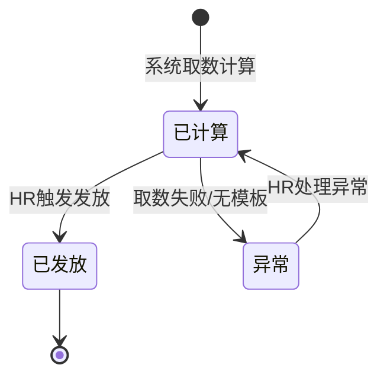

# 泳道图+状态机技法参考（Swimlane State Technique）

> 来源吸收：Trae `product-design-0to1` skill Step 5「泳道图 + 状态机图」的完整规则（含特殊系统泳道、核心业务对象状态机、迁移触发条件、异常恢复路径），作为 state-machine 的可选 to B 落地能力。
> 定位：state-machine 产出的 STATE-XXX 状态转移文本是权威；本文档提供"把状态流转按角色泳道可视化 + 为核心业务对象画状态机"的双图技法，增强多角色状态可见性。
> 触发：当状态流转涉及多角色（to B 审批/改派/转交）、或需为核心业务对象（告警单/审批单/工资单/质检单）画状态机时使用。**按需加载，不设全局闸门**。

## 1. 输入映射（pm-scaffold 语境）

| 外部 skill 输入 | pm-scaffold 对应产物 | 说明 |
|---|---|---|
| 状态机 | state-machine 的 STATE-XXX | 泳道的状态节点 / 状态机的迁移 |
| 角色 | user-journey 的角色 | 泳道行（角色泳道） |
| 事件 | state-machine 的状态×事件→目标状态 | 泳道的转移边 |
| 业务规则 | business-rules 的 BR-XXX | 转移的判定条件 |
| 异常 | exception-handling 的 EX-XXX | 失败转移的恢复 |
| 功能模块 | feature-list 的 FEA-XXX | 业务对象来源 |

> **上游未 confirmed，不启动双图**：以 STATE-XXX 已确认状态机为准；缺失标 `待确认`。

## 2. 泳道图（吸收自 product-design-0to1 Step 5.1）

每个角色一个 Mermaid `subgraph` 泳道。**允许特殊系统泳道**（v2 升级，to B 核心）：

| 特殊泳道 | 含义 | to B 场景 |
|---|---|---|
| 系统(定时任务) | 定时触发 | 月度工资计算、定时报送 |
| 系统(外部集成) | 对接外部系统取数/推送 | 对接老 ERP、银行接口 |
| 系统(自动流转) | 无人工自动状态流转 | 状态超时自动归档 |

特殊泳道在图下方"角色说明"标注触发条件。

```mermaid
flowchart TB
  subgraph HR[HR]
    H1[触发发放]
  end
  subgraph 系统_自动流转[系统(自动流转)]
    S1[取数计算]
  end
  subgraph 员工[员工]
    E1[查看工资条]
  end
  H1 --> S1
  S1 --> E1
```

泳道规则：
- 每个用户故事的主要动作必须有节点
- 必须有终态节点（归档/完成/结束）
- 特殊系统泳道须标注触发条件

## 3. 状态机图（吸收自 product-design-0to1 Step 5.2）

为每个**核心业务对象**（告警单/审批单/工资单/质检单/申请单）画状态机，Mermaid `stateDiagram-v2`：



状态机规则：
- 必须有起始 `[*]` 和终态 `[*]`
- 每条迁移必须标注触发条件（who/what 触发）
- 异常状态必须有恢复路径

## 4. 双视图对齐表（STATE-XXX）

| 当前状态 | 事件 | 目标状态 | 角色 | 追溯 |
|---|---|---|---|---|
| 待提交 | 提交 | 审批中 | 员工 | STATE-001, BR-001 |
| 审批中 | 审批通过 | 已通过 | 主管 | STATE-002, BR-002 |
| 审批中 | 审批驳回 | 已驳回 | 主管 | STATE-003, BR-003 |
| 审批中 | 改派退回 | 待提交 | 主管 | STATE-004, BR-004 |
| 异常 | 处理异常 | 已计算 | HR | STATE-005, EX-001 |

## 5. 工作流程

1. **读状态机**：从 STATE-XXX 提取状态节点、事件、目标状态。
2. **分泳道**：每个状态按归属角色分到泳道（归属由 BR-XXX 决定）；特殊系统泳道（定时/外部/自动流转）单独成道；未明示归属标 `待确认`。
3. **画泳道转移边**：状态×事件→目标状态，标注触发角色；失败转移追溯 EX-XXX。
4. **画业务对象状态机**：为核心业务对象画 stateDiagram-v2，含 [*] 起止、迁移触发条件、异常恢复路径。
5. **输出双图+对齐表**：Mermaid 泳道图 + 状态机图 + 状态表（与 STATE-XXX 一致）。

## 6. 核心硬规则

1. **泳道归属不臆断**：状态归属哪个角色泳道由 BR-XXX 决定；未明示标 `待确认`，不自行分配。
2. **双图一致**：泳道图、状态机图、对齐表三者的转移必须完全一致；不一致即 `CONFLICT`。
3. **状态机必须有起止**：每张状态机必须有起始 `[*]` 和终态 `[*]`；无终态的状态机不合格。
4. **迁移标注触发条件**：每条迁移必须标注 who/what 触发（如"HR 触发发放"），不写无主迁移。
5. **异常状态必须有恢复路径**：异常状态不能是死路，必须有恢复迁移（如"异常→已计算: HR 处理异常"），追溯 EX-XXX。
6. **to B 审批流显式**：审批/改派/转交/会签等多角色状态流转必须显式画出，不合并为单角色。

## 7. 边界（Do Not）

- 不设计状态持久化技术（状态存储/事务/锁，超出 PRD-only）。
- 不替代 STATE-XXX 文本——双图是可视化增强，状态表是权威。
- 不替业务方决定角色归属——以 BR-XXX 为准。
- 不把数据字段塞入状态机（属 validation-rules）。
- 不画无终态的状态机。

## 8. 质量自检清单

- [ ] 泳道行覆盖 user-journey 全部相关角色 + 特殊系统泳道（定时/外部/自动流转）
- [ ] 特殊系统泳道标注触发条件
- [ ] 状态节点与 STATE-XXX 一致（无 CONFLICT）
- [ ] 每张状态机有起始 [*] 和终态 [*]
- [ ] 每条迁移标注触发角色（who/what），追溯 BR-XXX
- [ ] 异常状态有恢复路径，追溯 EX-XXX，无死路
- [ ] 泳道图/状态机图/对齐表三者一致
- [ ] 审批/改派/转交多角色流转显式画出（to B）
- [ ] 无状态持久化技术越界内容
