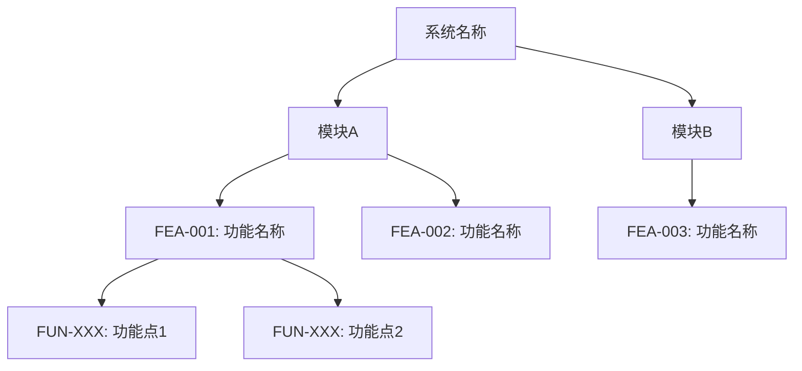

<!-- 功能结构图模板 · functional-structure branch -->
# 功能结构图

**上游**: `product-ux` artifact `待填写`（UX-XXX）
**功能总数**: `待填写` 个 FEA-XXX

## 树状结构

```text
系统名称
├── 模块A
│   ├── FEA-001: 功能名称
│   │   ├── FUN-XXX: 功能点1
│   │   └── FUN-XXX: 功能点2
│   └── FEA-002: 功能名称
│       └── FUN-XXX: 功能点3
├── 模块B
│   └── FEA-003: 功能名称
│       ├── FUN-XXX: 功能点4
│       └── FUN-XXX: 功能点5
└── ...
```

## Mermaid 图



## FUN-XXX 预分配（供 `function-description` 使用）

| FUN-ID | 功能点 | 所属 FEA | 所属模块 | 优先级建议 |
|---|---|---|---|---|
| FUN-001 | `待填写` | FEA-001 | 模块A | P0 |
| FUN-002 | `待填写` | FEA-001 | 模块A | P1 |

## 跨模块依赖

| 依赖方向 | 描述 |
|---|---|
| 模块A → 模块B | `待填写`（如"候选人管理模块依赖职位管理模块的数据"） |

## 覆盖率检查
- [ ] 所有 `product-ux` FEA-XXX 已映射
- [ ] 无孤儿功能点
- [ ] 无超过 4 层的嵌套
