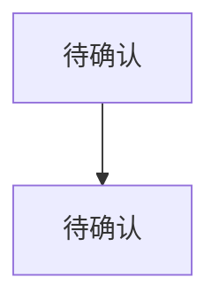

<!--
产物模板：产品 UX
product-ux SKILL.md 驱动 · 待确认 是唯一占位符。
-->
---
artifact_id: ""
version: "v0.1"
status: "draft"
owner: ""
business_fact_owner: ""
goal_decision_owner: ""
reviewer: ""
created_at: ""
updated_at: ""
confirmed_at: ""
upstream_artifact_id: ""
---

# 产品 UX

## 0. 预检输入充分度判定

- 上游产物：`待确认`
- 已确认故事卡片数：`待确认`
- 已确认角色数：`待确认`
- 判定：`待确认`

## 1. 项目范围（引用上游）

> 业务范围已在 Stage 1 Step 2 `user-journey-and-stories` §10 锁定。本步骤不再重新定义范围，只引用并在产品层面展开。

| 引用 | 内容 |
|---|---|
| 上游范围基线 | `待确认`（引用 JS-XXX §10 项目范围基线） |
| 产品层面补充假设 | `待确认`（仅当产品方案引入新的假设时才填写） |

## 2. 功能结构（Scope 层）

> 先理清"产品有哪些功能"，作为范围约束。来源：已确认范围基线 + 用户故事。

### 2.1 系统模块总览

```text
待确认
```

### 2.2 功能清单

| ID | 功能名称 | 描述 | 所属模块 | 来源故事 | 优先级 | 知识状态 |
|---|---|---|---|---|---|---|
| FEA-001 | `待确认` | `待确认` | `待确认` | `待确认` | `待确认` | `待确认` |

### 2.3 模块间关系

```text
待确认
```

## 3. UX 流程与交互规则（Structural 层）

> 用户怎么操作、操作后系统怎么反应。交互规则与 UX 流程同属页面层表达，合并产出。

### 3.1 主流程（P0）



### 3.2 分支与状态

```text
待确认
```

### 3.3 交互规则 IX-XXX

> 仅描述页面层交互（操作反馈/跳转/弹窗/表单交互），不包含业务规则（属于 function-description）。

| ID | 规则描述 | 触发条件 | 系统响应 | 适用页面/功能 | 来源 |
|---|---|---|---|---|---|
| `待确认` | `待确认` | `待确认` | `待确认` | `待确认` | `待确认` |

## 4. 页面与原型（Framework 层）

> 长什么样 + 可用性。原型是 UX 的落地产物，与 UX 一体，不是独立阶段。

### 4.1 页面与步骤描述

| 页面/步骤 | 所属功能 | 入口 | 前置条件 | 主要内容 | 操作 | 下一状态 |
|---|---|---|---|---|---|---|
| `待确认` | `待确认` | `待确认` | `待确认` | `待确认` | `待确认` | `待确认` |

### 4.2 HTML 原型（沟通载体，按需）

> 多方案/多角色沟通需要时生成 HTML 原型。原型是 UX 的视觉表达，不作为规范替代文本。

- [ ] 是否需要原型：`待确认`（多方案沟通 / 多角色评审时生成）
- 原型位置：`待确认`（保存到 99-review/diagrams/）

## 5. 事实与决定

| ID | 类型 | 内容 | 来源/决策人 | 状态 |
|---|---|---|---|---|
| 待确认 | 待确认 | 待确认 | 待确认 | 待确认 |

## 7. 假设、AI 推断、未知与冲突

| ID | 类型 | 内容 | 依据 | 影响 | 责任人 | 处理方式 |
|---|---|---|---|---|---|---|
| 待确认 | 待确认 | 待确认 | 待确认 | 待确认 | 待确认 | 待确认 |

## 8. 待确认问题

| ID | 问题 | 结论 |
|---|---|---|
| 待确认 | 待确认 | 待确认 |

## Clarifications

| session_id | category | question | ai_preliminary_judgment | options | decision_owner | blocking | deferral_risk | accepted_answer | reflow_target | integrated_at | integrated_by | audit_recheck |
|---|---|---|---|---|---|---|---|---|---|---|---|---|
| 待补充 | 待补充 | 待补充 | 待补充 | 待补充 | 待补充 | 待补充 | 待补充 | 待补充 | 待补充 | 待补充 | 待补充 | 待补充 |

## 9. 来源追溯

| 来源 ID | 材料/位置 | 关键内容 | 本文落位或排除理由 |
|---|---|---|---|
| 待确认 | 待确认 | 待确认 | 待确认 |

## 10. 下游输入摘要

```text
confirmed_version: 待确认
scope_summary: 待确认
feature_summary: 待确认
module_boundaries: 待确认
page_and_state_summary: 待确认
open_nonblocking_unknowns: 待确认
source_ids: 待确认
```

## 11. Constitution Compliance

| 原则 | 状态 | 证据 / 备注 |
|---|---|---|
| ① 业务事实分离 | 待确认 | |
| ② AI 不替业务决定 | 待确认 | |
| ③ 来源可追溯 | 待确认 | |
| ④ 冲突显式保留并关闭 | 待确认 | |

## 12. 版本变更摘要

| 版本 | 变更原因 | 主要变化 | 人工确认状态 |
|---|---|---|---|
| v0.1 | 初始候选 | 待确认 | 待确认 |
