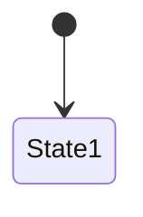

<!--
产物模板：PRD 工程师版 (Technical Variant)
读者：研发/架构师/QA · 聚焦可实现性和可测试性
从标准 PRD + function-description 提取，不新增需求。
-->
<!-- 🤖 AGENT INSTRUCTION: See prd.md agent block for full rules. This variant focuses on implementability. -->
---
artifact_id: ""
version: "v0.1"
status: "draft"
variant: "technical"
source_prd: ""
---
# {产品名称} · 技术规格

## 1. 系统架构

```text
{引自 PRD §5.1}
```

## 2. 三方系统对接

| 系统 | 对接内容 | 接口 SLA | 负责人 |
|---|---|---|---|
| | | | |

## 3. 数据模型

### 核心实体

| 实体 | 字段 | 类型 | 必填 | 校验规则 | 来源 (F-XXX) |
|---|---|---|---|---|---|
| | | | | | |

### 实体关系

```text
{实体A} --1:N-- {实体B}
```

## 4. 状态机

| 当前状态 | 触发事件 | 目标状态 | 条件 | 来源 |
|---|---|---|---|---|
| | | | | |



## 5. 业务规则清单

| BR ID | 规则 | 实现位置 | 优先级 |
|---|---|---|---|
| | | | |

## 6. 异常与失败处理

| 场景 | 触发条件 | 系统行为 | 恢复方式 | 用户提示 | 来源 |
|---|---|---|---|---|---|
| | | | | | |

## 7. 验收标准

| AC ID | Given/When/Then | 量化阈值 | 测试方式 | 来源 |
|---|---|---|---|---|
| | | | | |

## 8. 非功能性需求

### 性能
- 

### 安全
- 

### 埋点
- 

## 9. 技术风险与债务

| 风险 | 影响 | 缓解 |
|---|---|---|
| | | |
