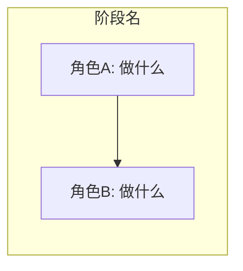
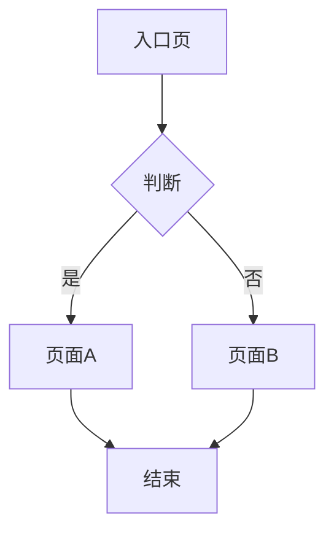
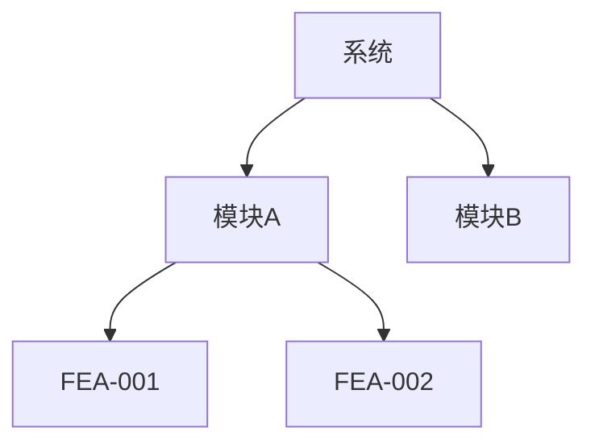

# 画图能力速查 · PM 脚手架

> 所有方式都是"文本 DSL → 渲染器 → 图形"，纯文本模型均可使用。

## 按场景选择

| 我想画... | 用什么 | 命令/方式 |
|---|---|---|
| 用户旅程图 | Mermaid `graph LR` | 嵌入 `user-journey-and-stories` §2，可选 Figma `generate_diagram` 导出 FigJam |
| UX 流程图 | Mermaid `graph TD` | 嵌入 `product-ux` §3，含决策分支+异常路径 |
| 系统架构图 | Figma `generate_diagram` (architecture) | 树状 Module→Feature，可编辑 |
| 功能结构树 | Mermaid `graph TD` 或 `functional-structure` 分支模板 | `product-ux` §2.1 内嵌 |
| 时序图 | Mermaid `sequenceDiagram` | 角色间交互、API 调用流 |
| 甘特图 | Mermaid `gantt` | 项目排期、里程碑 |
| ER 图/数据模型 | Mermaid `erDiagram` | `function-description` 数据模型 |
| 状态图 | Mermaid `stateDiagram-v2` | `function-description` 状态变化 |
| 可点击原型 | `frontend-design` Skill (+ `theme-factory`) | HTML+CSS+JS，品牌主题 |
| 数据图表 | `dataviz` Skill 或 ECharts/Chart.js | 竞品对比雷达图、漏斗图、KPI 卡片 |
| 竞品定位图 | `dataviz` Skill → 散点/气泡图 | 价格 vs 功能矩阵 |
| 静态视觉(海报/品牌) | `canvas-design` Skill | PNG/PDF 导出 |
| 飞书画板 | `lark-cli whiteboard-update` 或 Figma `generate_diagram` | Mermaid→飞书画板渲染 |

## Mermaid 常用模板

### 用户旅程图


### UX 流程图（含分支）


### 系统架构图


## Figma MCP 集成

| 场景 | MCP 方法 | 说明 |
|---|---|---|
| Mermaid→FigJam | `generate_diagram` | 自动创建 FigJam 文件，返回可编辑链接 |
| 设计稿→代码 | `get_design_context` | 获取 HTML/CSS 参考 + 设计变量 |
| 搜索设计系统组件 | `search_design_system` | 找到可复用的 Button/Form/Card |
| 网页截屏→Figma | `generate_figma_design` | 竞品页面截屏→Figma 画板 |
| 获取设计 Token | `get_variable_defs` | 颜色/字体/间距变量 |

## 飞书画板集成

```bash
# Mermaid 代码→飞书画板（飞书原生 MD 不渲染 Mermaid）
lark-cli docs +update --command block_replace --file ./flow.md

# 或将 Mermaid 内容写为 <whiteboard type="mermaid"> 块
```

## 原则

1. **文字是权威，图是辅助**——Mermaid 代码嵌入产物，渲染结果用于沟通
2. **图要可追溯**——节点标注对应的 ST-XXX/FEA-XXX/FUN-XXX ID
3. **不依赖多模态**——所有图都是文本 DSL，纯文本模型可生成
