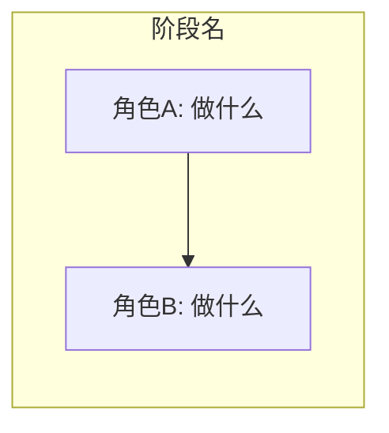
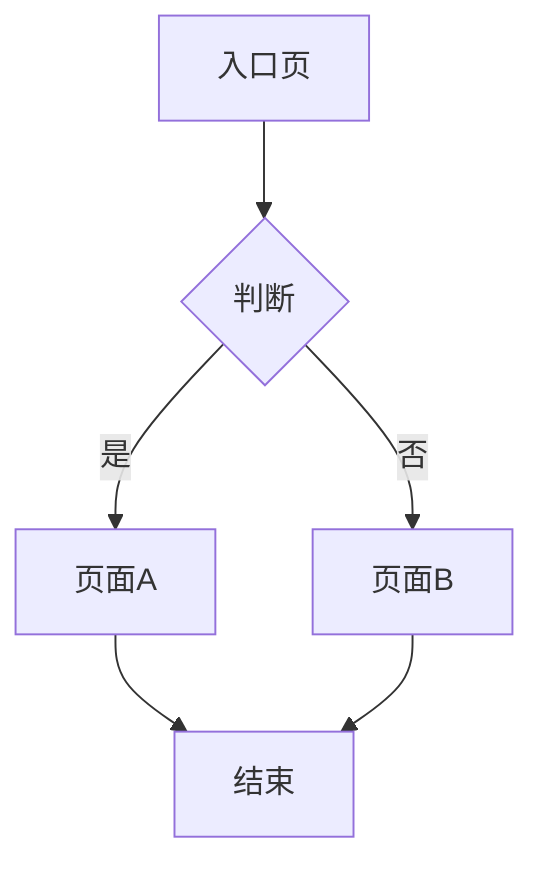
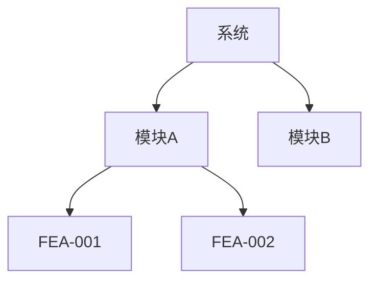

# 画图能力速查 · PM 脚手架

> 所有方式都是"文本 DSL → 渲染器 → 图形"，纯文本模型均可使用。
> 画图是工具层面的选择（toolkit decision），不是全局强制门禁；按需选用最轻量够用的格式。

## 选型决策

是否需要画图？当产物契约要求配图、或评审方需要视觉呈现时才用。选择最轻量可用的格式：

| 需求 | 首选 | 理由 |
|---|---|---|
| 权威流程逻辑，需嵌入 Markdown | **Mermaid** | 文本 DSL，随文档版本管理，可追溯 |
| 多人协作编辑 / 需要可编辑画布 | **FigJam / 本地白板** | 协作改图，评审时画批注 |
| 给业务方 / 开发沟通 UX | **HTML 原型** | 可点击交互，比静态图直观 |
| 仅用于分发（无编辑需求） | **PNG/SVG** | 产物分享、嵌入 PRD 时导出 |

选型铁律：
- 每张图必须**源于同一份源表或稳定 ID**（ST-XXX / FEA-XXX / FUN-XXX），不另造数据。
- 渲染后**检查一遍**再交付，并从产物中链接到图。
- 图只是辅助，**永不替代必填文字、规则或人工确认**。

## 按场景选择（速查）

| 我想画... | 用什么 | 命令/方式 |
|---|---|---|
| 用户旅程图 | Mermaid `graph LR` | 嵌入 `user-journey-and-stories` §2，可选 Figma `generate_diagram` 导出 FigJam |
| 功能流程图 | Mermaid `graph TD` | 嵌入 `function-description` §2，含决策分支+异常路径 |
| 系统架构图 | Figma `generate_diagram` (architecture) | 树状 Module→Feature，可编辑 |
| 功能结构树 | Mermaid `graph TD` | `function-description` §1 功能清单（FEA 树）内嵌 |
| 时序图 | Mermaid `sequenceDiagram` | 角色间交互、API 调用流 |
| 甘特图 | Mermaid `gantt` | 项目排期、里程碑 |
| ER 图/数据模型 | Mermaid `erDiagram` | `function-description` 数据模型 |
| 状态图 | Mermaid `stateDiagram-v2` | `function-description` 状态变化 |
| 可点击原型 | `frontend-design` Skill (+ `theme-factory`) | HTML+CSS+JS，品牌主题 |
| 数据图表 | `dataviz` Skill 或 ECharts/Chart.js | 竞品对比雷达图、漏斗图、KPI 卡片 |
| 竞品定位图 | `dataviz` Skill → 散点/气泡图 | 价格 vs 功能矩阵 |
| 静态视觉(海报/品牌) | `canvas-design` Skill | PNG/PDF 导出 |
| 飞书画板 | `lark-cli whiteboard-update` 或 Figma `generate_diagram` | Mermaid→飞书画板渲染 |

## Mermaid 常用模板

### 用户旅程图


### 功能流程图（含分支）


### 系统架构图


## 本地画图工具清单（Agent 无关）

> 所有工具均为开源、本地运行、CLI 可调用，任何 AI Agent 均可使用。
> 不依赖特定 Agent 的内置能力（Figma MCP / frontend-design Skill 等）。

### Tier 1: `diagram` — Rust 单二进制，零依赖 ⭐

```bash
# 安装 (需要 Rust)
cargo install --git https://github.com/yingkitw/diagram

# 或下载预编译二进制 (macOS/Linux/Windows)
# https://github.com/yingkitw/diagram/releases
```

**支持格式**: Mermaid, PlantUML, Graphviz DOT, D2 → SVG / PNG / PDF

**常用命令**:
```bash
diagram render input.mmd --output out.svg
diagram render input.mmd --output out.png
diagram render input.puml --output out.svg    # PlantUML
diagram render input.dot --output out.png     # Graphviz

# MCP 模式 (任何 MCP 客户端可调用)
diagram mcp
```

**适用**: 无 Node/Python/Docker 环境，单文件部署。

### Tier 2: `mermaid-cli` (mmdc) — 官方 CLI，Markdown 内嵌渲染

```bash
npm install -g @mermaid-js/mermaid-cli
```

**核心能力: Markdown → 渲染后的 Markdown**
```bash
# 提取 .md 中所有 ```mermaid 块 → 渲染为 SVG → 替换为图片引用
mmdc -i input.md -o output.md

# 单图渲染
mmdc -i diagram.mmd -o output.svg
mmdc -i diagram.mmd -o output.png -t dark -b transparent -s 2

# 批量转换
for f in *.mmd; do mmdc -i "$f" -o "${f%.mmd}.svg"; done
```

**适用**: 已有 Node 环境，需要处理含 Mermaid 的 Markdown 文件。

### Tier 3: `@neverprepared/mcp-kroki` — 28+ 格式，MCP 服务器

```bash
# 需要 Docker
npx -y @neverprepared/mcp-kroki
```

**支持的图类型**: PlantUML, Mermaid, Graphviz, D2, C4, BPMN, Excalidraw, Vega, Bytefield, 等 28+ 种

**MCP 配置** (claude_desktop_config.json / settings.json):
```json
{
  "mcpServers": {
    "kroki": {
      "command": "npx",
      "args": ["-y", "@neverprepared/mcp-kroki"]
    }
  }
}
```

**适用**: 需要多种图格式，已安装 Docker。

### Tier 4: `diagramify-ai` — AI 辅助生成

```bash
npm install -g diagramify-ai
```

**能力**: 分析代码库或自然语言描述 → 生成 Mermaid 图 → SVG/PNG/HTML
```bash
diagramify generate "用户旅程: 求职者浏览职位到投递" --output journey
diagramify render diagram.mmd --format svg
diagramify diff base.mmd modified.mmd
```

**适用**: 需要 AI 从描述/代码中自动生成图。

### 本地工具按 PM 场景选择

| 场景 | 推荐工具 | 命令 |
|---|---|---|
| 画用户旅程图 (Mermaid) | `mermaid-cli` | `mmdc -i journey.md -o journey-rendered.md` |
| 画功能流程图 | `mermaid-cli` | `mmdc -i functional-flow.md -o functional-flow-rendered.md` |
| 画架构图 (PlantUML/D2) | `diagram` | `diagram render arch.puml -o arch.svg` |
| 画 ER 图/数据模型 | `mermaid-cli` | `mmdc -i erd.mmd -o erd.svg` |
| 画甘特图 | `mermaid-cli` | `mmdc -i gantt.mmd -o gantt.svg` |
| 批量 Markdown→带图的 MD | `mermaid-cli` | `mmdc -i prd.md -o prd-rendered.md` |
| 网页端可交互图 | `diagramify-ai` | `diagramify preview diagram.mmd` |
| Agent 通过 MCP 调用 | `diagram` (MCP) 或 `kroki` (MCP) | `diagram mcp` |
| 无任何依赖 (纯文本) | VS Code 原生 Mermaid 预览 | `Cmd+Shift+V` 打开 .md |

### 脚手架集成方式

**方案 A: CLI 脚本封装 (推荐)**

```bash
# src/scripts/render_diagrams.sh
#!/bin/bash
# 将指定 .md 文件中所有 Mermaid 块渲染为 SVG
# 用法: bash render_diagrams.sh requirements/REQ-NNN-<topic>/001-business-requirements/02-user-journey-stories/journey-and-stories.md

INPUT="$1"
OUTPUT="${INPUT%.md}-rendered.md"

if command -v mmdc &> /dev/null; then
    mmdc -i "$INPUT" -o "$OUTPUT"
    echo "✅ Rendered: $OUTPUT"
elif command -v diagram &> /dev/null; then
    # diagram 逐图渲染
    echo "Using diagram CLI..."
else
    echo "⚠️  No diagram CLI found. Install: npm install -g @mermaid-js/mermaid-cli"
fi
```

**方案 B: Python 脚本 (无需 Node)**

```python
# src/scripts/render_diagrams.py
# 提取 Markdown 中的 Mermaid 块，调用 subprocess 渲染
import subprocess, re, sys
from pathlib import Path

def render_mermaid(md_path: Path):
    text = md_path.read_text()
    blocks = re.findall(r'```mermaid\n(.*?)```', text, re.DOTALL)
    for i, block in enumerate(blocks):
        tmp = md_path.with_suffix(f'.tmp{i}.mmd')
        tmp.write_text(block)
        subprocess.run(['diagram', 'render', str(tmp), '--output', 
                       str(md_path.with_name(f'{md_path.stem}-{i}.svg'))])
        tmp.unlink()
```

**方案 C: CI 自动化**

```yaml
# .github/workflows/render-diagrams.yml
- name: Render Mermaid diagrams
  run: |
    npm install -g @mermaid-js/mermaid-cli
    find requirements/ -name "*.md" -exec mmdc -i {} -o {} \;
```

### 对比: Agent 内置 vs 开源工具

| 能力 | Agent 内置 (Claude Code) | 开源本地工具 |
|---|---|---|
| Mermaid 渲染 | VS Code 原生预览 | `mmdc` → SVG/PNG/PDF |
| PlantUML | ❌ | `diagram` / `kroki` |
| D2 图 | ❌ | `diagram` |
| Graphviz DOT | ❌ | `diagram` / `kroki` |
| 批量 Markdown→图 | ❌ | `mmdc -i input.md -o output.md` |
| HTML 原型 | `frontend-design` Skill | `diagramify-ai` |
| FigJam 导出 | Figma MCP | ❌ (需 Figma API) |
| 零依赖本地 | VS Code 预览 | `diagram` (Rust binary) |
| MCP 标准接口 | Figma MCP | `diagram mcp` / `kroki` MCP |

**结论**: Agent 内置能力用于交互式预览和 Figma 协作；开源 CLI/MCP 用于批量渲染、CI 集成、和 Agent 无关的本地持久化输出。

## Figma MCP 集成

> 详细操作见 `figma-mcp-integration.md`（Figma 专属 MCP 集成文档）。

| 场景 | MCP 方法 | 说明 |
|---|---|---|
| Mermaid→FigJam | `generate_diagram` | 自动创建 FigJam 文件，返回可编辑链接 |
| 设计稿→代码 | `get_design_context` | 获取 HTML/CSS 参考 + 设计变量 |
| 搜索设计系统组件 | `search_design_system` | 找到可复用的 Button/Form/Card |
| 网页截屏→Figma | `generate_figma_design` | 竞品页面截屏→Figma 画板 |
| 获取设计 Token | `get_variable_defs` | 颜色/字体/间距变量 |

## 飞书画板集成

```bash
# Mermaid 代码→飞书画板（飞书原生 MD 不渲染 Mermaid）
lark-cli docs +update --command block_replace --file ./flow.md

# 或将 Mermaid 内容写为 <whiteboard type="mermaid"> 块
```

## 原则

1. **文字是权威，图是辅助**——Mermaid 代码嵌入产物，渲染结果用于沟通
2. **图要可追溯**——节点标注对应的 ST-XXX/FEA-XXX/FUN-XXX ID
3. **不依赖多模态**——所有图都是文本 DSL，纯文本模型可生成
4. **图不替代确认**——图只辅助沟通，必填文字、规则与人工确认不被替代
