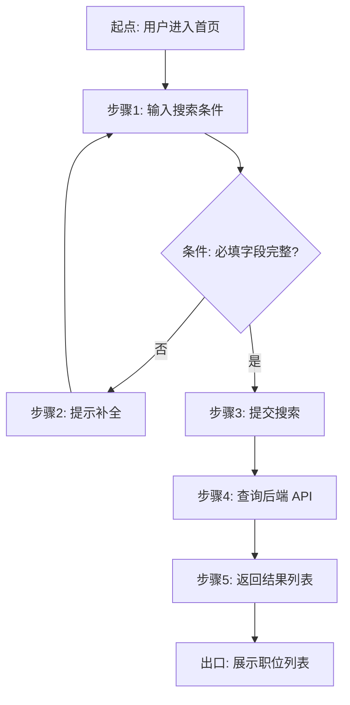
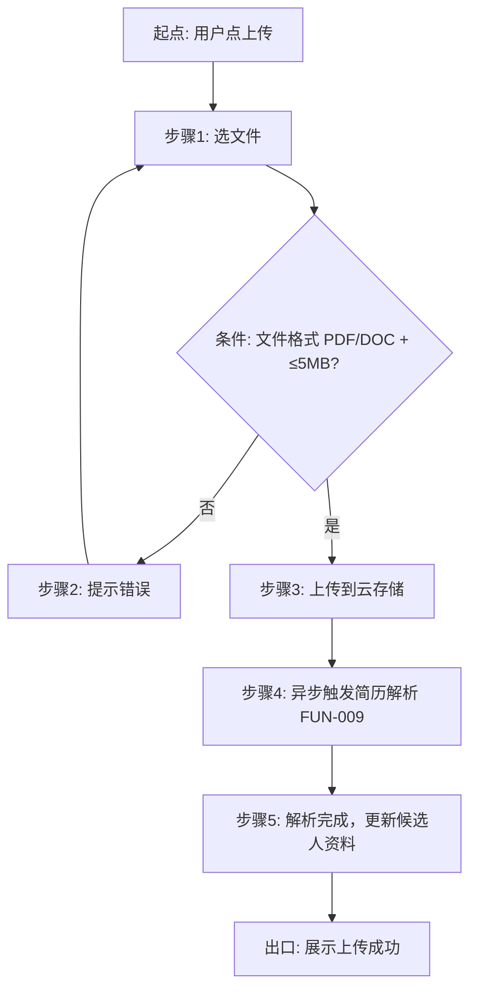
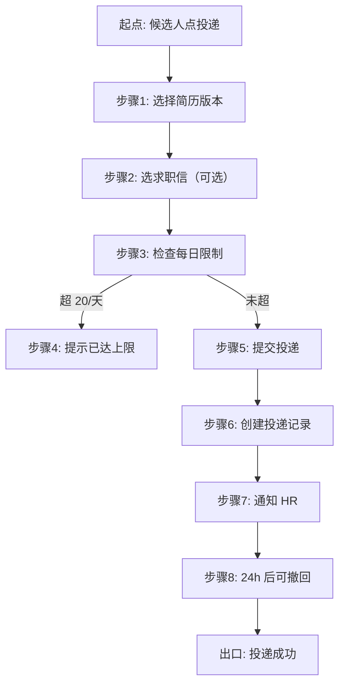
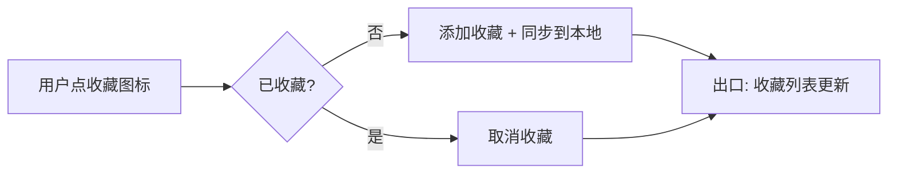
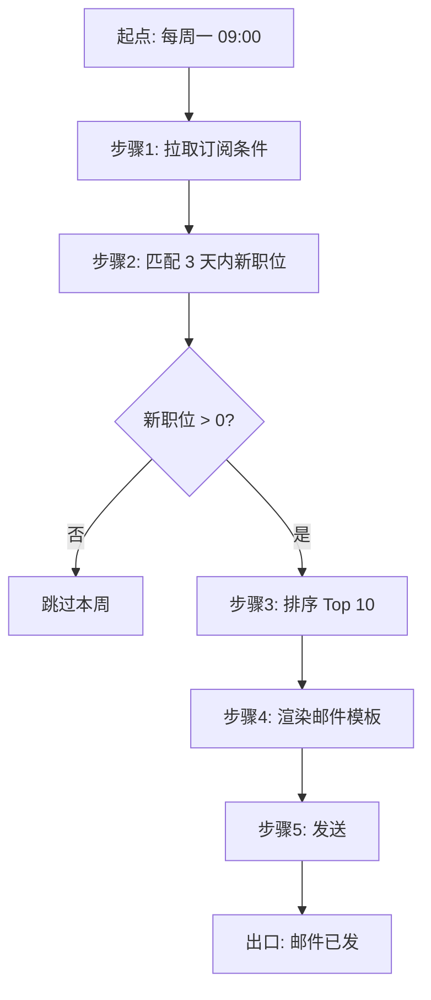
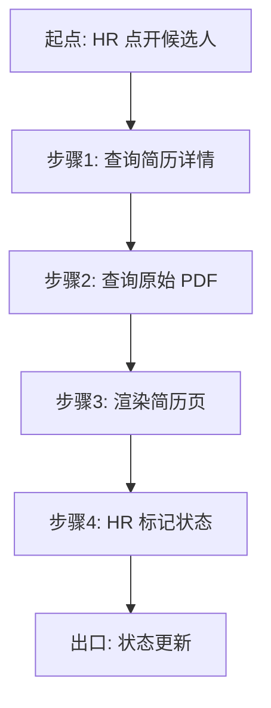
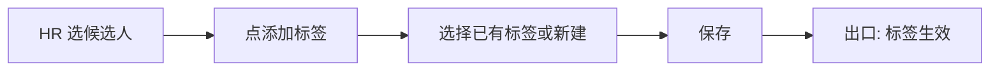
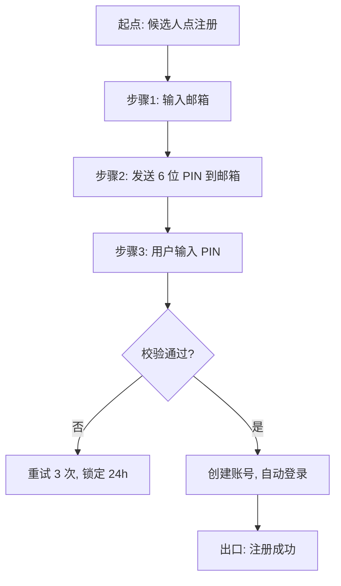
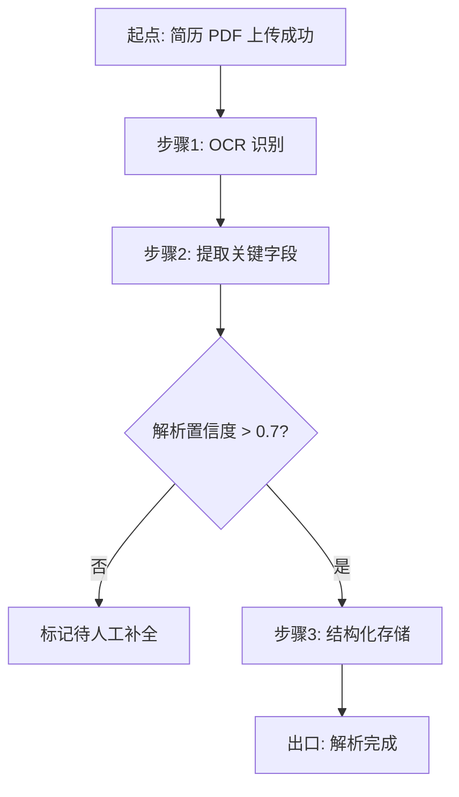
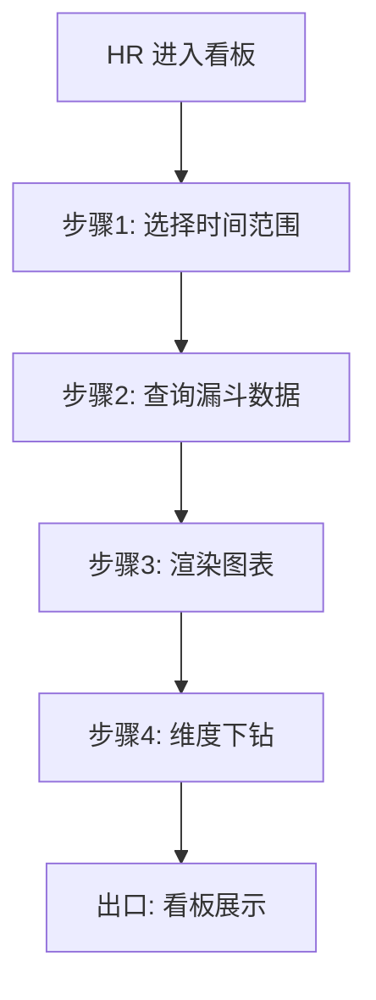

# 功能流程（FUN）

> 10 个 FUN-XXX 功能流程图 · 主流程 + 异常分支

## 0. 预检输入充分度判定

- 输入：FEA-HIRE-001 v0.1 ready_for_human_review（18 个 FEA）
- 判定：**充分模式** → 走 §FUN-001~§FUN-010 完整工作流

---

## FUN-001: 职位搜索（FEA-001 · ST-001）

### 主流程

### 异常路径

- F-001-1：用户输入关键词包含 SQL 注入字符 → 步骤3 拒绝，返回 400
- F-001-2：后端 API 超时（>3s）→ 步骤4 重试 1 次，仍失败则展示"搜索服务暂不可用"
- F-001-3：结果集 >10000 → 分页 + 提示"已显示前 10000 条"
- F-001-4：用户取消搜索 → 直接退出，无副作用

---

## FUN-002: 简历上传（FEA-002 · ST-002）

### 主流程

### 异常路径

- F-002-1：文件超过 5MB → 步骤2 拒绝（前端校验 + 后端校验）
- F-002-2：上传中断（网络断开）→ 步骤3 重试 3 次，仍失败则回滚（删除已上传部分）
- F-002-3：简历解析失败 → 标记"待人工补全"，用户可手动填关键字段
- F-002-4：用户上传含病毒的 PDF → 步骤3 拒绝，提示"文件不安全"

---

## FUN-003: 简历投递（FEA-003 · ST-002）

### 主流程

### 异常路径

- F-003-1：用户已投递过此职位（重复投递）→ 步骤5 拒绝，提示"已投递"
- F-003-2：职位已关闭 → 步骤5 拒绝
- F-003-3：网络失败 → 步骤5 重试 3 次
- F-003-4：超过 24h 后用户想撤回 → 步骤8 拒绝，提示"已超过撤回时限"

---

## FUN-004: 职位收藏（FEA-004 · ST-003）

### 主流程

### 异常路径

- F-004-1：用户未登录 → 弹登录引导
- F-004-2：网络失败 → 重试 3 次 + 离线缓存（登录后同步）

---

## FUN-005: 邮件推荐触发（FEA-005 · ST-004）

### 主流程

### 异常路径

- F-005-1：用户取消订阅 → 步骤1 跳过此用户
- F-005-2：邮件发送失败 → 重试 1 次，仍失败则标记"待重发"
- F-005-3：用户邮箱无效 → 标记"邮箱待验证"

---

## FUN-006: HR 查看简历（FEA-006 · ST-005）

### 主流程

### 异常路径

- F-006-1：候选人撤回简历 → 显示"候选人已撤回"
- F-006-2：HR 误操作标记 → 7 天内可撤销状态

---

## FUN-007: HR 筛选标签（FEA-007 · ST-005）

### 主流程

---

## FUN-008: 用户注册登录（FEA-008 · ST-006）

### 主流程

### 异常路径

- F-008-1：邮箱已注册 → 提示"该邮箱已注册，请直接登录"
- F-008-2：PIN 邮件未送达 → 重发 1 次
- F-008-3：PIN 输入错误 3 次 → 锁定 24h + 邮件告警
- F-008-4：邮件格式无效 → 步骤1 拒绝

---

## FUN-009: 简历解析（FEA-009 · ST-007）

### 主流程

---

## FUN-010: HR 数据可视化（FEA-012 · ST-010）

### 主流程

## 知识状态标注

- 各 FUN 主流程/异常路径节点均源于 ST-001~016 与 FEA-001~018 的明确行为描述 → **FACT**
- 重试次数（如 F-001-2 重试 1 次、F-002-2 重试 3 次）与超时阈值（3s）为技术实现决定 → **DECISION**
- FUN-005 邮件推荐的"每周一 09:00 推送"执行时点属运营假设 → **AI_INFERENCE**
- 各流程的 SLA 指标（如搜索 P99 < 800ms）的具体验收口径待性能基线确认 → **UNKNOWN**
