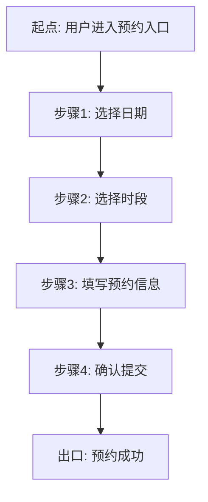

## 功能流程

### FUN-001: 场地预约（FEA-001，来源 ST-003）

#### 主流程

#### 分支流程

| 决策点 | 判定条件 | 去向 | 条件是否互斥/穷举 |
|---|---|---|---|
| 时段选择 | 名额已满 | 转异常流程-改期/排队 | 是 |
| 时段选择 | 时段可预约 | 进入填写预约信息 | 是 |
| 登录判断 | 未登录 | 先登录再回跳本步骤 | 是 |

#### 异常流程

| 异常场景 | 触发条件 | 流程走向 | 回退目标 |
|---|---|---|---|
| 名额满 | 目标时段名额已满（FACT） | 提示改期或加入排队 | 回退到步骤2 选时段 |
| 提交失败 | 支付/接口失败（FACT） | 重试或取消 | 回退到步骤4 确认提交 |
| 库存不足 | 目标场地库存不足（FACT） | 回选时段 | 回退到步骤2 选时段 |

#### 步骤追溯

| 步骤 | 来源 |
|---|---|
| 步骤1-4 主流程 | FEA-001 / ST-003 |
| 异常回退路径 | AI_INFERENCE（待人工确认回退目标） |
