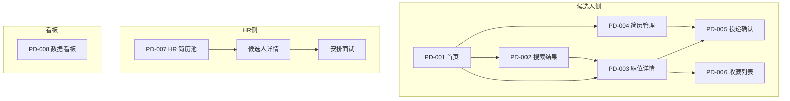

# 页面设计（PD）

> 8 个 PD-XXX 页面骨架 · 信息架构 + 移动端适配 + 跨页面导航

## 0. 预检输入充分度判定

- 输入：FEA-HIRE-001（18 个 FEA）+ FL-HIRE-001（10 个 FUN 流程）
- 判定：**充分模式** → 走 §1-§3 完整工作流

## 1. 信息架构图

## 2. 页面设计

### PD-001 首页（候选人侧入口）

| 字段 | 内容 |
|---|---|
| 入口 | 浏览器直接访问 `https://hire.company.com/` |
| 前置 | 无（无需登录可浏览） |
| 头部 | Logo / 搜索框 / 登录按钮 / 注册按钮 |
| 主内容（桌面） | Hero 区：标题"找到你的下一份工作"+ 城市/行业/经验 3 个下拉 + 搜索按钮 |
| 主内容（移动） | 简化版 Hero（城市+搜索）+ 折叠的行业抽屉 |
| 边栏 | 热门城市 / 热门行业 |
| 可用操作 | 搜索 / 登录 / 注册 / 查看职位详情 |
| 失败处理 | 搜索服务不可用：显示"搜索暂不可用，请稍后" |
| 移动端差异 | 隐藏边栏 + 折叠抽屉 |

### PD-002 搜索结果页

| 字段 | 内容 |
|---|---|
| 入口 | PD-001 提交搜索 / 搜索框回车 |
| 前置 | 搜索条件（城市/行业/经验，可为空） |
| 头部 | 搜索框（保留上次条件）/ 排序下拉（相关性/最新/薪酬）/ 筛选器 |
| 主内容 | 职位卡片列表（每页 20 条）— 卡片含职位名/公司/城市/薪酬/标签/投递按钮 |
| 边栏 | 进阶筛选（薪资范围/发布时间/公司规模） |
| 分页 | 底部 1-2-3-...-N + 跳页 |
| 空状态 | "暂无匹配职位"+ 推荐城市/行业建议 |
| 加载状态 | 卡片骨架屏（不闪烁） |
| 失败处理 | 500 错误：显示"搜索服务出错"+ 重试按钮 |
| 移动端 | 筛选器抽屉化（点击展开） |

### PD-003 职位详情页

| 字段 | 内容 |
|---|---|
| 入口 | PD-002 卡片点开 / 收藏列表点开 |
| 前置 | 职位 ID |
| 头部 | 面包屑（首页 > 搜索 > 职位名） |
| 主内容 | 职位详情（描述/要求/薪酬/福利）/ 公司简介 / 相似职位推荐 |
| 右侧栏 | 投递按钮（醒目）/ 收藏图标 / 分享按钮 |
| 底部 | "申请此职位" CTA 按钮 |
| 失败处理 | 职位已关闭：显示"该职位已关闭"+ 相似职位 |
| 移动端 | 右侧栏折叠到底部固定栏 |

### PD-004 简历上传/管理页

| 字段 | 内容 |
|---|---|
| 入口 | 顶部导航"我的简历" / PD-005 投递时"换一份简历" |
| 前置 | 已登录 |
| 头部 | 标题"我的简历"+ 上传按钮 |
| 主内容 | 简历列表（每条卡片：文件名/上传时间/解析状态/默认标识/操作按钮） |
| 上传弹窗 | 拖拽区 + 选文件按钮 + 格式说明（PDF/DOC, ≤5MB）|
| 失败处理 | 解析失败：标注"待补全"+ 手动填写关键字段入口 |
| 移动端 | 列表单列 + 上传按钮浮动 |

### PD-005 投递确认页

| 字段 | 内容 |
|---|---|
| 入口 | PD-003 投递按钮 / PD-004 简历选择后点"去投递" |
| 前置 | 已登录 + 至少 1 份简历 + 至少 1 个目标职位 |
| 头部 | 职位摘要（公司/职位名/薪酬） |
| 主内容 | 简历版本选择（多版本时）/ 求职信撰写（富文本 + 模板）/ 一键投递按钮 |
| 提交后 | 成功页（投递确认 + 推荐相似职位）/ 失败页（错误信息 + 重试） |
| 失败处理 | 每日 20 限制：提示"今日已达上限"+ 明日再来 |

### PD-006 收藏列表页

| 字段 | 内容 |
|---|---|
| 入口 | 顶部导航"我的收藏" |
| 前置 | 已登录 |
| 头部 | 标题"我收藏的职位"（共 X 个）+ 排序/筛选 |
| 主内容 | 职位卡片列表（与 PD-002 卡片相同 + 取消收藏按钮） |
| 空状态 | "你还没收藏任何职位"+ 推荐热门职位 |
| 移动端 | 列表单列 |

### PD-007 HR 后台：简历池页

| 字段 | 内容 |
|---|---|
| 入口 | HR 登录后默认页 |
| 前置 | HR 角色 + 已登录 |
| 左侧栏 | 职位列表（HR 管理的所有职位）+ 标签筛选树 |
| 主内容 | 候选人卡片列表（每条：姓名/投递职位/投递时间/状态徽章/标签） |
| 顶部 | 全局筛选（状态/时间/标签）+ 搜索 + 批量操作 |
| 详情抽屉 | 点卡片右侧滑出（候选人详情 + 简历 PDF + 操作按钮） |
| 空状态 | "暂无候选人"+ 推广建议 |
| 加载状态 | 卡片骨架屏（每行 6 个骨架）|
| 失败处理 | 加载失败：每行单独"重试"按钮，不阻塞整体 |

### PD-008 HR 后台：数据看板页

| 字段 | 内容 |
|---|---|
| 入口 | HR 顶部导航"数据看板" |
| 前置 | HR 角色 |
| 头部 | 时间范围选择（今日/本周/本月/本季/自定义）|
| 顶部 KPI | 4 个数字卡片（曝光/投递/面试/录用 + 同比%变化） |
| 主图表 | 漏斗图（曝光→点击→投递→面试→录用）+ 折线图（每日新增） |
| 维度下钻 | 按职位 / 渠道 / HR 拆分 |
| 加载状态 | 图表骨架屏（避免闪烁） |
| 失败处理 | 数据加载失败：显示"暂无可用数据"+ 重试 |

## 3. 跨页面导航规则

| 起点 | 终点 | 触发 | 数据 |
|---|---|---|---|
| PD-001 | PD-002 | 搜索提交 | 搜索条件 |
| PD-002 | PD-003 | 卡片点开 | 职位 ID |
| PD-003 | PD-005 | 投递按钮 | 职位 ID |
| PD-005 | PD-006 | 投递成功+推荐 | — |
| PD-001 | PD-004 | 顶部导航 | 登录态 |
| PD-007 | PD-007 详情 | 卡片点开 | 候选人 ID |
| 任何 | PD-008 | 顶部导航 | HR 角色 |
