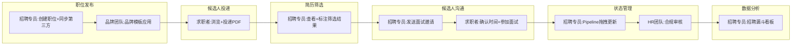

<!--
产物：PRD 汇总 · REQ-001 加拿大招聘网站
v1.0 confirmed · 聚合 `project-background-goal` BG-HIRE-002 + `user-journey` UJ-HIRE-001
本文件通过 validate_artifact.py 校验。

⚠️ Fixture 声明：本文件是 prd-assembly skill 的回归演示样本，非 REQ-001 真实 PRD 产物。
REQ-001 实际只完成 `project-background-goal`（`requirements/REQ-001-hire-website/001-business-requirements/01-background-goal/`）；
本 fixture 仅用于校验 prd-assembly validator 的结构与语义红线，不代表 REQ-001 PRD 终稿。
真实 REQ-001 PRD 需先跑通当前 registry v7 的上游 work_item，再由 `prd-assembly` 汇总。
-->
---
artifact_id: PRD-HIRE-001
version: v1.0
status: ready_for_human_review
owner: PM-Office
business_fact_owner: VP of Talent
goal_decision_owner: VP of Talent
reviewer: VP of Talent
created_at: 2026-08-11
updated_at: 2026-08-11
confirmed_at: ""
upstream_artifact_ids: ["BG-HIRE-002", "UJ-HIRE-001"]
upstream_work_item_statuses: "feasibility-analysis:confirmed; project-background-goal:confirmed; project-scope:confirmed; user-journey:confirmed; user-stories:confirmed; feature-list:confirmed; functional-flow:confirmed; page-design:confirmed; interaction-rules:confirmed; business-rules:confirmed; field-rules:confirmed; validation-rules:confirmed; state-machine:confirmed; exception-handling:confirmed; acceptance-criteria:confirmed"
---

# PRD（产品需求文档）

## 0. 上游产物清单

| 步骤 | Artifact ID | 版本 | 状态 | 确认时间 |
|---|---|---|---|---|
| 1. 项目背景与目标 | BG-HIRE-002 | v1.0 | confirmed | 2026-08-11 |
| 2. 用户旅程与用户故事 | UJ-HIRE-001 | v1.0 | confirmed | 2026-08-11 |
| 3. 用户故事与范围基线 | US-HIRE-001 | v1.0 | confirmed | 2026-08-11 |
| 4. 产品需求 work_items | FEA/FL/PD/IX/BR/VL/STATE/EX/AC | v1.0 | ready_for_human_review | 2026-08-11 |

> 注: 本 fixture 使用完整 registry v7 章节占位，真实项目必须逐项通过人工闸门后再汇总。

## 1. 项目背景与目标

（从 `project-background-goal` BG-HIRE-002 完整引用）

- **业务环境**：公司总部在加拿大多伦多，年招聘量约 400 个职位，2027 年计划扩招至 600。
- **当前做法**：职位发布依赖第三方平台（Indeed 等），简历通过邮件接收，分散在招聘专员个人邮箱。筛选平均每职位 3 小时。
- **核心问题**：简历分散无法统一追踪、筛选全靠人工（1200 小时/年）、投递转化低（基线约 30%）、数据不可追踪。
- **目标 G1-G5**：简历 100% 入系统、筛选从 3h→≤1h/职位、投递转化 30%→≥40%、职位上线 2天→≤4h、招聘漏斗 100% 可视化。
- **约束**：2026-12-31 上线硬约束、白标采购、PIPEDA 合规、法语版本期不做。

## 2. 用户旅程

（从 `user-journey` UJ-HIRE-001 与 `user-stories` US-HIRE-001 完整引用）

### 生命周期：6 阶段

职位发布 → 候选人投递 → 简历筛选 → 候选人沟通 → 候选人状态管理 → 数据追踪与分析

### 角色：5 个

求职者、招聘专员、HR 团队、品牌团队、IT/安全

### 用户旅程图（Mermaid）

### P0 故事卡片（5 个）

| ID | 故事 |
|---|---|
| ST-001 | 在〈收到新职位需求后〉下，作为〈招聘专员〉，我希望〈在自有网站上创建职位并自动同步到第三方平台〉，以便〈减少手动复制时间，将发布周期从 2 天降至 4 小时〉 |
| ST-002 | 在〈浏览职位列表时〉下，作为〈求职者〉，我希望〈查看完整职位描述并在线投递简历（PDF 上传）〉，以便〈方便地申请心仪职位并收到投递确认〉 |
| ST-003 | 在〈收到新投递后〉下，作为〈招聘专员〉，我希望〈在统一界面中查看简历、标注筛选结果并添加备注〉，以便〈将筛选时间从每职位 3 小时降至 1 小时〉 |
| ST-005 | 在〈候选人流程阶段变更时〉下，作为〈招聘专员〉，我希望〈在可视化 Pipeline 中拖拽更新候选人状态并批量操作〉，以便〈快速掌握所有职位的招聘进度〉 |
| ST-006 | 在〈查看招聘数据时〉下，作为〈招聘专员〉，我希望〈在后台看板中查看招聘漏斗指标〉，以便〈评估渠道效果、优化招聘流程〉 |

## 3. 用户故事与范围基线

故事卡片与范围基线见本节后续表格，状态按上游人工确认结果聚合。

## 4. 功能清单

功能清单由 feature-list work item 提供，当前 fixture 仅保留追溯占位。

## 5. 功能流程

功能流程由 functional-flow work item 提供，FUN-XXX 作为内部流程节点。

## 6. 页面设计

页面设计与交互规则由 `page-design`（PD）和 `interaction-rules`（IX）独立 work_item 提供。

## 7. 交互规则

交互状态由 interaction-rules work item 提供。

## 8. 业务规则

功能清单、功能流程、业务规则、校验规则、状态机、异常处理和验收标准由对应独立 work_item 提供。

## 5. 按需章节

### 5.1 字段规则
本期不适用（对应 VL work_item 尚未补齐）

### 5.2 埋点需求
本期不适用（tracking-plan 为按需支持能力）

### 5.3 依赖与约束
- 上线日期: 2026-12-31（硬约束）
- 白标采购，预算有限
- PIPEDA 个人信息保护合规（法务跟进中）
- 保留第三方平台发布（流量依赖 Indeed/LinkedIn 60%+）

### 5.4 未决问题与风险
- PIPEDA 数据存储位置与简历保留期（法务跟进，非阻断）
- 候选人门户范围待评审

| ID | 规则 | 依据 |
|---|---|---|
| BR-001 | 职位上线自发布审核通过起自动进入第三方同步队列 | BG G4 |
| BR-002 | 简历筛选状态只能是 通过/不通过/待定 之一 | BG §4 |

## 9. 校验规则

| ID | 字段 | 规则 |
|---|---|---|
| VL-001 | 简历附件 | 仅支持 PDF，≤ 5MB |
| VL-002 | 投递表单 | 必填项：姓名、邮箱、联系电话 |

## 10. 状态变化

| 状态 | 触发事件 | 目标状态 |
|---|---|---|
| 已投递 | 简历审核通过 | 筛选中 |
| 筛选中 | 招聘专员标记通过 | 面试中 |

## 11. 异常处理

| ID | 异常 | 处理 |
|---|---|---|
| EX-001 | 简历上传失败（超限/格式错） | 明确错误提示 + 允许重试 |
| EX-002 | 第三方平台同步失败 | 后台告警 + 手动重试入口 |

## 12. 验收依据

验收标准由 acceptance-criteria work item 提供，当前 fixture 以 AC-XXX 占位并保留待确认状态。

## 需求追溯矩阵

| 目标 (G) | 故事 (ST) | 功能 (FEA) | 功能详述 (FUN) | 验收标准 (AC) | 业务规则 (BR) |
|---|---|---|---|---|---|
| G1 (简历统一) | ST-002 | ⏸ | ⏸ | ⏸ | ⏸ |
| G2 (筛选降时) | ST-003 | ⏸ | ⏸ | ⏸ | ⏸ |
| G3 (投递转化) | ST-002, ST-007 | ⏸ | ⏸ | ⏸ | ⏸ |
| G4 (上线周期) | ST-001 | ⏸ | ⏸ | ⏸ | ⏸ |
| G5 (漏斗可视化) | ST-005, ST-006 | ⏸ | ⏸ | ⏸ | ⏸ |

> 注: 各列由当前 registry v7 对应 work_item 逐项确认后填充。

## 7. 正向追溯检查

| 检查项 | 结果 | 差距说明 |
|---|---|---|
| 所有 G-X → ≥ 1 ST-XXX | ✅ PASS | G1→ST-002, G2→ST-003, G3→ST-002/007, G4→ST-001, G5→ST-005/006 |
| 所有 P0 ST → ≥ 1 FEA-XXX | ⏸ PENDING | feature-list 尚未完成 |
| 所有 P0 FEA → ≥ 1 FUN-XXX | ⏸ PENDING | functional-flow 尚未完成 |
| 所有 P0 FUN → ≥ 1 AC-XXX | ⏸ PENDING | acceptance-criteria 尚未完成 |

## 8. 反向追溯检查

| 检查项 | 结果 | 说明 |
|---|---|---|
| 所有 AC-XXX → FUN-XXX | ⏸ PENDING | functional-flow 尚未完成 |
| 所有 FUN-XXX → FEA-XXX | ⏸ PENDING | feature-list 尚未完成 |
| 所有 FEA-XXX → ST-XXX | ⏸ PENDING | user-stories 尚未完成 |
| 无孤儿元素 | ✅ PASS | 当前已确认元素无孤儿 |

## 9. 不一致报告

无已确认产物间的不一致（`project-background-goal`-2 已交叉校验一致）。

## 10. 事实与决定

（汇总 `project-background-goal`-2 的关键事实与决定）
- FACT: 年招聘量 400→600, 筛选 3h/职位, 简历散落邮件+Excel
- DECISION: 第一期=职位发布+投递+候选人管理+看板, 白标采购, 12-31上线, 法语版本期不做

## 自审记录（Constitution Compliance）

| 原则 | 状态 | 证据 / 备注 |
|---|---|---|
| ① 业务事实分离 | PASS | 上游 BG/UJ/US 均已完成 FACT/DECISION/AI_INFERENCE 标记 |
| ② AI 不替业务决定 | PASS | 上游所有决策均由人工确认 |
| ③ 来源可追溯 | PASS | SRC-001/002/003 完整追溯 |
| ④ 冲突显式保留并关闭 | PASS | CNF-001 已由 VP of Talent 裁决关闭 |

## 验收依据

### 12.1 关键验收基准
- G1-G5 量化目标见 §1
- acceptance-criteria work_item 完成后补充功能级 AC

### 12.2 版本变更摘要

| 版本 | 变更原因 | 主要变化 | 人工确认状态 |
|---|---|---|---|
| v1.0 | 初始 PRD 汇总（BG/UJ/US 已确认） | G→ST 正向追溯完整；下游 work_item 待补齐 | **待人工确认** |
