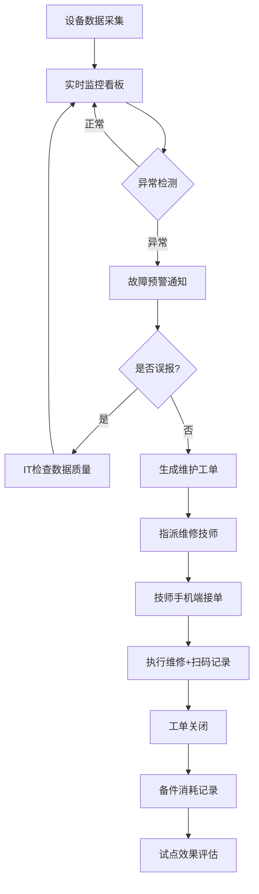

<!--
产物：UX与交互规则 · REQ-002 设备预测性维护平台
v1.0 confirmed · 基于上游 JS-PDM-001 (confirmed v1.0)
本文件通过 validate_artifact.py 校验。

⚠️ Fixture 声明：本文件是 product-ux skill 的回归演示样本，非 REQ-002 真实需求产物。
上游引用 JS-PDM-001 在 `requirements/REQ-002-predictive-maintenance/001-business-requirements/02-user-journey-stories/journey-and-stories.md` 中真实落位；
本 fixture 仅用于校验 product-ux validator 的结构与语义红线，不代表 REQ-002 已跑通 `product-ux`。
真实 REQ-002 `product-ux` 需由 product-ux skill 在 `requirements/REQ-002-predictive-maintenance/002-product-requirements/01-product-ux/` 重新生成。
-->
---
artifact_id: UX-PDM-001
version: v1.0
status: confirmed
owner: PM-Office
business_fact_owner: 设备工程部总监 陈工
goal_decision_owner: 生产运营部 郑总
reviewer: 设备工程部 陈工 + IT 周工
created_at: 2026-08-11
updated_at: 2026-08-11
confirmed_at: 2026-08-11
upstream_artifact_id: JS-PDM-001
---

# 产品 UX

## 0. 预检输入充分度判定

- 上游产物：JS-PDM-001（status: confirmed, v1.0）
- 已确认故事卡片数：10（P0: 5, P1: 5）
- 已确认角色数：7
- 判定：**充分模式** → 走完整工作流

## 1. 项目范围（引用上游）

### 1.1 本期包含

| 功能域 | 描述 | 来源故事 ID | 优先级 |
|---|---|---|---|
| 设备数据采集与接入 | 苏州压铸厂 26 台压铸机传感器+网关安装，数据接入平台 | ST-001, ST-010 | P0 |
| 实时状态监控 | 设备参数（温度/振动/压力/电流）实时展示，异常高亮 | ST-002, ST-009 | P0 |
| 故障预警管理 | 异常检测→预警通知→查看详情→建议操作 | ST-003, ST-008 | P0 |
| 维护工单管理 | 预警→生成工单→指派技师→跟踪进度 | ST-004, ST-005 | P0 |
| 备件分析看板 | 备件消耗模式→库存优化建议 | ST-006 | P1 |
| 试点效果评估 | 预警准确率回溯→试点效果报告 | ST-007 | P1 |

### 1.2 本期不包含（非目标）

| 排除项 | 排除原因 | 来源 |
|---|---|---|
| 常州/无锡工厂推广 | 本期仅苏州 26 台试点 | BG DEC-001 |
| 自研算法平台 | 联合算法供应商 | BG DEC-004 |
| SaaS 云端部署 | 本地化部署要求 | BG DEC-002 |
| 模具管理系统集成 | 下期 | BG §8 |
| 移动 App | 浏览器访问即可 | BG §8 |

### 1.3 假设与依赖

| 类型 | 内容 | 影响 | 状态 |
|---|---|---|---|
| 假设 | 老设备可通过外挂传感器实现数据采集 | 低——IT 已确认可行 | 已确认 |
| 依赖 | 算法供应商需提供模型训练+调优服务 | 中——影响预警准确率 | 供应商选型中 |
| 依赖 | OPC-UA 接口适配（注塑机标准接口可用） | 低 | 已确认 |

## 2. 功能结构

### 2.1 系统模块总览

```text
预测性维护平台（苏州试点）
├── 数据采集层
│   └── 传感器数据接入（边缘网关 → 平台）
├── 监控与预警层
│   ├── 实时监控看板
│   └── 故障预警引擎
├── 工单管理层
│   └── 维护工单系统
└── 分析层
    ├── 备件优化分析
    └── 试点效果评估
```

### 2.2 功能清单

| ID | 功能名称 | 描述 | 所属模块 | 来源故事 | 优先级 | 知识状态 |
|---|---|---|---|---|---|---|
| FEA-001 | 设备数据接入 | 26台压铸机传感器数据采集、边缘网关配置、数据质量验证 | 数据采集层 | ST-001 | P0 | FACT |
| FEA-002 | 实时监控看板 | 设备参数实时展示、异常高亮、状态一览 | 监控与预警层 | ST-002, ST-009 | P0 | AI_INFERENCE |
| FEA-003 | 故障预警引擎 | 异常检测→预警通知（≥48h提前）→详情查看→建议操作 | 监控与预警层 | ST-003 | P0 | FACT |
| FEA-004 | 维护工单系统 | 预警→一键生成工单→指派技师→手机端执行→扫码记录 | 工单管理层 | ST-004, ST-005 | P0 | AI_INFERENCE |
| FEA-005 | 备件分析看板 | 备件消耗模式分析→安全库存/重订货点建议 | 分析层 | ST-006 | P1 | FACT |
| FEA-006 | 试点效果报告 | 预警准确率回溯→停机降幅/OEE/备件变化自动报告 | 分析层 | ST-007 | P1 | AI_INFERENCE |

### 2.3 模块间关系

```text
数据采集层 ──(数据流)──> 监控与预警层 ──(预警事件)──> 工单管理层
                                   │                        │
                                   └──(预警记录)──> 分析层 <──(维修记录)──┘
```

## 3. UX 流程与交互规则

### 3.1 主流程（P0）：设备监控→预警→工单→维修闭环



### 3.2 分支与状态

```text
实时监控看板状态:
  - 正常（绿色）: 参数在基线范围内
  - 关注（黄色）: 参数偏离基线但未触发预警阈值
  - 异常（红色）: 触发预警，需立即处理

预警处理分支:
  - 正常路径: 检测→预警→工单→维修→关闭
  - 误报路径: 检测→预警→IT确认误报→标记→反馈模型
  - 升级路径: 高严重度预警→通知工厂厂长→协调生产计划
```

### 4.1 页面与步骤描述

| 页面/步骤 | 所属功能 | 入口 | 前置条件 | 主要内容 | 操作 | 下一状态 |
|---|---|---|---|---|---|---|
| 实时监控看板 | FEA-002 | 主导航 | 数据已接入 | 26台设备卡片（温度/振动/压力/电流实时值）、异常设备红色高亮、历史趋势小图 | 点击设备→设备详情；筛选→按工厂/状态 | 设备详情页 |
| 设备详情页 | FEA-002 | 监控看板点击设备 | 该设备数据在线 | 实时参数曲线、历史趋势、预警记录列表、维护记录列表 | 查看预警详情；查看维护历史 | 预警详情 |
| 预警详情页 | FEA-003 | 设备详情/预警通知 | 预警已触发 | 异常参数对比（当前vs基线）、趋势图、AI建议操作、所需备件清单 | 一键生成工单；标记误报 | 工单创建 / 监控看板 |
| 工单管理列表 | FEA-004 | 主导航 | 有工单数据 | 工单列表（状态/优先级/技师/截止时间/设备）、超时标记 | 新建工单；查看详情；筛选 | 工单详情 |
| 工单执行页(手机端) | FEA-004 | 工单详情/扫码 | 工单已派发 | 设备信息、操作指引、备件清单、扫码录入区 | 扫码记录备件消耗；提交维修结果 | 工单关闭 |
| 管理仪表板 | FEA-002 | 主导航(厂长) | 已登录 | 实时OEE、停机趋势、设备健康度概览 | 切换时间范围；导出 | — |

### 3.3 交互规则 IX-XXX

## 4. 页面与原型

（fixture演示，交互规则略）

## 6. 事实与决定

| ID | 类型 | 内容 | 来源/决策人 | 状态 |
|---|---|---|---|---|
| FCT-001 | FACT | 6 个功能模块覆盖 P0+P1 故事 | JS-PDM-001 §3 | 确认 |
| DEC-001 | DECISION | 手机端扫描采用浏览器 WebRTC API（不开发独立 App） | IT 周工 | 确认 |

## 7. 假设、AI 推断、未知与冲突

| ID | 类型 | 内容 | 依据 | 影响 | 责任人 | 处理方式 |
|---|---|---|---|---|---|---|
| AII-001 | AI_INFERENCE | 监控看板布局参考工业 SCADA 模式（设备卡片+趋势图） | 行业常见模式 | 低 | UX 设计师 | 人工确认后转为原型参考 |
| UNK-001 | UNKNOWN | 算法供应商提供的预警 UI 组件是否可嵌入我方平台 | — | 中——影响预警详情页设计 | IT 周工 | 供应商选型后确认 |

## 8. 待确认问题

| ID | 问题 | 结论 |
|---|---|---|
| Q-001 | 监控看板刷新频率（实时 vs 5秒间隔）？ | 待确认（影响性能设计） |
| Q-002 | 手机端操作是否需要离线支持？ | 待确认 |

## Clarifications

| session_id | category | question | ai_preliminary_judgment | options | decision_owner | blocking | deferral_risk | accepted_answer | reflow_target | integrated_at | integrated_by | audit_recheck |
|---|---|---|---|---|---|---|---|---|---|---|---|---|
| CL-001 | ux_pattern | 监控看板采用设备卡片还是列表形式？ | 推断设备卡片（26台适合卡片+状态色标） | A. 设备卡片 B. 列表 C. 混合 | 设备主管 | no | 信息密度不足 | A（设备卡片+状态色标） | §4 页面与步骤描述 | 2026-08-11T18:00:00Z | AI | pass |

## 9. 来源追溯

| 来源 ID | 材料/位置 | 关键内容 | 本文落位或排除理由 |
|---|---|---|---|
| JS-PDM-001 | 上游 confirmed §10 | story_summary / confirmed_roles / lifecycle_clues | §0 / §1 / §2 |
| SRC-002 | 评审会纪要（IT 预算/本地化） | IT 周工确认传感器方案 | §1.3 假设与依赖 |

## 10. 下游输入摘要

```text
confirmed_version: v1.0
scope_summary: 6 个功能模块（数据采集/实时监控/预警管理/工单管理/备件分析/效果评估），苏州 26 台试点
feature_summary: 6 个 FEA（P0: FEA-001~004, P1: FEA-005~006），覆盖 10 个 ST
module_boundaries: 4 层架构（数据采集→监控预警→工单管理→分析层）
key_interaction_patterns: 6 个 IX（实时高亮/通知推送/一键工单/扫码记录/超时告警/误报标记）
open_nonblocking_unknowns: 算法供应商 UI 组件兼容性（UNK-001）
source_ids: JS-PDM-001, SRC-002
```

## 11. Constitution Compliance

| 原则 | 状态 | 证据 / 备注 |
|---|---|---|
| ① 业务事实分离 | PASS | §6 区分 FACT/DECISION；§7 区分 AI_INFERENCE/UNKNOWN |
| ② AI 不替业务决定 | PASS | CL-001 由设备主管裁决；Q-001/Q-002 待确认 |
| ③ 来源可追溯 | PASS | §9 可追溯到上游 JS-PDM-001 和原始 SRC |
| ④ 冲突显式保留并关闭 | PASS | 无冲突 |

## 12. 版本变更摘要

| 版本 | 变更原因 | 主要变化 | 人工确认状态 |
|---|---|---|---|
| v0.1 | 初始候选（基于 JS-PDM-001） | 6 FEA + Mermaid 主流程图 + 6 页面定义 | 已升级 v1.0 |
| v1.0 | 人工评审确认 | CL-001 设备卡片模式确认；§10 下游交接填写 | **已确认** |
